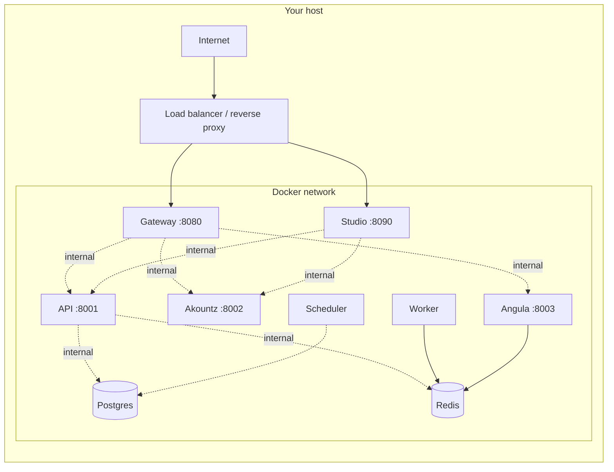
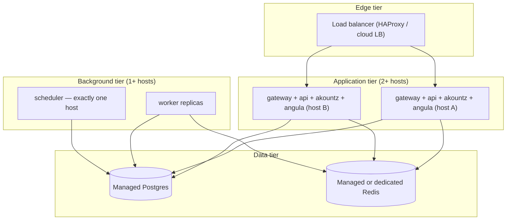

Pawabase is a self-contained platform that runs on any modern Linux host with Docker. It packages seven processes into a single build image and orchestrates them through `docker-compose.yml`, so the hardware requirements are modest and the deployment path is short. This page lays out exactly what you need — nothing optional, nothing assumed — so you can size your machine and prepare your environment with confidence before running `docker compose up -d` for the first time.

## Hardware

The seven Pawabase services (gateway, API, worker, scheduler, Akountz, Angula, and Studio) share one Docker image and run as separate containers. Because the worker and scheduler are CPU-bound rather than memory-bound, and because Postgres and Redis are the only stateful services, the hardware picture is straightforward.

<CardGroup cols={3}>
  <Card title="Minimum" icon="minus-circle">
    2 CPU cores, 4 GB RAM, 20 GB disk. Suitable for development, demo projects, and low-traffic staging environments. The gateway, API, Akountz, and Studio share the API container's memory pool; Postgres and Redis account for the bulk of RAM usage.
  </Card>
  <Card title="Recommended" icon="check-circle">
    4 CPU cores, 8 GB RAM, 50 GB disk. Handles concurrent requests across multiple environments, background job processing, and realtime connections without pressure. This is the shape most teams run in production.
  </Card>
  <Card title="High-throughput" icon="bolt">
    8+ CPU cores, 16+ GB RAM, 100+ GB SSD. Needed when running many projects, high-volume event fan-out, large file uploads through the gateway, or multi-replica deployments. Scale the gateway and worker horizontally behind a load balancer (see [Scaling](/self-hosting/scaling)).
  </Card>
</CardGroup>

Disk space matters more than people expect. Postgres WAL files, Redis AOF persistence, and the `/data` volume that stores compiled apps and object storage can grow quickly under heavy write loads. An SSD is strongly recommended — not for throughput, but because Postgres and Redis both do random I/O constantly and a spinning disk turns their I/O wait into a bottleneck for every other service.

<Warning>
The Docker named volumes (`postgres`, `redis`, `api-data`) are stored in Docker's data directory (typically `/var/lib/docker/volumes/`). On a fresh host, ensure this partition has at least 20 GB of free space before the first startup. A single project's compiled app cache plus Postgres WAL can consume several gigabytes during normal operation, and Docker does not automatically clean up stopped containers or unused volumes.
</Warning>

## Software

Nothing exotic is required on the host itself — Docker and Docker Compose are the only system-level dependencies. Pawabase does not ship a system package, does not require Python or Node on the host (the container carries everything), and does not use anything outside the Docker network.

<Steps>
  <Step title="Docker Engine 24.0 or later">
    Pawabase targets the Docker Compose specification v2 syntax (`docker compose`, not the deprecated `docker-compose`). Docker Engine 24.0+ includes the Compose plugin bundled. Verify with:
    ```bash
    docker --version
    # Docker version 24.0.7 or later
    docker compose version
    # Docker Compose version v2.29.1 or later
    ```
    If your distribution ships an older Docker, install the standalone `docker-compose` plugin or upgrade via your distribution's package manager.
  </Step>
  <Step title="Docker Compose v2 CLI plugin">
    The `docker compose` command (with a space) is the v2 plugin, distinct from the old `docker-compose` binary. Pawabase's `docker-compose.yml` uses `x-pawabase` YAML anchors and `condition: service_healthy` directives that require Compose spec v2. Confirm compatibility:
    ```bash
    docker compose config --quiet && echo "Compose v2 compatible"
    ```
    If this prints an error about `x-pawabase` or `condition`, your Compose version is too old.
  </Step>
  <Step title="A POSIX-compatible shell">
    The included `scripts/dev.sh` uses bash features (`set -euo pipefail`, arrays, `trap`). Bash is available on all Linux distributions and macOS. On Windows, use WSL2 or Git Bash.
  </Step>
  <Step title="OpenSSL (for generating secrets)">
    Every secret — the internal service token, the JWT master key, the master encryption key, and the Postgres password — should be a cryptographically random 32-byte hex string. OpenSSL ships with most Linux distributions and macOS:
    ```bash
    openssl rand -hex 32
    ```
  </Step>
</Steps>

## Networking

Pawabase binds ports on the host for exactly two things: the gateway (port 8080 by default) and Studio (port 8090 by default). Every other service — API, worker, scheduler, Akountz, Angula, Postgres, and Redis — lives entirely on the internal Docker network and is never reachable from outside the host. This is not a configuration choice; it is the default topology, and the `docker-compose.yml` exposes only the two ports the documentation mentions.



The gateway's host port is configurable via `PAWABASE_GATEWAY_PORT` in `.env`, and Studio's via `PAWABASE_STUDIO_PORT`. Neither defaults to 443 or 80 because Pawabase expects a reverse proxy (Caddy, Nginx, Traefik) or a cloud load balancer in front of it to handle TLS termination, rate limiting at the edge, and HTTP→HTTPS redirects. See [TLS](/self-hosting/tls) for the recommended reverse proxy setup.

<Note>
If you are running on a cloud VM (AWS EC2, GCP Compute, Azure VM), you must open the gateway and Studio ports in your security group or firewall rules. The internal ports (8001, 8002, 8003, 5432, 6379) should remain closed — they are only reachable from localhost on the host or from other containers on the Docker network. Opening Postgres to the public internet is the single most common self-hosting security mistake.
</Note>

## Secrets you must generate

Pawabase requires six distinct secrets before the first `docker compose up`. Every one of them is independent, and compromising any single one does not automatically compromise the others — but all six are needed for the platform to start. The `.env.example` file documents each one, and the `docker-compose.yml` validates that `POSTGRES_PASSWORD` is set via the `${POSTGRES_PASSWORD:?...}` syntax, which causes Compose to abort immediately with a clear error if it is missing.

<AccordionGroup>
  <Accordion title="PAWABASE_INTERNAL_SECRET">
    Signs service-to-service tokens. Every internal call from the gateway or Studio to the API, Akountz, or Angula carries a token signed with this secret, and the receiving service verifies it independently. Generate with `openssl rand -hex 32`. This secret must be identical across every Pawabase container (it is set from `.env`, which all services share), but it must never appear in a client-side JavaScript bundle or a public repository.
  </Accordion>
  <Accordion title="PAWABASE_JWT_MASTER_SECRET">
    The master secret from which all per-environment user token signing keys are derived. Each `(project, environment)` pair derives its access-token signing key as `HMAC(master_secret, "<project>:<env>")`, so the gateway and Akountz can verify tokens locally without a lookup, but a compromised master key invalidates every token in every environment. Rotate it only as a break-glass operation — see [Upgrades](/self-hosting/upgrades). Generate with `openssl rand -hex 32`.
  </Accordion>
  <Accordion title="PAWABASE_MASTER_KEY">
    Encrypts environment secrets (`secret://NAME` values) and webhook signing keys at rest. When you store a secret in Studio's secrets manager, it is encrypted with this key before being written to the `pb_secrets` table. If this key is lost, the encrypted secrets are unrecoverable — you would need to re-create every secret for every environment. Generate with `openssl rand -hex 32`.
  </Accordion>
  <Accordion title="POSTGRES_PASSWORD">
    The password for the `pawabase` database superuser. Used in the `PAWABASE_DATABASE_URL` connection string inside the API and Akountz containers. The `docker-compose.yml` enforces it with `${POSTGRES_PASSWORD:?set POSTGRES_PASSWORD in .env}`, so the platform simply will not start without it. Generate with `openssl rand -hex 32`.
  </Accordion>
  <Accordion title="PAWABASE_ADMIN_EMAIL and PAWABASE_ADMIN_PASSWORD">
    The first platform operator account, created automatically on startup. Akountz checks whether any operator exists for the reserved `_platform` project; if none exists, it creates one with these credentials and grants the built-in `admin` role with `permissions=["*"]`. The password must contain upper- and lower-case letters, a digit, and a symbol. This is the account you use to sign into Studio for the first time. Change the password through Studio's account settings after the first login — do not leave the default in `.env`.
  </Accordion>
  <Accordion title="PAWABASE_PUBLIC_URL and PAWABASE_PUBLIC_GATEWAY_URL">
    The origin clients and browsers reach. Links in emails, OAuth callbacks, signed storage URLs, and CORS origin checks are all built from this value. In development, `http://localhost:8080` works. In production, this must be your actual domain (e.g., `https://api.your-app.example.com`) because tokens, redirects, and storage URLs are all constructed relative to it. Setting this to `http://` in production will cause browsers to reject the `Secure` flag on session cookies and break OAuth redirects that require HTTPS.
  </Accordion>
</AccordionGroup>

<Warning>
Never commit `.env` to version control. The `.gitignore` in the project root already excludes it, but if you copy `.env.example` to `.env` and manually edit it, make sure the file is not tracked. All six secrets appear in plaintext in `.env`, and the `docker-compose.yml` reads them directly via `env_file`. A leaked `.env` gives an attacker every credential needed to sign tokens, decrypt secrets, and access the database.
</Warning>

## Operating system considerations

Pawabase runs in containers, so the host operating system is largely irrelevant to the platform itself. The following notes cover the common edge cases:

- **File descriptor limits**: Docker containers inherit the host's `ulimit -n`. With many concurrent WebSocket connections to Angula or large file uploads through the gateway, the default Linux limit of 1024 is too low. Set it to at least 65536: `ulimit -n 65536` in your shell before starting Docker, or configure it in `/etc/security/limits.conf`.
- **Memory limits**: If you set `--memory` on the Docker daemon or per-container, ensure Postgres gets enough. Postgres defaults to using up to 25% of available RAM for shared buffers; with 2 GB total container memory, that is 512 MB, which is fine. With 512 MB total, Postgres will thrash.
- **Docker storage driver**: Use `overlay2` (the default on most modern Linux distributions). Older `devicemapper` or `aufs` drivers have known issues with Docker Compose volume management and can cause startup failures or data corruption.
- **Systemd and Docker**: If you plan to run `docker compose up -d` as a systemd service (see [Production checklist](/self-hosting/production-checklist)), ensure the Docker socket is available to your service user and that `docker.service` is enabled and started.

## What this page does not cover

This page addresses the prerequisites for running Pawabase on your own infrastructure. It does not cover:

- **Deployment automation** — see [Production checklist](/self-hosting/production-checklist) for systemd units, reverse proxy configuration, and monitoring setup.
- **TLS termination** — see [TLS](/self-hosting/tls) for how to configure Caddy or Nginx in front of the gateway.
- **Scaling beyond a single host** — see [Scaling](/self-hosting/scaling) for multi-replica and Kubernetes strategies.
- **Data protection** — see [Backups](/self-hosting/backups) for backup and recovery procedures.

## Sizing by workload

The three hardware tiers above (Minimum, Recommended, High-throughput) are starting points, not a substitute for sizing against your actual workload. The variables that matter most are: how many projects and environments you run, how many concurrent requests the gateway handles, how many background jobs the worker processes per minute, and how many realtime connections Angula holds open. The table below gives concrete sizing examples for common workload shapes, based on the resource behavior described in [Scaling](/self-hosting/scaling).

| Workload shape | Example | Suggested host | Notes |
| --- | --- | --- | --- |
| Single internal tool | One project, a handful of internal users, low request volume | 2 CPU, 4 GB RAM, 20 GB disk (the Minimum tier) | All seven services plus Postgres and Redis comfortably fit; no horizontal scaling needed |
| Small SaaS backend | 5-20 projects, a few hundred requests/minute, occasional background jobs | 4 CPU, 8 GB RAM, 50 GB disk (the Recommended tier) | Single replica of every service; monitor Postgres CPU as project count grows |
| Growing SaaS backend | 20-100 projects, sustained request load, active job queues | 8 CPU, 16 GB RAM, 100+ GB SSD, 2-3 gateway/API replicas | Start splitting services onto their own hosts if Postgres or Redis becomes a bottleneck; see [Scaling](/self-hosting/scaling) |
| High-volume platform | 100+ projects, heavy webhook/event fan-out, large file uploads | Multi-host with managed Postgres, dedicated Redis, 3+ gateway replicas behind a load balancer | See the [multi-server topology](#multi-server-topology) section below and [Scaling](/self-hosting/scaling) for the full story |

These are starting points derived from the architecture, not benchmarked throughput numbers — Pawabase does not publish a fixed "requests per second per core" figure because it depends heavily on your projects' flows, function complexity, and database query patterns. Size conservatively, monitor with `docker stats` and Postgres's own metrics, and scale the bottleneck you actually observe rather than guessing ahead of time.

## Cloud provider instance sizing

If you are provisioning a VM specifically for Pawabase, here is how the hardware tiers above map onto common cloud instance families. These are suggestions based on the CPU/RAM ratios in the tiers above, not endorsements of any particular provider.

<AccordionGroup>
  <Accordion title="AWS EC2">
    - **Minimum tier**: `t3.medium` (2 vCPU, 4 GB RAM) — burstable, fine for low or spiky traffic
    - **Recommended tier**: `t3.xlarge` (4 vCPU, 16 GB RAM) or `m6i.xlarge` (4 vCPU, 16 GB RAM) for sustained load without CPU credit exhaustion
    - **High-throughput tier**: `c6i.2xlarge` (8 vCPU, 16 GB RAM) for CPU-bound workloads, or `r6i.2xlarge` (8 vCPU, 64 GB RAM) if Postgres and Redis both need generous memory
    - Attach a separate EBS volume (`gp3`, provisioned for at least 3000 IOPS) for Docker's data root rather than relying on the root volume — this isolates Postgres's random I/O from the OS disk
  </Accordion>
  <Accordion title="Google Cloud Compute Engine">
    - **Minimum tier**: `e2-medium` (2 vCPU, 4 GB RAM)
    - **Recommended tier**: `e2-standard-4` (4 vCPU, 16 GB RAM) or `n2-standard-4` for more consistent CPU performance
    - **High-throughput tier**: `n2-standard-8` (8 vCPU, 32 GB RAM)
    - Use a `pd-ssd` or `pd-balanced` persistent disk, not `pd-standard` (spinning disk performance characteristics), for the same reason as above
  </Accordion>
  <Accordion title="Azure">
    - **Minimum tier**: `B2s` or `B2ms` (2 vCPU, 4-8 GB RAM) — burstable series
    - **Recommended tier**: `D4s_v5` (4 vCPU, 16 GB RAM)
    - **High-throughput tier**: `D8s_v5` (8 vCPU, 32 GB RAM)
    - Use Premium SSD (`P-series`) managed disks for the Docker data root
  </Accordion>
  <Accordion title="DigitalOcean / Hetzner / other VPS providers">
    - **Minimum tier**: a 4 GB / 2 vCPU droplet or server
    - **Recommended tier**: an 8 GB / 4 vCPU server with SSD-backed storage (most VPS providers use local NVMe by default, which is ideal for Postgres)
    - **High-throughput tier**: a 16 GB / 8 vCPU server, or move to a dedicated/bare-metal offering if available
    - These providers typically bundle local NVMe storage at every tier, which removes the network-attached-disk latency concern that applies to some cloud block storage products
  </Accordion>
</AccordionGroup>

## Managed Postgres vs. containerized Postgres

The bundled `docker-compose.yml` runs Postgres as a container (`postgres:16-alpine`) with a named volume. This is the simplest path and is what every other page in this section assumes by default, but it is not the only option, and the requirements differ depending on which you choose.

<Tabs>
  <Tab title="Containerized Postgres (default)">
    Running Postgres inside the Compose stack means:

    - No additional infrastructure to provision — `docker compose up -d` brings up everything, including the database.
    - Postgres competes for the same host's CPU, RAM, and disk I/O as every other Pawabase service. Size your host's RAM and disk with Postgres's needs in mind — it is usually the most resource-hungry single container in the stack once your projects have real data volume.
    - Backups, upgrades, and point-in-time recovery are entirely your responsibility (see [Backups](/self-hosting/backups) and [Upgrades](/self-hosting/upgrades)).
    - This is the right choice for single-host deployments, development, staging, and any deployment where operational simplicity outweighs the benefits of a managed database.
  </Tab>
  <Tab title="Managed Postgres (e.g. RDS, Cloud SQL, AlloyDB, Neon)">
    To use a managed Postgres instance instead of the containerized one:

    1. Remove or comment out the `postgres` service in a `docker-compose.override.yml` (see [Docker compose](/self-hosting/docker-compose) for override file mechanics).
    2. Point `PAWABASE_DATABASE_URL` (constructed today from `POSTGRES_PASSWORD` and the internal `postgres:5432` host) at your managed instance's connection string instead, via an override on the `api` and `akountz` services' `environment` block.
    3. Create the `pawabase` and `akountz` databases yourself on the managed instance — the `docker/postgres/init.sql` script that normally creates the `akountz` database only runs against the bundled Postgres container's `docker-entrypoint-initdb.d` mechanism, so a managed database will not run it automatically. Run the equivalent `CREATE DATABASE akountz;` statement yourself before starting the stack.
    4. Ensure network connectivity: the `api` and `akountz` containers must be able to reach the managed Postgres endpoint, which usually means running Pawabase inside the same VPC or over a VPN/peering connection, not over the public internet.

    The benefit: automated backups, point-in-time recovery, read replicas, and automated minor-version patching are handled by the provider. The tradeoff: additional cost, additional network latency (usually low if same-region/same-VPC), and one more system to authenticate against and monitor. This is the right choice once a single host's Postgres container becomes a scaling or operational bottleneck — see [Scaling](/self-hosting/scaling) for when that typically happens.
  </Tab>
</Tabs>

## Multi-server topology

Everything above this section assumes Pawabase runs on a single host via the bundled `docker-compose.yml`. Once you outgrow a single host — either because one host cannot provide enough CPU/RAM, or because you want redundancy — the requirements shift from "one machine sized correctly" to "several machines, each sized for its role, on a shared network."

A typical multi-server split looks like this:



Requirements per tier:

- **Application tier hosts**: size each the same way as a single-host "Recommended" or "High-throughput" tier, since each host runs a full set of stateless services. Two identically sized hosts behind a load balancer give you both horizontal capacity and failover.
- **Background tier hosts**: worker hosts can be smaller if jobs are lightweight (2 CPU, 4 GB RAM is often enough per worker host, scaled by replica count). The scheduler host needs only minimal resources (1 CPU, 1-2 GB RAM) since it only reconciles schedules every 15 seconds and enqueues work — but it must be exactly one host, ever (see [Scaling](/self-hosting/scaling)).
- **Data tier**: a managed Postgres instance (see above) sized for your write/read volume, and either a managed Redis instance or a dedicated Redis host with enough RAM to hold your queue backlog and event history comfortably (Redis is entirely in-memory with AOF for durability, so RAM sizing should account for peak queue depth, not just steady-state).

This topology requires networking beyond what `docker-compose.yml` provides out of the box — each host needs the internal service URLs (`PAWABASE_API_URL`, `PAWABASE_AKOUNTZ_URL`, `PAWABASE_ANGULA_URL`, `PAWABASE_GATEWAY_URL`, `PAWABASE_STUDIO_URL`) pointed at the correct host or load-balanced address rather than the Docker Compose service names (`api`, `akountz`, `angula`, `gateway`, `studio`), which only resolve within a single Compose project's network. See [Scaling](/self-hosting/scaling) for the full multi-host and Kubernetes deployment models.

## Storage growth and sizing in depth

The Warning above establishes a 20 GB floor for Docker's data directory, but actual growth depends on usage patterns. Here is how to reason about each volume:

<AccordionGroup>
  <Accordion title="postgres volume growth">
    Postgres growth is driven by two things: your actual row data (projects, definitions, users, audit entries, event history if events are persisted to tables) and WAL (Write-Ahead Log) churn from write-heavy workloads. A platform with modest usage (tens of projects, low request volume) typically stays under a few GB for months. A platform processing thousands of writes per minute (webhooks, audit entries, job records) can accumulate WAL and table bloat much faster — plan for tens of GB within the first few months and monitor `pg_database_size()` and table bloat directly. Autovacuum runs by default in the bundled Postgres image; do not disable it.
  </Accordion>
  <Accordion title="redis volume growth">
    Redis with AOF persistence (the bundled configuration uses `--appendonly yes`) grows with every write until it is compacted. Redis periodically rewrites the AOF file in the background (`BGREWRITEAOF`), which compacts it to the size of the current dataset. Size Redis's expected RAM (and by extension, its persisted file size) around your queue depth at peak load plus event/realtime history retention — a few hundred MB to low GBs is typical for moderate workloads; heavy event fan-out with long replay windows can grow larger.
  </Accordion>
  <Accordion title="api-data volume growth">
    This volume holds compiled app caches (small, proportional to the number of distinct environments), object storage files (unbounded — grows directly with what your projects' users upload), and SQLite fallback databases for any environment that has not been given its own Postgres connection. If you expect meaningful file upload volume, budget disk space generously here and monitor it directly — object storage files are the one category of data in this volume that is not rebuildable and not something Postgres backups protect.
  </Accordion>
</AccordionGroup>

## Network bandwidth considerations

For a single-host deployment behind a typical cloud provider's network, inbound/outbound bandwidth is rarely the bottleneck compared to CPU, RAM, or disk I/O — but it matters in two specific cases:

- **Large file uploads/downloads through the gateway**: the gateway streams file uploads and downloads rather than buffering them fully in memory (see [TLS](/self-hosting/tls) for why `flush_interval -1` matters for this), but the underlying network throughput of your host still caps how fast large files move. If your workload involves large media files, size your host's network tier accordingly (most cloud providers scale network bandwidth with instance size).
- **Multi-region or multi-host deployments**: if the application tier and data tier are in different regions or availability zones, every database query and Redis operation crosses that network hop. Keep the data tier and application tier in the same region (and ideally the same availability zone or VPC) to avoid adding tens of milliseconds to every request.

## Architecture and OS considerations

<AccordionGroup>
  <Accordion title="ARM64 vs x86_64">
    The Dockerfile's base images (`node:22-slim` for the Studio frontend build stage and `python:3.11-slim` for the runtime) both publish official multi-architecture manifests covering `linux/amd64` and `linux/arm64`. This means `docker compose build` produces a working image on Apple Silicon Macs (for local development) and on ARM-based cloud instances (AWS Graviton, Azure Ampere, Oracle Cloud Ampere) without modification, as long as your Python and Node dependencies do not include architecture-specific compiled wheels that lack `arm64` builds. If you build on `amd64` and deploy on `arm64` (or vice versa), build the image on the target architecture or use `docker buildx` for cross-platform builds — do not assume an image built on one architecture runs on the other.
  </Accordion>
  <Accordion title="Docker Desktop vs. Docker Engine">
    Everything in this documentation assumes Docker Engine running natively on Linux, which is how production deployments should run. If you are evaluating Pawabase locally on macOS or Windows with Docker Desktop, be aware that Docker Desktop runs containers inside a Linux VM, which adds a virtualization layer with different disk I/O and file-sharing performance characteristics than native Linux. This is fine for development and testing but is not representative of production performance — do not size a production host based on benchmarks taken from Docker Desktop.
  </Accordion>
  <Accordion title="Kernel and cgroup version">
    Modern Docker Compose health checks and resource limits rely on cgroup v2, which is the default on current mainstream distributions (Ubuntu 22.04+, Debian 11+, Fedora 31+, RHEL 9+). If you are on an older distribution still using cgroup v1, resource limits and some monitoring integrations (like `cAdvisor`, mentioned in [Production checklist](/self-hosting/production-checklist)) may report metrics differently. Prefer a distribution with cgroup v2 by default for a new deployment.
  </Accordion>
</AccordionGroup>

## Frequently encountered sizing mistakes

<Warning>
The most common under-sizing mistake is provisioning for the "Minimum" tier and then adding real project traffic. The Minimum tier assumes low-frequency, low-concurrency usage — the moment you have concurrent users hitting the gateway, background jobs running continuously, and realtime connections held open, memory pressure builds quickly because Postgres, Redis, and up to seven application containers are all competing for the same 4 GB. If containers start showing `OOMKilled` in `docker compose ps` or `docker inspect <container> --format='{{.State.OOMKilled}}'`, that is a direct signal to move to the Recommended tier rather than tuning individual services.
</Warning>

- **Undersized disk, not just undersized RAM**: teams often size for RAM and CPU but forget that Postgres WAL and Docker's layer cache both consume disk continuously. Monitor `df -h` on the Docker data root, not just `free -h`.
- **Running Postgres and Redis on network-attached storage with high latency**: some cloud block storage tiers (particularly the cheapest ones) have latency profiles poorly suited to a database's random-write pattern. If Postgres feels slow despite adequate CPU/RAM, check disk I/O latency (`iostat -x 1`) before assuming it is a query problem.
- **Treating the scheduler as needing the same resources as the API**: the scheduler is lightweight (it reconciles schedules from Postgres every 15 seconds and enqueues jobs) — do not over-provision it, and do not under-provision it into contention with heavier services if you are placing multiple containers per host.
- **Ignoring file descriptor limits until WebSocket connections fail**: the note above about `ulimit -n 65536` is not optional for any deployment expecting meaningful Angula (realtime) traffic. The default Linux limit of 1024 is exhausted quickly by concurrent long-lived WebSocket connections plus normal HTTP connection churn.

## Requirements checklist

Before running `docker compose up -d` for the first time, confirm:

- [ ] Docker Engine 24.0+ and the Compose v2 plugin are installed (`docker --version`, `docker compose version`)
- [ ] The host meets or exceeds the hardware tier appropriate for your expected workload
- [ ] The Docker data directory has adequate free disk space (20 GB minimum, more for production)
- [ ] `ulimit -n` is raised to at least 65536 if you expect meaningful realtime or upload traffic
- [ ] OpenSSL is available to generate the six required secrets
- [ ] You have decided between containerized Postgres and a managed Postgres instance
- [ ] If deploying across multiple hosts, you have a network topology plan (VPC, peering, or a shared private network) so services can reach each other and the data tier
- [ ] Firewall rules are planned so only the gateway and Studio ports are reachable externally

The next logical page is [Docker compose](/self-hosting/docker-compose), which walks through the orchestration file line by line and explains what each service contributes.
