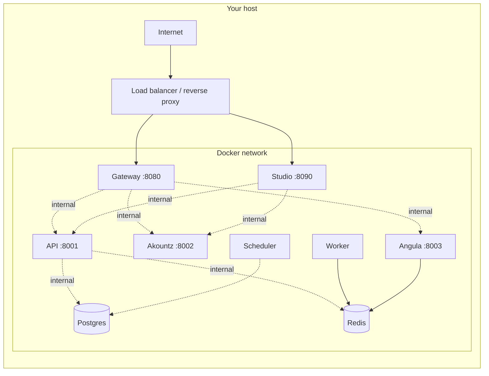

Pawabase is a self-contained platform that runs on any modern Linux host with Docker. It packages seven processes into a single build image and orchestrates them through `docker-compose.yml`, so the hardware requirements are modest and the deployment path is short. This page lays out exactly what you need — nothing optional, nothing assumed — so you can size your machine and prepare your environment with confidence before running `docker compose up -d` for the first time.

## Hardware

The seven Pawabase services (gateway, API, worker, scheduler, Akountz, Angula, and Studio) share one Docker image and run as separate containers. Because the worker and scheduler are CPU-bound rather than memory-bound, and because Postgres and Redis are the only stateful services, the hardware picture is straightforward.

<CardGroup cols={3}>
  <Card title="Minimum" icon="minus-circle">
    2 CPU cores, 4 GB RAM, 20 GB disk. Suitable for development, demo projects, and low-traffic staging environments. The gateway, API, Akountz, and Studio share the API container's memory pool; Postgres and Redis account for the bulk of RAM usage.
  </Card>
  <Card title="Recommended" icon="check-circle">
    4 CPU cores, 8 GB RAM, 50 GB disk. Handles concurrent requests across multiple environments, background job processing, and realtime connections without pressure. This is the shape most teams run in production.
  </Card>
  <Card title="High-throughput" icon="bolt">
    8+ CPU cores, 16+ GB RAM, 100+ GB SSD. Needed when running many projects, high-volume event fan-out, large file uploads through the gateway, or multi-replica deployments. Scale the gateway and worker horizontally behind a load balancer (see [Scaling](/self-hosting/scaling)).
  </Card>
</CardGroup>

Disk space matters more than people expect. Postgres WAL files, Redis AOF persistence, and the `/data` volume that stores compiled apps and object storage can grow quickly under heavy write loads. An SSD is strongly recommended — not for throughput, but because Postgres and Redis both do random I/O constantly and a spinning disk turns their I/O wait into a bottleneck for every other service.

<Warning>
The Docker named volumes (`postgres`, `redis`, `api-data`) are stored in Docker's data directory (typically `/var/lib/docker/volumes/`). On a fresh host, ensure this partition has at least 20 GB of free space before the first startup. A single project's compiled app cache plus Postgres WAL can consume several gigabytes during normal operation, and Docker does not automatically clean up stopped containers or unused volumes.
</Warning>

## Software

Nothing exotic is required on the host itself — Docker and Docker Compose are the only system-level dependencies. Pawabase does not ship a system package, does not require Python or Node on the host (the container carries everything), and does not use anything outside the Docker network.

<Steps>
  <Step title="Docker Engine 24.0 or later">
    Pawabase targets the Docker Compose specification v2 syntax (`docker compose`, not the deprecated `docker-compose`). Docker Engine 24.0+ includes the Compose plugin bundled. Verify with:
    ```bash
    docker --version
    # Docker version 24.0.7 or later
    docker compose version
    # Docker Compose version v2.29.1 or later
    ```
    If your distribution ships an older Docker, install the standalone `docker-compose` plugin or upgrade via your distribution's package manager.
  </Step>
  <Step title="Docker Compose v2 CLI plugin">
    The `docker compose` command (with a space) is the v2 plugin, distinct from the old `docker-compose` binary. Pawabase's `docker-compose.yml` uses `x-pawabase` YAML anchors and `condition: service_healthy` directives that require Compose spec v2. Confirm compatibility:
    ```bash
    docker compose config --quiet && echo "Compose v2 compatible"
    ```
    If this prints an error about `x-pawabase` or `condition`, your Compose version is too old.
  </Step>
  <Step title="A POSIX-compatible shell">
    The included `scripts/dev.sh` uses bash features (`set -euo pipefail`, arrays, `trap`). Bash is available on all Linux distributions and macOS. On Windows, use WSL2 or Git Bash.
  </Step>
  <Step title="OpenSSL (for generating secrets)">
    Every secret — the internal service token, the JWT master key, the master encryption key, and the Postgres password — should be a cryptographically random 32-byte hex string. OpenSSL ships with most Linux distributions and macOS:
    ```bash
    openssl rand -hex 32
    ```
  </Step>
</Steps>

## Networking

Pawabase binds ports on the host for exactly two things: the gateway (port 8080 by default) and Studio (port 8090 by default). Every other service — API, worker, scheduler, Akountz, Angula, Postgres, and Redis — lives entirely on the internal Docker network and is never reachable from outside the host. This is not a configuration choice; it is the default topology, and the `docker-compose.yml` exposes only the two ports the documentation mentions.



The gateway's host port is configurable via `PAWABASE_GATEWAY_PORT` in `.env`, and Studio's via `PAWABASE_STUDIO_PORT`. Neither defaults to 443 or 80 because Pawabase expects a reverse proxy (Caddy, Nginx, Traefik) or a cloud load balancer in front of it to handle TLS termination, rate limiting at the edge, and HTTP→HTTPS redirects. See [TLS](/self-hosting/tls) for the recommended reverse proxy setup.

<Note>
If you are running on a cloud VM (AWS EC2, GCP Compute, Azure VM), you must open the gateway and Studio ports in your security group or firewall rules. The internal ports (8001, 8002, 8003, 5432, 6379) should remain closed — they are only reachable from localhost on the host or from other containers on the Docker network. Opening Postgres to the public internet is the single most common self-hosting security mistake.
</Note>

## Secrets you must generate

Pawabase requires six distinct secrets before the first `docker compose up`. Every one of them is independent, and compromising any single one does not automatically compromise the others — but all six are needed for the platform to start. The `.env.example` file documents each one, and the `docker-compose.yml` validates that `POSTGRES_PASSWORD` is set via the `${POSTGRES_PASSWORD:?...}` syntax, which causes Compose to abort immediately with a clear error if it is missing.

<AccordionGroup>
  <Accordion title="PAWABASE_INTERNAL_SECRET">
    Signs service-to-service tokens. Every internal call from the gateway or Studio to the API, Akountz, or Angula carries a token signed with this secret, and the receiving service verifies it independently. Generate with `openssl rand -hex 32`. This secret must be identical across every Pawabase container (it is set from `.env`, which all services share), but it must never appear in a client-side JavaScript bundle or a public repository.
  </Accordion>
  <Accordion title="PAWABASE_JWT_MASTER_SECRET">
    The master secret from which all per-environment user token signing keys are derived. Each `(project, environment)` pair derives its access-token signing key as `HMAC(master_secret, "<project>:<env>")`, so the gateway and Akountz can verify tokens locally without a lookup, but a compromised master key invalidates every token in every environment. Rotate it only as a break-glass operation — see [Upgrades](/self-hosting/upgrades). Generate with `openssl rand -hex 32`.
  </Accordion>
  <Accordion title="PAWABASE_MASTER_KEY">
    Encrypts environment secrets (`secret://NAME` values) and webhook signing keys at rest. When you store a secret in Studio's secrets manager, it is encrypted with this key before being written to the `pb_secrets` table. If this key is lost, the encrypted secrets are unrecoverable — you would need to re-create every secret for every environment. Generate with `openssl rand -hex 32`.
  </Accordion>
  <Accordion title="POSTGRES_PASSWORD">
    The password for the `pawabase` database superuser. Used in the `PAWABASE_DATABASE_URL` connection string inside the API and Akountz containers. The `docker-compose.yml` enforces it with `${POSTGRES_PASSWORD:?set POSTGRES_PASSWORD in .env}`, so the platform simply will not start without it. Generate with `openssl rand -hex 32`.
  </Accordion>
  <Accordion title="PAWABASE_ADMIN_EMAIL and PAWABASE_ADMIN_PASSWORD">
    The first platform operator account, created automatically on startup. Akountz checks whether any operator exists for the reserved `_platform` project; if none exists, it creates one with these credentials and grants the built-in `admin` role with `permissions=["*"]`. The password must contain upper- and lower-case letters, a digit, and a symbol. This is the account you use to sign into Studio for the first time. Change the password through Studio's account settings after the first login — do not leave the default in `.env`.
  </Accordion>
  <Accordion title="PAWABASE_PUBLIC_URL and PAWABASE_PUBLIC_GATEWAY_URL">
    The origin clients and browsers reach. Links in emails, OAuth callbacks, signed storage URLs, and CORS origin checks are all built from this value. In development, `http://localhost:8080` works. In production, this must be your actual domain (e.g., `https://api.your-app.example.com`) because tokens, redirects, and storage URLs are all constructed relative to it. Setting this to `http://` in production will cause browsers to reject the `Secure` flag on session cookies and break OAuth redirects that require HTTPS.
  </Accordion>
</AccordionGroup>

<Warning>
Never commit `.env` to version control. The `.gitignore` in the project root already excludes it, but if you copy `.env.example` to `.env` and manually edit it, make sure the file is not tracked. All six secrets appear in plaintext in `.env`, and the `docker-compose.yml` reads them directly via `env_file`. A leaked `.env` gives an attacker every credential needed to sign tokens, decrypt secrets, and access the database.
</Warning>

## Operating system considerations

Pawabase runs in containers, so the host operating system is largely irrelevant to the platform itself. The following notes cover the common edge cases:

- **File descriptor limits**: Docker containers inherit the host's `ulimit -n`. With many concurrent WebSocket connections to Angula or large file uploads through the gateway, the default Linux limit of 1024 is too low. Set it to at least 65536: `ulimit -n 65536` in your shell before starting Docker, or configure it in `/etc/security/limits.conf`.
- **Memory limits**: If you set `--memory` on the Docker daemon or per-container, ensure Postgres gets enough. Postgres defaults to using up to 25% of available RAM for shared buffers; with 2 GB total container memory, that is 512 MB, which is fine. With 512 MB total, Postgres will thrash.
- **Docker storage driver**: Use `overlay2` (the default on most modern Linux distributions). Older `devicemapper` or `aufs` drivers have known issues with Docker Compose volume management and can cause startup failures or data corruption.
- **Systemd and Docker**: If you plan to run `docker compose up -d` as a systemd service (see [Production checklist](/self-hosting/production-checklist)), ensure the Docker socket is available to your service user and that `docker.service` is enabled and started.

## What this page does not cover

This page addresses the prerequisites for running Pawabase on your own infrastructure. It does not cover:

- **Deployment automation** — see [Production checklist](/self-hosting/production-checklist) for systemd units, reverse proxy configuration, and monitoring setup.
- **TLS termination** — see [TLS](/self-hosting/tls) for how to configure Caddy or Nginx in front of the gateway.
- **Scaling beyond a single host** — see [Scaling](/self-hosting/scaling) for multi-replica and Kubernetes strategies.
- **Data protection** — see [Backups](/self-hosting/backups) for backup and recovery procedures.

The next logical page is [Docker compose](/self-hosting/docker-compose), which walks through the orchestration file line by line and explains what each service contributes.
