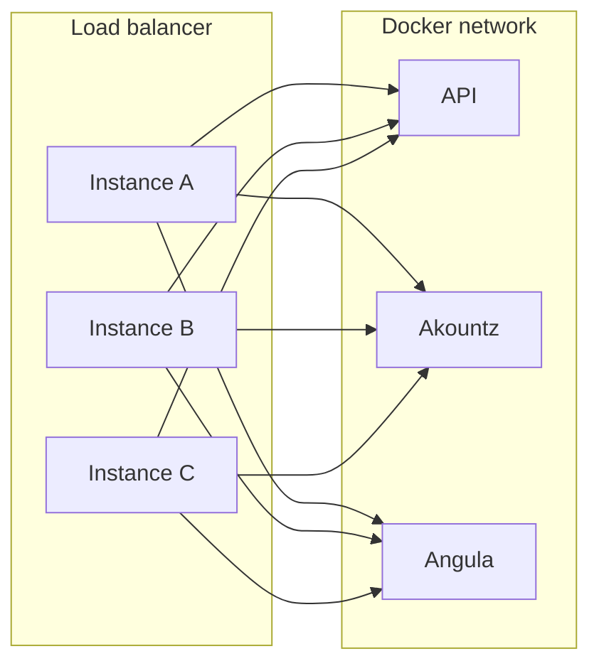
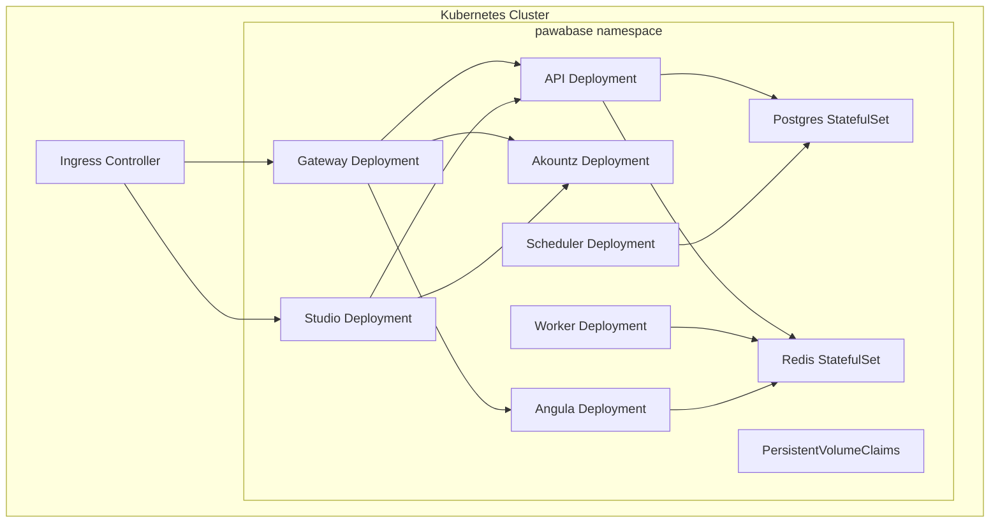

Pawabase is built to scale, but not every service scales the same way. Seven processes, one image, and a shared Docker network give you a starting point that works on a single host. Scaling beyond that requires understanding which services can be multiplied freely, which have strict singleton constraints, and what infrastructure changes are needed at each layer.

This page covers the complete scaling story: horizontal scaling for stateless services, the scheduler's singleton rule, the worker's queue-based scaling, the gateway's load balancing, and the Kubernetes deployment model for teams running container orchestration.

## The scaling rulebook

Before diving into any specific service, internalize the three rules that govern scaling in Pawabase:

<CardGroup cols={3}>
  <Card title="Stateless services scale horizontally" icon="arrows-left-right">
    The gateway, API, Akountz, and Studio are stateless per request. Any replica can handle any request. Scale them horizontally without coordination — add more replicas behind a load balancer and traffic distributes automatically. The only shared state is caches (compiled apps in the API, key caches in the gateway, sessions in Studio), and these caches are pure functions of the data they cache, so any replica can rebuild them independently.
  </Card>
  <Card title="The scheduler must be exactly one" icon="ban">
    Sillo's scheduler keeps its registered jobs in memory. It is not a distributed lock, not leader-elected, and not designed for multi-replica operation. Two scheduler processes will each independently decide "it is time" and each independently queue or emit the same job. For a `trigger.schedule` flow that charges a subscription, this means two identical charges. Run exactly one scheduler, always, on exactly one host.
  </Card>
  <Card title="Workers scale horizontally without limit" icon="layers">
    The worker consumes jobs from Redis-backed queues. Every replica is an independent consumer of the same queues, and Sillo's queue semantics handle multiple consumers safely. More replicas or higher concurrency per replica means more jobs processed in parallel. There is no coordination between worker replicas and no risk of duplicate processing.
  </Card>
</CardGroup>

## Service-by-service scaling

### Gateway — unlimited replicas behind a load balancer

The gateway is the most important service to scale because it is the only public entry point. It is stateless: it has no database connections, no cached state that would be inconsistent across replicas, and no request affinity requirements. Every request is independent — the key cache is warmable from the API on any miss.



Scale by adding more gateway containers. Behind a TCP load balancer (HAProxy, Nginx, cloud load balancer), each gateway instance connects to the same internal services. The load balancer distributes requests across all instances.

```bash
# Add two more gateway replicas
docker compose up -d --scale gateway=3
```

The only consideration is the gateway's key cache: with multiple replicas, each resolves API keys independently. On a cache miss, a replica queries the API's key-lookup endpoint. This adds minimal latency (a single internal HTTP request) and is safe — the cache is a performance optimization, not a correctness requirement.

<Warning>
The rate limiter backend matters when scaling the gateway. With the default Redis backend, rate limits are correct across all replicas — every replica consults the same Redis store. With the in-memory backend (`"memory"`), each replica enforces its own rate limit independently, which means a client that rotates its source IP can bypass the rate limit by hitting different replicas. In production, always use the Redis backend for rate limiting.
</Warning>

### API — stateless, scale freely, but watch the compiled-app cache

The API is stateless per request beyond its compiled-app cache. The cache is a pure function of the environment's definitions — any replica can rebuild it, and a cache miss simply triggers a rebuild. Compiling an environment is not free (it reads every definition and constructs routes, validators, and policy plans), so replicas that see traffic for many different environments pay the compilation cost independently the first time they see a given environment.

Scale the API horizontally the same way as the gateway:

```bash
docker compose up -d --scale api=3
```

Each replica shares the same Postgres database, Redis instance, and `api-data` volume (for the compiled-app cache). Postgres becomes the bottleneck as you add API replicas — it handles all the reads and writes for every replica. Monitor Postgres CPU and query latency as you scale. At some point (typically 8-12 replicas), you should consider read replicas or sharding by project.

<Note>
The `api-data` volume is mounted by all API replicas. Multiple replicas reading and writing to the same Docker named volume is safe — Docker's volume driver handles concurrent access. However, the SQLite fallback databases (`PAWABASE_DEFAULT_DATA_URL`) are **not** safe for concurrent access. If any environment uses SQLite as its `database_url`, run only one API replica for that environment. Postgres is the only safe choice for multi-replica API deployments.
</Note>

### Worker — scale horizontally without limit

Every worker replica is an independent consumer of the same Redis-backed queues (`events`, `webhooks`, `flows`, `functions`, `mail`, `default`). Sillo's queue semantics ensure that each job is delivered to exactly one consumer — no duplicate processing, no coordination needed.

```bash
docker compose up -d --scale worker=5
```

You can also increase concurrency per replica via `PAWABASE_WORKER_CONCURRENCY` (default 4 for the standalone process). A worker with `concurrency=8` processes twice as many jobs simultaneously as one with `concurrency=4`. The practical limit depends on your environment's database connection pool size and the I/O profile of your jobs (CPU-bound jobs are limited by CPU, I/O-bound jobs by network latency).

```bash
# Scale to 3 replicas with higher concurrency
docker compose up -d --scale worker=3
# Then set PAWABASE_WORKER_CONCURRENCY=8 in .env
```

### Scheduler — exactly one, on exactly one host

The scheduler is the exception to every scaling rule. It must run exactly one instance, on exactly one host. The reason is architectural: Sillo's scheduler keeps its registered jobs in memory and reconciles them from Postgres every 15 seconds. Two schedulers will each independently register the same jobs, and when the time comes, both will fire them.

```bash
# Correct: exactly one scheduler
docker compose up -d --scale scheduler=1

# Wrong: two schedulers = double charges, duplicate emails
docker compose up -d --scale scheduler=2
```

If you are running a multi-host deployment, pin the scheduler to a specific host using Docker placement constraints or Kubernetes affinity rules. See the [Kubernetes section](#kubernetes) below for details.

If the scheduler host fails, no time-sensitive jobs fire until the scheduler is restored. This is the single point of failure for scheduled work. The failure mode is silent — schedules simply stop firing, with no error surfaced to a client anywhere. This is why Studio's status page and [Observability](/operate/observability) both surface scheduler heartbeats explicitly.

### Akountz and Angula — scale freely with caveats

Akountz is stateless per request beyond its own Postgres tables. Scale it horizontally like the API:

```bash
docker compose up -d --scale akountz=2
```

Akountz's per-environment token signing key is derived (`HMAC(master_key, "<project>:<env>")`), not stored, so any replica can verify or issue a token for any environment without a lookup or shared cache.

Angula scales horizontally, and this is the one service where horizontal scaling changes behavior in a way worth understanding. With Redis pub/sub wired up, publishing to a channel on instance A is delivered to a subscriber connected to instance B. Without Redis, realtime works within a single instance's own connections only.

```bash
docker compose up -d --scale angula=3
```

With multiple Angula instances, the Redis pub/sub channel must be working for cross-instance realtime to function. If Redis is unavailable, each Angula instance serves only its own connections — realtime works but is isolated per instance.

## Multi-host deployment with Docker Swarm

For deployments across multiple hosts, Docker Swarm provides the simplest orchestration layer on top of the existing `docker-compose.yml`.

### Swarm setup

Initialize a Swarm cluster across your hosts:

```bash
# On the manager node
docker swarm init --advertise-addr <MANAGER-IP>

# On each worker node
docker swarm join --token <TOKEN> <MANAGER-IP>:2377
```

Deploy the stack:

```bash
docker stack deploy -c docker-compose.yml pawabase
```

### Placement constraints

Pin the scheduler to a specific node and distribute other services across the cluster:

```yaml
# docker-compose.swarm.yml
services:
  scheduler:
    deploy:
      placement:
        constraints:
          - node.hostname == scheduler-node-1
    replicas: 1

  gateway:
    deploy:
      replicas: 3
      placement:
        max_replicas_per_node: 1

  api:
    deploy:
      replicas: 3
      placement:
        max_replicas_per_node: 1

  worker:
    deploy:
      replicas: 3

  akountz:
    deploy:
      replicas: 2

  angula:
    deploy:
      replicas: 3
```

```bash
docker stack deploy -c docker-compose.yml -c docker-compose.swarm.yml pawabase
```

### Shared volumes in Swarm

Named volumes in Swarm are managed by Swarm and replicated across nodes for managed services. For data persistence, use an external storage backend (NFS, cloud block storage) that all nodes can access:

```yaml
volumes:
  postgres:
    driver: cloudblockstore
  redis:
    driver: cloudblockstore
  api-data:
    driver: cloudblockstore
```

<Warning>
In Swarm mode, `docker compose up --scale` is replaced by `docker service scale` or the `deploy.replicas` field. The `docker-compose.yml` format is compatible, but the scaling commands differ. Ensure you use `docker stack deploy` rather than `docker compose up`.
</Warning>

## Kubernetes deployment

For teams running Kubernetes, the same `Dockerfile` and image can be deployed as a set of Deployments, Services, and ConfigMaps. The architecture maps naturally to Kubernetes primitives.

### Architecture mapping



### Key configuration considerations

**Scheduler singleton**: The scheduler is the only service that cannot be scaled horizontally. In Kubernetes, enforce this with `replicas: 1` and add a PodDisruptionBudget to prevent simultaneous eviction:

```yaml
apiVersion: policy/v1
kind: PodDisruptionBudget
metadata:
  name: scheduler-pdb
  namespace: pawabase
spec:
  minAvailable: 1
  selector:
    matchLabels:
      app: scheduler
```

**Postgres as StatefulSet**: Run Postgres as a StatefulSet with a PersistentVolumeClaim for durability. Do not use the bundled Postgres image from `docker-compose.yml` for production Kubernetes — use a managed Postgres service (Cloud SQL, Amazon RDS, AlloyDB, Cloud Native PG on Kubernetes) or a production-hardened PostgreSQL operator (CloudNativePG, Crunchy PostgreSQL Operator).

**Redis as StatefulSet**: Same pattern — use a StatefulSet with persistent storage, or a managed Redis service (Amazon ElastiCache, Google Memorystore, Azure Cache for Redis).

**Worker horizontal scaling**: Workers scale freely — set `replicas` based on queue depth. Monitor the Redis queue length and scale workers proportionally. A Kubernetes Horizontal Pod Autoscaler (HPA) based on a custom metric (Redis queue depth) is ideal:

```yaml
apiVersion: autoscaling/v2
kind: HorizontalPodAutoscaler
metadata:
  name: worker-hpa
  namespace: pawabase
spec:
  scaleTargetRef:
    apiVersion: apps/v1
    kind: Deployment
    name: worker
  minReplicas: 2
  maxReplicas: 20
  metrics:
    - type: External
      external:
        metric:
          name: redis_queue_length
          selector:
            matchLabels:
              queue: default
        target:
          type: AverageValue
          averageValue: "100"
```

### Resource requests and limits

Every Kubernetes Deployment should have resource requests and limits. Without them, the scheduler cannot place pods efficiently and a runaway container can consume all node resources:

```yaml
apiVersion: apps/v1
kind: Deployment
metadata:
  name: api
  namespace: pawabase
spec:
  replicas: 3
  template:
    spec:
      containers:
        - name: api
          image: pawabase:latest
          resources:
            requests:
              cpu: "500m"
              memory: "1Gi"
            limits:
              cpu: "2000m"
              memory: "4Gi"
```

### Service discovery

In Kubernetes, internal service discovery is handled by DNS. The `PAWABASE_API_URL`, `PAWABASE_AKOUNTZ_URL`, `PAWABASE_ANGULA_URL`, `PAWABASE_GATEWAY_URL`, and `PAWABASE_STUDIO_URL` environment variables in `docker-compose.yml` are designed for Docker Compose's internal DNS. In Kubernetes, these map to ClusterIP Services:

```yaml
# Internal services that the gateway and studio call
apiVersion: v1
kind: Service
metadata:
  name: api-internal
  namespace: pawabase
spec:
  selector:
    app: api
  ports:
    - port: 8001
---
apiVersion: v1
kind: Service
metadata:
  name: akountz-internal
  namespace: pawabase
spec:
  selector:
    app: akountz
  ports:
    - port: 8002
```

Set the environment variables in each Deployment to use these internal service names:

```yaml
env:
  - name: PAWABASE_API_URL
    value: "http://api-internal.pawabase.svc.cluster.local:8001"
  - name: PAWABASE_AKOUNTZ_URL
    value: "http://akountz-internal.pawabase.svc.cluster.local:8002"
  - name: PAWABASE_ANGULA_URL
    value: "http://angula-internal.pawabase.svc.cluster.local:8003"
  - name: PAWABASE_GATEWAY_URL
    value: "http://gateway-internal.pawabase.svc.cluster.local:8080"
  - name: PAWABASE_STUDIO_URL
    value: "http://studio-internal.pawabase.svc.cluster.local:8090"
```

### Ingress configuration

The Kubernetes Ingress controller replaces the reverse proxy:

```yaml
apiVersion: networking.k8s.io/v1
kind: Ingress
metadata:
  name: pawabase-ingress
  namespace: pawabase
  annotations:
    nginx.ingress.kubernetes.io/ssl-redirect: "true"
    nginx.ingress.kubernetes.io/force-ssl-redirect: "true"
    nginx.ingress.kubernetes.io/proxy-body-size: "50m"
spec:
  tls:
    - hosts:
        - api.your-app.example.com
        - studio.your-app.example.com
      secretName: pawabase-tls
  rules:
    - host: api.your-app.example.com
      http:
        paths:
          - path: /
            pathType: Prefix
            backend:
              service:
                name: gateway-service
                port:
                  number: 8080
    - host: studio.your-app.example.com
      http:
        paths:
          - path: /
            pathType: Prefix
            backend:
              service:
                name: studio-service
                port:
                  number: 8090
```

## Database scaling

Postgres is the platform database for every project and environment. As you scale, Postgres becomes the bottleneck — every API request reads and writes to it, and every scheduler tick queries it.

<AccordionGroup>
  <Accordion title="Read replicas">
    Postgres supports streaming replication to read replicas. The API and Akountz can be configured to route read-only queries to replicas, reducing the load on the primary. This is a configuration change within Sillo's database layer — see the database configuration documentation for setting up replica routing.

    Note: not all queries are read-only. Writes always go to the primary. And the scheduler's reconciliation queries are reads that could benefit from a replica, but stale reads could cause the scheduler to miss a schedule change. For the scheduler specifically, always read from the primary.
  </Accordion>
  <Accordion title="Connection pooling">
    Use PgBouncer or the built-in connection pooler to manage database connections. Each API replica opens multiple connections to Postgres (one per concurrent request, plus maintenance connections). With 4 API replicas at concurrency 4, that is 16+ connections. A connection pooler limits the total number of connections to Postgres and queues excess requests.

    Configure the pooler size to match Postgres's `max_connections` minus a margin for admin connections and the scheduler.
  </Accordion>
  <Accordion title="Sharding by project">
    For deployments with many projects, consider sharding by project. Each project's data lives in its own database, and a router directs connections to the correct database based on the project identifier. This is an advanced configuration that requires changes to how the API resolves the database connection for each request. See the architecture documentation for the multi-tenant database strategy.
  </Accordion>
</AccordionGroup>

## What does not scale horizontally

Understanding what cannot scale is as important as understanding what can:

| Service | Horizontal scaling | Reason |
| --- | --- | --- |
| Scheduler | No | In-memory job registry; two schedulers fire every job twice |
| Postgres (primary) | No | Single-writer; scale with read replicas, not horizontal writes |
| Redis (single instance) | No | Single-threaded; scale with Redis Cluster or sharding if needed |
| SQLite-backed environments | No | File-level locking; only one writer can access the database at a time |
| Any service using the same `api-data` volume | Careful | Docker volumes handle concurrent access, but SQLite files inside do not |

<Tip>
If your deployment outgrows a single Postgres instance, the first step is to switch from the bundled Postgres to a managed database service. AWS RDS, Google Cloud SQL, AlloyDB, and Neon all provide automated scaling, backups, and replication without you managing a Postgres server. Update `PAWABASE_DEFAULT_DATA_URL` and each environment's `infra.database_url` to point at the managed service, and the platform works without any code changes.
</Tip>

## Monitoring scaling decisions

Before adding replicas, monitor what you are trying to fix:

- **Gateway latency**: Add gateway replicas if request latency increases under load
- **API CPU**: Add API replicas if CPU usage exceeds 70% sustained
- **Worker queue depth**: Scale workers if the Redis queue depth grows faster than workers can drain it
- **Postgres connections**: If `max_connections` is approaching, add a connection pooler or read replicas
- **Postgres CPU/IO**: If CPU or I/O wait is high on the primary, consider read replicas or sharding

The [Observability](/operate/observability) page covers what metrics are available and how to set up dashboards.

## Summary

Scaling Pawabase is straightforward for most services: stateless services scale horizontally without configuration changes. The scheduler is the one exception — run exactly one instance, always. Postgres is the ultimate bottleneck for any large deployment, and the scaling strategy for it (read replicas, connection pooling, managed services, sharding) should be planned before you hit the limit, not after.
