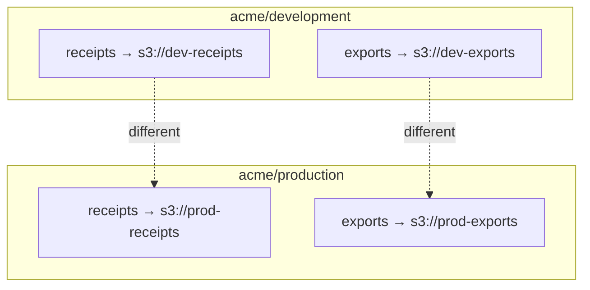

**Buckets** are the fundamental containers of Pawabase storage. Every bucket holds objects and is governed by its own read and write policies, backed by an S3-compatible driver. Every project-environment has its own set of buckets, and every bucket is isolated from every other bucket in the project.

<CardGroup cols={3}>
  <Card title="Create" icon="plus">Define a bucket with name, driver, and policies.</Card>
  <Card title="Configure" icon="wrench">Set driver config, policies, and flags.</Card>
  <Card title="Manage" icon="wrench">List, update, and delete buckets.</Card>
</CardGroup>

## Creating a bucket

A bucket is defined as a resource in the platform. When you create a bucket, you specify:

```json
{
  "name": "receipts",
  "driver": "s3",
  "config": {
    "endpoint": "https://s3.amazonaws.com",
    "region": "us-east-1",
    "bucket": "my-project-receipts"
  },
  "read_policy": {
    "all": [{"authenticated": true}]
  },
  "write_policy": {
    "all": [{"authenticated": true}, {"in": ["$auth.roles", ["admin"]]}]
  }
}
```

| Field | Type | Required | Description |
| --- | --- | --- | --- |
| `name` | `string` | yes | Unique bucket name within the project-environment |
| `driver` | `string` | yes | The S3-compatible driver (`s3`, `minio`, `gcs`, etc.) |
| `config` | `object` | yes | Driver-specific configuration (endpoint, region, bucket) |
| `read_policy` | `condition` | no | Defaults to `"authenticated"` |
| `write_policy` | `condition` | no | Defaults to `"authenticated"` |
| `signed_reads` | `boolean` | no | Whether signed URLs grant reads (default `true`) |
| `signed_writes` | `boolean` | no | Whether signed URLs grant writes (default `true`) |

The `config` object is passed directly to the driver. For the `s3` driver, it must include `endpoint`, `region`, and `bucket`. The bucket name in `config` is the actual bucket name in the S3-compatible store, which may differ from the Pawabase bucket name.

## Bucket isolation

Buckets are scoped to a project-environment pair (`acme/development`, `acme/production`). Two different environments can have a bucket with the same name pointing to different storage locations. This ensures that development data never leaks into production.



## Managing buckets

Buckets are managed through the platform API and Studio. From Studio (**Build → Storage → Buckets**) or via the `/storage/v1/buckets` management endpoint:

- **List**: All buckets in the current project-environment
- **Get**: Bucket configuration and policies
- **Update**: Modify policies, driver config, or flags (not the name)
- **Delete**: Remove a bucket and all its objects (irreversible)

```bash
# List buckets
curl "$GW/storage/v1/buckets" \
  -H "apikey: $PUBLISHABLE_KEY" -H "Authorization: Bearer $USER_TOKEN"

# Create a bucket
curl -X POST "$GW/storage/v1/buckets" \
  -H "apikey: $SECRET_KEY" -H "content-type: application/json" \
  -d '{"name": "exports", "driver": "s3", "config": {...}}'
```

## Bucket naming conventions

Bucket names must follow these conventions:

- Lowercase letters, numbers, and hyphens only
- Must start with a letter
- Maximum 63 characters
- Unique within a project-environment

Common naming patterns:

| Pattern | Example | Use case |
| --- | --- | --- |
| `data-<type>` | `data-receipts` | Project data |
| `user-<resource>` | `user-uploads` | User-generated content |
| `export-<name>` | `export-archives` | Batch exports |
| `cache-<name>` | `cache-thumbnails` | Cached media |

## Driver configuration

The driver determines how the store is accessed. The bucket's `config` object is driver-specific:

```json
{
  "driver": "s3",
  "config": {
    "endpoint": "https://s3.amazonaws.com",
    "region": "us-east-1",
    "bucket": "my-project-receipts",
    "acl": "private"
  }
}
```

See [Drivers](/storage/drivers) for the full list of supported drivers and their configuration options.

## Bucket policies and the policy engine

Bucket policies are evaluated by the same `PolicyEngine` that guards resources and routes. The engine supports the full policy condition language:

```json
{
  "read_policy": {
    "all": [
      {"authenticated": true},
      {"eq": ["$object.segments.0", "user"]},
      {"eq": ["$object.segments.1", "$auth.user_id"]}
    ]
  },
  "write_policy": {
    "all": [
      {"authenticated": true},
      {"in": ["$auth.roles", ["admin", "finance_staff"]]}
    ]
  }
}
```

The `$object` variable gives access to the object's key and path segments, enabling path-based access control. See [Access](/storage/access) for the full policy reference.

## Next

<CardGroup cols={2}>
  <Card title="Access" icon="shield-check" href="/storage/access">Bucket policies and permissions.</Card>
  <Card title="Uploads" icon="cloud-upload" href="/storage/uploads">How to upload files.</Card>
  <Card title="Downloads" icon="cloud-download" href="/storage/downloads">How to download files.</Card>
  <Card title="Overview" icon="folder" href="/storage/overview">Storage architecture and concepts.</Card>
</CardGroup>

