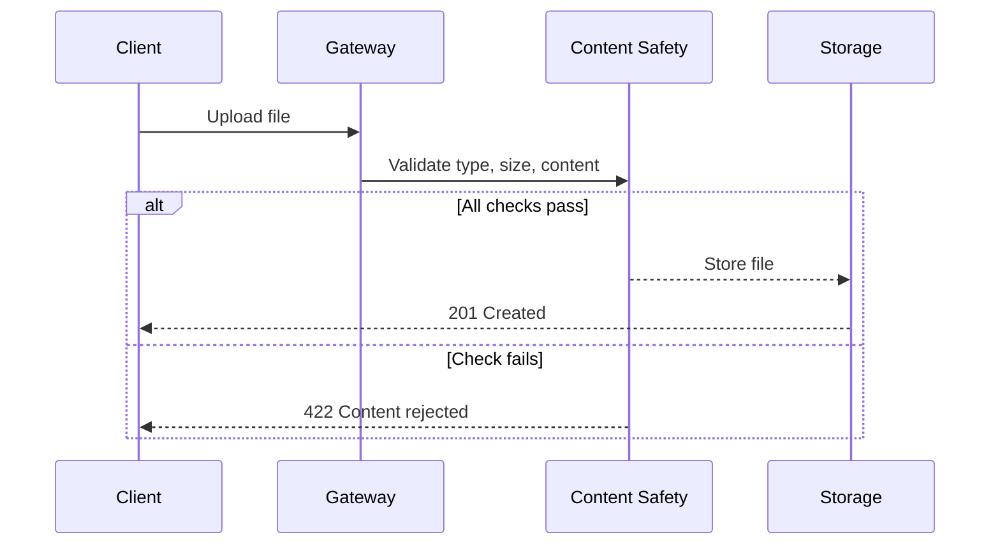
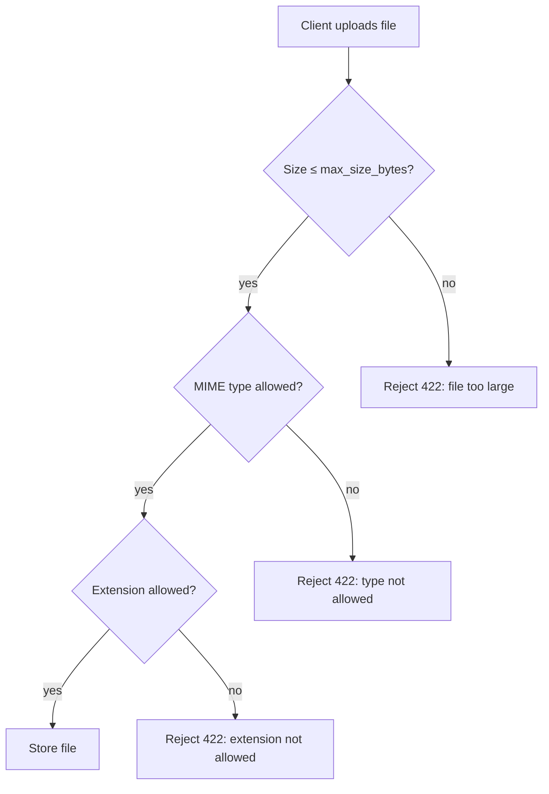

**Content safety** in Pawabase storage ensures that files uploaded to buckets meet configured standards for file type, size, and content integrity. When content safety checks are enabled on a bucket, every upload is validated before the file is accepted and stored.

<CardGroup cols={3}>
  <Card title="Type validation" icon="file">Restrict allowed file extensions and MIME types.</Card>
  <Card title="Size limits" icon="scale">Enforce maximum file sizes.</Card>
  <Card title="Scanning" icon="search">Detect malicious content before storage.</Card>
</CardGroup>

## How content safety works

When a client uploads a file to a bucket with content safety enabled, the following checks are performed in order:

1. **Extension check**: The file extension must match an allowed list
2. **MIME type check**: The detected MIME type must match an allowed list
3. **Size check**: The file must not exceed the configured maximum size
4. **Content scan**: Optional deep scan for malicious content



## Configuration

Content safety is configured per-bucket through the bucket's `content_safety` settings:

```json
{
  "name": "receipts",
  "content_safety": {
    "enabled": true,
    "max_size_bytes": 10485760,
    "allowed_types": ["image/jpeg", "image/png", "application/pdf"],
    "allowed_extensions": [".jpg", ".jpeg", ".png", ".pdf"],
    "scan_for_malware": false
  }
}
```

| Field | Type | Required | Description |
| --- | --- | --- | --- |
| `enabled` | `boolean` | no | Whether content safety is active (default `false`) |
| `max_size_bytes` | `integer` | no | Maximum file size in bytes (default 10 MB) |
| `allowed_types` | `array` | no | Allowed MIME types |
| `allowed_extensions` | `array` | no | Allowed file extensions |
| `scan_for_malware` | `boolean` | no | Whether to scan for malicious content (default `false`) |

If a file fails any check, the upload is rejected with a `422` status code and a description of which check failed. The file is never stored.

## File type validation

File type validation works on both the extension and the MIME type. The extension is checked against the `allowed_extensions` list, and the MIME type is detected from the file's content magic bytes (not from the `Content-Type` header, which can be spoofed).

Both checks must pass. If `allowed_types` is specified but `allowed_extensions` is not, only the MIME type is checked. If `allowed_extensions` is specified but `allowed_types` is not, only the extension is checked.

```json
// Example: only allow images
{
  "allowed_types": ["image/jpeg", "image/png", "image/webp"],
  "allowed_extensions": [".jpg", ".jpeg", ".png", ".webp"]
}
```

## Size limits

The `max_size_bytes` field enforces a hard limit on file size. If a client attempts to upload a file that exceeds this limit, the upload is rejected immediately. The gateway also enforces `max_body_bytes` (default 100 MB) as an additional safety layer.



## Malware scanning

When `scan_for_malware` is enabled, the uploaded file is scanned for known malicious patterns before storage. This requires the content safety scanner to be configured in the platform settings. The scan runs asynchronously — the upload is accepted but the file is quarantined until the scan completes.

<Note>
Malware scanning is an enterprise feature that requires additional configuration. Contact your Pawabase administrator to enable it for your project.
</Note>

## Next

<CardGroup cols={2}>
  <Card title="Buckets" icon="folder" href="/storage/buckets">Creating and managing buckets.</Card>
  <Card title="Uploads" icon="cloud-upload" href="/storage/uploads">How to upload files.</Card>
  <Card title="Access" icon="shield-check" href="/storage/access">Bucket policies and permissions.</Card>
  <Card title="Overview" icon="folder" href="/storage/overview">Storage architecture and concepts.</Card>
</CardGroup>

