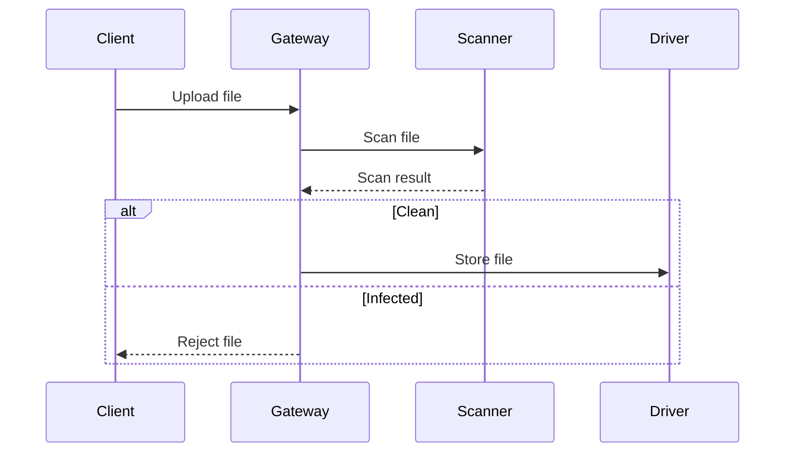

## Overview

Content safety features protect your storage from malicious files and policy violations. When enabled, every uploaded file is scanned for viruses, validated against allowed types, and checked against content moderation rules.

Content safety features protect your storage from malicious files and policy violations. When enabled, every uploaded file is scanned for viruses, validated against allowed types, and checked against content moderation rules.

Content safety features protect your storage from malicious files and policy violations. When enabled, every uploaded file is scanned for viruses, validated against allowed types, and checked against content moderation rules.

Content safety features protect your storage from malicious files and policy violations. When enabled, every uploaded file is scanned for viruses, validated against allowed types, and checked against content moderation rules.

Content safety features protect your storage from malicious files and policy violations. When enabled, every uploaded file is scanned for viruses, validated against allowed types, and checked against content moderation rules.

## How Content Safety Works



## Virus Scanning

Every uploaded file is scanned for known malware and viruses using integrated scanning engines.

Every uploaded file is scanned for known malware and viruses using integrated scanning engines.

Every uploaded file is scanned for known malware and viruses using integrated scanning engines.

Every uploaded file is scanned for known malware and viruses using integrated scanning engines.

Every uploaded file is scanned for known malware and viruses using integrated scanning engines.

| Engine | Description | Update Frequency |
| --- | --- | --- |
| Engine A | Signature-based detection | Real-time |
| Engine B | Heuristic analysis | Daily |

## File Validation

File validation checks the file type, size, and content against the bucket's configuration before accepting the upload.

File validation checks the file type, size, and content against the bucket's configuration before accepting the upload.

File validation checks the file type, size, and content against the bucket's configuration before accepting the upload.

File validation checks the file type, size, and content against the bucket's configuration before accepting the upload.

File validation checks the file type, size, and content against the bucket's configuration before accepting the upload.

```json
{
  "allowed_types": ["image/png", "image/jpeg", "image/gif"],
  "max_size": 5242880,
  "max_dimensions": [4096, 4096]
}
```

## Content Moderation

Content moderation uses AI-powered classifiers to detect inappropriate content in uploaded images and documents.

Content moderation uses AI-powered classifiers to detect inappropriate content in uploaded images and documents.

Content moderation uses AI-powered classifiers to detect inappropriate content in uploaded images and documents.

Content moderation uses AI-powered classifiers to detect inappropriate content in uploaded images and documents.

Content moderation uses AI-powered classifiers to detect inappropriate content in uploaded images and documents.

| Category | Description | Action |
| --- | --- | --- |
| NSFW detection | Detect inappropriate content | Quarantine or reject |
| Spam detection | Detect spam content | Reject |
| Copyright | Detect copyrighted material | Flag for review |

## Configuration

```yaml
- name: "uploads"
  content_safety: true
  safety_config:
    virus_scan: true
    file_validation: true
    content_moderation: true
```

## Handling Failures

When content safety checks fail, the upload is rejected and the client receives an error response.

When content safety checks fail, the upload is rejected and the client receives an error response.

When content safety checks fail, the upload is rejected and the client receives an error response.

When content safety checks fail, the upload is rejected and the client receives an error response.

When content safety checks fail, the upload is rejected and the client receives an error response.

Failed uploads are logged for auditing and troubleshooting purposes.
## Best Practices

**1. Enable content safety for all public-facing buckets**
**2. Configure appropriate file type restrictions**
**3. Set reasonable file size limits**
**4. Review quarantined files regularly**
**5. Keep virus definitions up to date**
<CardGroup cols={2}>
  <Card title="Buckets" icon="folder" href="/storage/buckets">Creating and managing buckets.</Card>
  <Card title="Access" icon="shield-check" href="/storage/access">Bucket policies and permissions.</Card>
</CardGroup>
