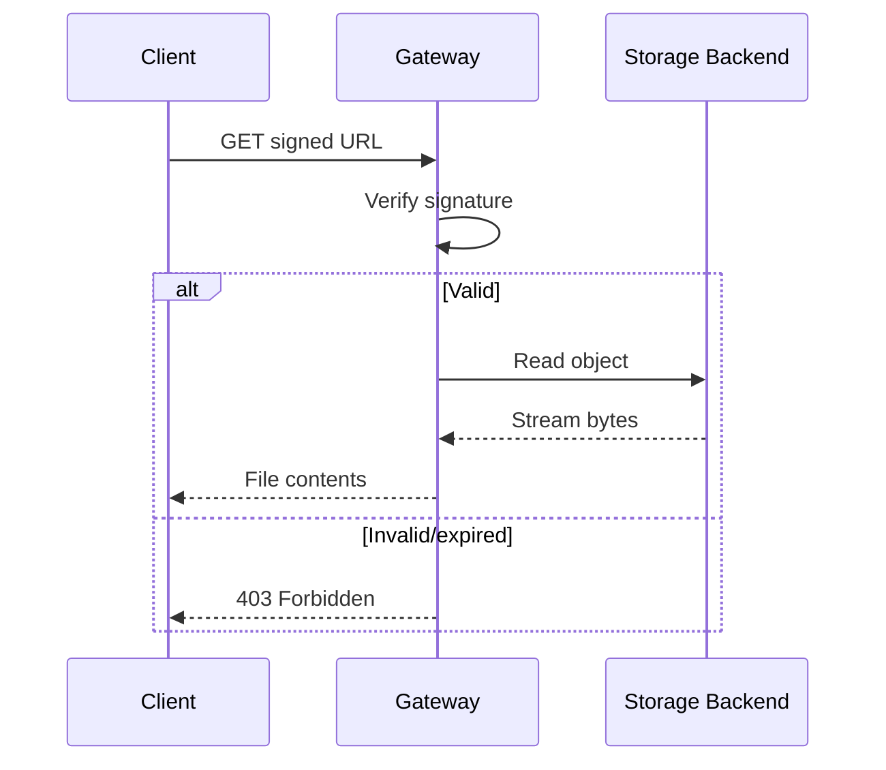
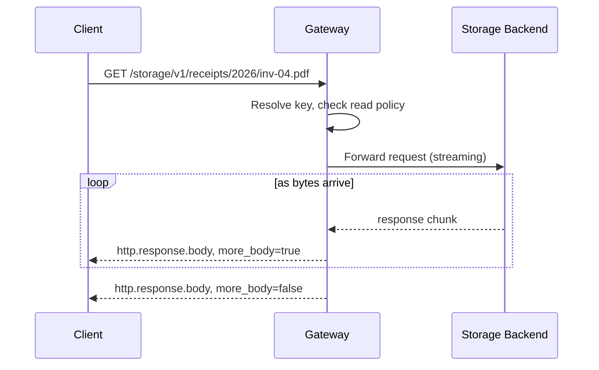

**Downloads** in Pawabase storage provide two mechanisms: pre-signed URLs for direct client downloads and the management API for server-side retrieval. Both respect the bucket's read policy, and both support streaming for large files.

<CardGroup cols={2}>
  <Card title="Signed URLs" icon="link">Time-limited URLs for direct client access.</Card>
  <Card title="API download" icon="code">Server-side retrieval through the API.</Card>
</CardGroup>

## Pre-signed URLs

The primary way clients download files is through pre-signed URLs. A signed URL is generated by calling `storage.signed_url` in a flow or through the management API:

```json
{
  "id": "get_download",
  "data": {
    "block": "storage.signed_url",
    "config": {
      "bucket": "receipts",
      "key": "2026/inv-04.pdf",
      "method": "GET",
      "expires_in": 300
    }
  }
}
```

| Config Field | Type | Required | Description |
| --- | --- | --- | --- |
| `bucket` | `string` | yes | The bucket name |
| `key` | `string` | yes | The object key |
| `method` | `string` | no | `GET` or `PUT` (default `GET`) |
| `expires_in` | `integer` | no | Seconds until expiration (default 300) |

The block returns a signed URL:

```json
{
  "url": "https://<api host>/storage/v1/signed/receipts/2026/inv-04.pdf?sig=..."
}
```

The signature is valid for `expires_in` seconds. After that, the URL returns a `403` error. The recipient doesn't need a Pawabase API key — the signature is the credential.

## Consuming a signed URL

A signed URL can be consumed by any HTTP client:

```bash
curl -o receipt.pdf "$GW/storage/v1/signed/receipts/2026/inv-04.pdf?sig=..."
```

The gateway handles the signed URL request without requiring a project API key or bearer token. The URL itself contains all the authorization information.



## API-side downloads

For server-side downloads, the `storage.read` block reads a file from a bucket:

```json
{
  "id": "read_file",
  "data": {
    "block": "storage.read",
    "config": {
      "bucket": "receipts",
      "key": "2026/inv-04.pdf"
    }
  }
}
```

The block returns the file content as text (UTF-8 decoded). This is limited to 1 MB (`storage_read` default limit of 1,048,576 bytes). For larger files, use signed URLs.

```python
data = await run.runtime.storage_read("receipts", "2026/inv-04.pdf")
return BlockResult(output=data.decode("utf-8", "replace"))
```

## Streaming downloads

Large downloads stream through the gateway without buffering the entire file in memory. The gateway uses `response.aiter_raw()` to relay bytes chunk by chunk as `more_body: True` frames, finishing with an empty `more_body: False` frame:



The gateway doesn't buffer the response — it relays chunks as they arrive from the storage backend. This means a 300 MB export can be downloaded without the gateway allocating 300 MB of memory.

## Access control on downloads

Every download is gated by the bucket's `read_policy`. The policy evaluation includes the object's key and path segments, so you can write path-based access rules:

```json
{
  "read_policy": {
    "all": [
      {"authenticated": true},
      {"eq": ["$object.segments.0", "user"]},
      {"eq": ["$object.segments.1", "$auth.user_id"]}
    ]
  }
}
```

This ensures that only authenticated users can read files under `user/<their_user_id>/`.

## Next

<CardGroup cols={2}>
  <Card title="Buckets" icon="folder" href="/storage/buckets">Creating and managing buckets.</Card>
  <Card title="Uploads" icon="cloud-upload" href="/storage/uploads">How to upload files.</Card>
  <Card title="Access" icon="shield-check" href="/storage/access">Bucket policies and permissions.</Card>
  <Card title="Overview" icon="folder" href="/storage/overview">Storage architecture and concepts.</Card>
</CardGroup>

