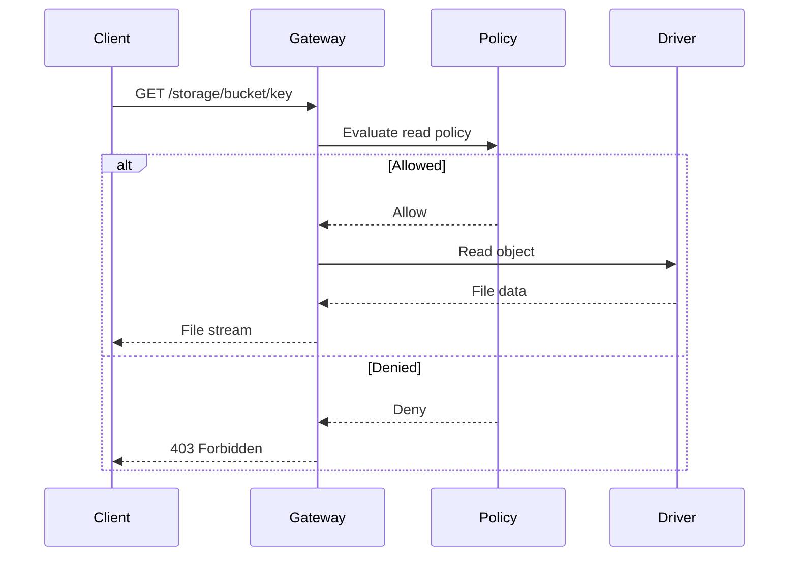

## Overview

Downloads in Pawabase storage can be performed using signed URLs, direct access, or streaming. Each method has its own use case and security implications.

Downloads in Pawabase storage can be performed using signed URLs, direct access, or streaming. Each method has its own use case and security implications.

Downloads in Pawabase storage can be performed using signed URLs, direct access, or streaming. Each method has its own use case and security implications.

Downloads in Pawabase storage can be performed using signed URLs, direct access, or streaming. Each method has its own use case and security implications.

Downloads in Pawabase storage can be performed using signed URLs, direct access, or streaming. Each method has its own use case and security implications.

## Download Methods

| Method | Description | Use Case |
| --- | --- | --- |
| Signed URL | Time-limited URL for secure downloads | Temporary access |
| Direct Access | Permanent URL with policy enforcement | Public content |
| Streaming | Chunked download for large files | Media playback |

## Signed URLs

Signed URLs are time-limited URLs that grant temporary access to a specific object. They are the most secure way to download files.

Signed URLs are time-limited URLs that grant temporary access to a specific object. They are the most secure way to download files.

Signed URLs are time-limited URLs that grant temporary access to a specific object. They are the most secure way to download files.

Signed URLs are time-limited URLs that grant temporary access to a specific object. They are the most secure way to download files.

Signed URLs are time-limited URLs that grant temporary access to a specific object. They are the most secure way to download files.

To generate a signed URL:
```python
from pawabase import storage

url = await storage.generate_signed_url(
    bucket="documents",
    key="report.pdf",
    expires_in=3600
)
```

```json
{
  "url": "https://storage.example.com/documents/report.pdf?token=...",
  "expires_at": 1699003600
}
```

## Direct Access

When the bucket read policy allows public access, objects can be downloaded directly without signed URLs.

When the bucket read policy allows public access, objects can be downloaded directly without signed URLs.

When the bucket read policy allows public access, objects can be downloaded directly without signed URLs.

When the bucket read policy allows public access, objects can be downloaded directly without signed URLs.

When the bucket read policy allows public access, objects can be downloaded directly without signed URLs.

Direct access URLs follow this pattern:
```
https://<gateway host>/storage/<bucket>/<key>
```

## Streaming Downloads

Streaming downloads allow clients to download large files in chunks. This is useful for media files and large documents.

Streaming downloads allow clients to download large files in chunks. This is useful for media files and large documents.

Streaming downloads allow clients to download large files in chunks. This is useful for media files and large documents.

Streaming downloads allow clients to download large files in chunks. This is useful for media files and large documents.

Streaming downloads allow clients to download large files in chunks. This is useful for media files and large documents.

| Header | Description |
| --- | --- |
| Content-Length | Total size of the file |
| Content-Range | Byte range for streaming |
| Accept-Ranges | Supports range requests |

## Download Behavior



## Best Practices

**1. Use signed URLs for sensitive files**
**2. Set short expiration times for signed URLs**
**3. Use streaming for large files**
**4. Monitor download patterns for abuse**
**5. Use content disposition headers for browser downloads**
<CardGroup cols={2}>
  <Card title="Buckets" icon="folder" href="/storage/buckets">Creating and managing buckets.</Card>
  <Card title="Uploads" icon="cloud-upload" href="/storage/uploads">How to upload files.</Card>
</CardGroup>
