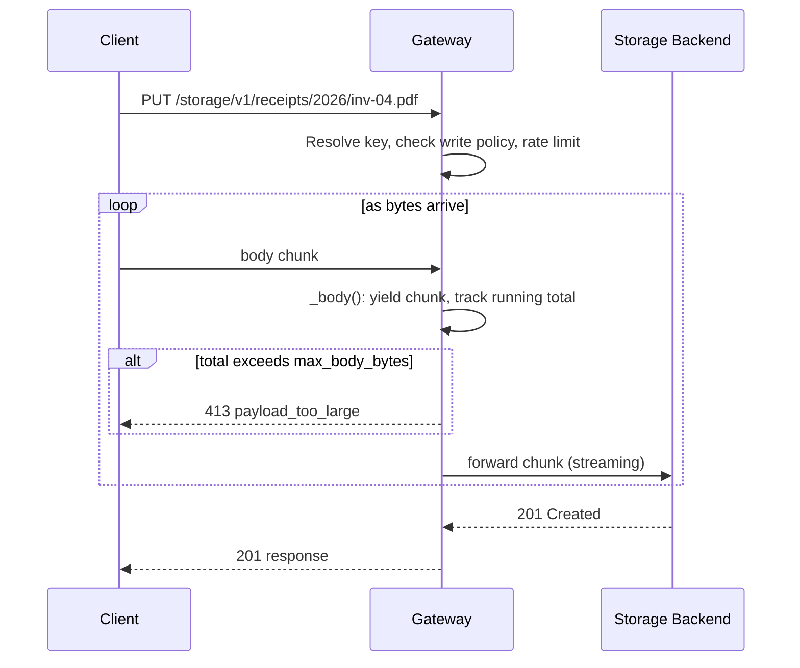

**Uploads** in Pawabase storage provide two primary mechanisms: pre-signed URLs for direct client-side uploads and the management API for server-side uploads. All uploads respect the bucket's `write_policy`, and content safety checks can be enforced per-bucket.

<CardGroup cols={2}>
  <Card title="Signed URLs" icon="link">Generate a URL, upload directly to storage.</Card>
  <Card title="API upload" icon="code">Server-side uploads through the API.</Card>
</CardGroup>

## Pre-signed URLs for upload

The preferred way to upload files from a client is through pre-signed PUT URLs. A signed URL is generated by calling `storage.signed_url` with `method: "PUT"`:

```json
{
  "id": "get_upload_url",
  "data": {
    "block": "storage.signed_url",
    "config": {
      "bucket": "receipts",
      "key": "2026/inv-04.pdf",
      "method": "PUT",
      "expires_in": 300
    }
  }
}
```

The block returns a signed URL that the client can PUT to directly:

```json
{
  "url": "https://<api host>/storage/v1/signed/receipts/2026/inv-04.pdf?sig=..."
}
```

The client uploads the file directly to the storage backend using the signed URL:

```bash
curl -X PUT "$SIGNED_URL" \
  -H "Content-Type: application/pdf" \
  --data-binary @inv-04.pdf
```

The signed URL includes the signature, so no Pawabase API key is needed for the upload. The URL is valid for `expires_in` seconds (default 300).

## Streaming uploads

For large uploads, the gateway streams the request body directly to the storage backend without buffering in memory. The gateway's `_body()` function reads ASGI `http.request` messages as they arrive and yields each chunk immediately:



The gateway enforces `max_body_bytes` (default 100 MB) as a safety limit. If the request body exceeds this, the upload is rejected with `413 payload_too_large` and the client's upload is aborted.

## API-side uploads

Server-side code can upload files through the `storage.put` block or the `storage_put` runtime method:

```json
{
  "id": "archive",
  "data": {
    "block": "storage.put",
    "config": {
      "bucket": "exports",
      "key": "orders/{{ steps.day.output }}.json",
      "content": "{{ steps.rows.output }}",
      "content_type": "application/json"
    }
  }
}
```

The `storage.put` block converts the `content` to bytes and delegates to `runtime.storage_put()`:

```python
data = content.encode() if isinstance(content, str) else content
await run.runtime.storage_put(bucket, key, data, content_type)
```

This runs with the platform's service credentials, so it always succeeds regardless of the bucket's `write_policy`.

## Content safety on upload

When a bucket has content safety enabled, uploads are validated before storage. See [Content safety](/storage/content-safety) for details on file type validation, size limits, and malware scanning.

If an upload fails content safety checks, the file is rejected with a `422` error and the file is never stored.

## Upload constraints

| Constraint | Default | Description |
| --- | --- | --- |
| `max_body_bytes` | 100 MB | Maximum request body size at the gateway |
| `max_message_bytes` | 64 KB | Maximum client message in realtime channels |
| `history_bytes` | 256 KB | Maximum history per channel |
| Content safety `max_size_bytes` | 10 MB | Per-bucket upload size limit |

## Best practices

1. **Use signed URLs for client uploads** — they avoid proxying the entire file through the gateway and reduce server load.
2. **Validate file types before upload** — use client-side validation to catch unsupported types early.
3. **Set appropriate `expires_in`** — short-lived URLs (5-15 minutes) are more secure.
4. **Generate unique keys** — use UUIDs or timestamps in keys to prevent overwrites.
5. **Use content safety** — enable it for buckets that accept user-uploaded files.

## Next

<CardGroup cols={2}>
  <Card title="Buckets" icon="folder" href="/storage/buckets">Creating and managing buckets.</Card>
  <Card title="Downloads" icon="cloud-download" href="/storage/downloads">How to download files.</Card>
  <Card title="Access" icon="shield-check" href="/storage/access">Bucket policies and permissions.</Card>
  <Card title="Overview" icon="folder" href="/storage/overview">Storage architecture and concepts.</Card>
</CardGroup>

