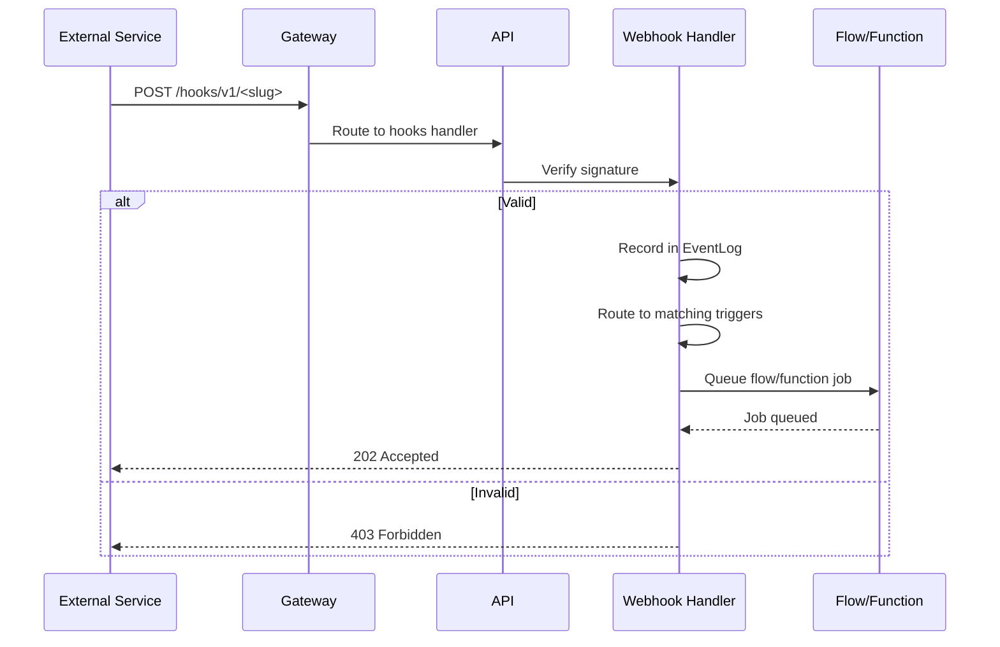

**Inbound webhooks** allow external services to send events into your Pawabase project. When a third-party service (GitHub, Stripe, Slack, or any custom integration) sends an HTTP POST to an inbound webhook endpoint, Pawabase verifies the signature, records the event, and routes it to the matching trigger — a flow, a function, or an event emission.

<CardGroup cols={3}>
  <Card title="Verify" icon="shield-check">Signature and freshness checks.</Card>
  <Card title="Route" icon="flowchart">Dispatch to flows, functions, or events.</Card>
  <Card title="Record" icon="database">Every inbound webhook is logged.</Card>
</CardGroup>

## How inbound webhooks work

1. An **inbound webhook** is configured with a slug and an event pattern
2. An external service sends an HTTP POST to the webhook endpoint
3. Pawabase verifies the request signature
4. The event is recorded in the `EventLog` table
5. The event is routed to matching consumers: flows with `trigger.webhook`, subscriptions, or functions
6. The consumer executes (queued as a job)
7. A response is returned to the caller



## Webhook endpoint

Inbound webhooks are served at `/hooks/v1/<slug>` on the gateway. The gateway requires no project API key — the webhook's own signature authenticates the request. The slug is configured when creating the inbound webhook.

```bash
# Receive a webhook from an external service
curl -X POST "$GW/hooks/v1/github-events" \
  -H "X-Pawabase-Signature: t=1700000000,v1=..." \
  -H "content-type: application/json" \
  -d '{"action": "opened", "issue": {...}}'
```

The gateway's `/hooks/v1/*` route is listed in the [public surface](/concepts/architecture) as a key-optional path because the upstream authenticates the request using the webhook signature rather than a project API key.

## Signature verification

Every inbound webhook request must include a `Pawabase-Signature` header. Pawabase supports two signature formats:

1. **Pawabase format**: `t=<timestamp>,v1=<hex HMAC-SHA256 of "t.body">`
2. **Plain HMAC format**: Bare hex or `sha256=<hex>` (for GitHub, Shopify, and similar providers)

```python services/api/app/webhooks.py
def sign_payload(secret: str, body: bytes, timestamp: int | None = None) -> str:
    timestamp = int(timestamp or time.time())
    digest = hmac.new(secret.encode(), f"{timestamp}.".encode() + body, hashlib.sha256).hexdigest()
    return f"t={timestamp},v1={digest}"

def verify_signature(secret: str, body: bytes, header: str, *, tolerance: int = TOLERANCE_SECONDS) -> bool:
    parts = dict(item.split("=", 1) for item in header.split(",") if "=" in item)
    try:
        timestamp = int(parts.get("t", ""))
    except ValueError:
        return False
    if abs(time.time() - timestamp) > tolerance:
        return False
    expected = hmac.new(secret.encode(), f"{timestamp}.".encode() + body, hashlib.sha256).hexdigest()
    return hmac.compare_digest(expected, parts.get("v1", ""))
```

The timestamp tolerance is 300 seconds. A request with a timestamp older than 5 minutes is rejected as a replay attack prevention measure. The comparison uses `hmac.compare_digest` to prevent timing attacks.

## Routing to flows

An inbound webhook's payload is matched against flow triggers. Flows with a `trigger.webhook` block whose `hook` config matches the webhook slug are invoked:

```json
{
  "nodes": [
    {
      "id": "webhook_handler",
      "data": {
        "block": "trigger.webhook",
        "config": {"hook": "github-events"}
      }
    },
    {
      "id": "process",
      "data": {
        "block": "resource.create",
        "config": {"resource": "issues", "data": "{{ steps.webhook_handler.output }}"}
      }
    }
  ],
  "edges": [{"source": "webhook_handler", "target": "process"}]
}
```

When a matching webhook is received, the flow is queued as a `RunFlowJob` and the worker processes it asynchronously.

## Event emissions

In addition to triggering flows, inbound webhooks can emit platform events. The event processor routes events to subscriptions and realtime channels automatically:

```python services/api/app/events.py
class EventProcessor:
    async def handle(self, event: PlatformEvent) -> list[dict[str, Any]]:
        ...
        for subscription in state.subscriptions:
            if not fnmatch.fnmatchcase(event.name, subscription.event):
                continue
            ...
        if any(endpoint.enabled and endpoint_matches(endpoint.events, event.name) ...):
            await queue_deliveries(...)
```

## Webhook delivery records

Every inbound webhook request is recorded in the `EventLog` table:

```json
{
  "event_id": "evt_abc123",
  "project": "acme",
  "env": "production",
  "name": "github:issues",
  "source": "webhook",
  "actor": "system",
  "payload": {"action": "opened", "issue": {...}},
  "consumers": [{"type": "flow", "target": "issue-processor", "status": "queued"}]
}
```

You can inspect webhook delivery history from Studio (**Build → Webhooks → Deliveries**) or through the management API.

## Concurrency and retries

Inbound webhooks are processed by the worker queue. Each webhook-triggered flow or function is queued as a job with its own retry policy. If a job fails, it's retried according to its configuration and eventually dead-lettered after too many failures.

The worker processes jobs from the `events`, `webhooks`, `flows`, `functions`, and `mail` queues. You can configure additional queues via `PAWABASE_WORKER_QUEUES`.

<Warning>
Always verify the webhook signature before processing. Without verification, an attacker could forge webhook requests and trigger unauthorized actions. The signature must be checked against the webhook's secret, and the timestamp must be within the 300-second tolerance window.
</Warning>

## Next

<CardGroup cols={2}>
  <Card title="Signatures" icon="key" href="/webhooks/signatures">Detailed signature verification and code examples.</Card>
  <Card title="Outbound" icon="link" href="/webhooks/outbound">Delivering events to external endpoints.</Card>
  <Card title="Events" icon="bolt" href="/events/overview">The event system.</Card>
  <Card title="Subscriptions" icon="link" href="/events/subscriptions">How subscriptions work.</Card>
</CardGroup>

