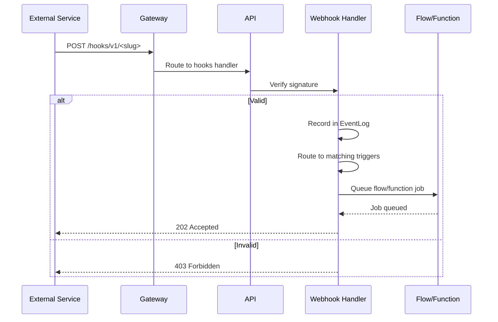

**Inbound webhooks** allow external services to send events into your Pawabase project. When a third-party service (GitHub, Stripe, Slack, or any custom integration) sends an HTTP POST to an inbound webhook endpoint, Pawabase verifies the signature, records the event, and routes it to the matching trigger — a flow, a function, or an event emission. This page covers the complete inbound webhook pipeline from configuration to delivery.

<CardGroup cols={3}>
  <Card title="Verify" icon="shield-check">Signature and freshness checks.</Card>
  <Card title="Route" icon="flowchart">Dispatch to flows, functions, or events.</Card>
  <Card title="Record" icon="database">Every inbound webhook is logged.</Card>
</CardGroup>

## How inbound webhooks work

The inbound webhook pipeline processes every incoming webhook request through these stages:

1. An **inbound webhook** is configured with a slug and an event pattern
2. An external service sends an HTTP POST to the webhook endpoint
3. Pawabase verifies the request signature
4. The event is recorded in the `EventLog` table
5. The event is routed to matching consumers: flows with `trigger.webhook`, subscriptions, or functions
6. The consumer executes (queued as a job)
7. A response is returned to the caller



The gateway's `/hooks/v1/*` route is listed in the public surface as a key-optional path because the upstream authenticates the request using the webhook signature rather than a project API key.

## Webhook endpoint

Inbound webhooks are served at `/hooks/v1/<slug>` on the gateway. The gateway requires no project API key — the webhook's own signature authenticates the request. The slug is configured when creating the inbound webhook.

```bash
# Receive a webhook from an external service
curl -X POST "$GW/hooks/v1/github-events" \
  -H "X-Pawabase-Signature: t=1700000000,v1=..." \
  -H "content-type: application/json" \
  -d '{"action": "opened", "issue": {...}}'
```

The slug is a unique identifier for the inbound webhook. It is set when the inbound webhook is created in Studio's **Build → Webhooks → Inbound** section. The slug must be URL-safe and unique within the project.

## Signature verification

Every inbound webhook request must include a `Pawabase-Signature` header. Pawabase supports two signature formats:

1. **Pawabase format**: `t=<timestamp>,v1=<hex HMAC-SHA256 of "t.body">`
2. **Plain HMAC format**: Bare hex or `sha256=<hex>` (for GitHub, Shopify, and similar providers)

The signature verification is performed by the `verify_signature` and `verify_plain_hmac` functions in `services/api/app/webhooks.py`:

```python
def verify_signature(
    secret: str, body: bytes, header: str, *, tolerance: int = TOLERANCE_SECONDS
) -> bool:
    """Check a ``t=…,v1=…`` signature (the format Pawabase sends)."""
    parts = dict(item.split("=", 1) for item in header.split(",") if "=" in item)
    try:
        timestamp = int(parts.get("t", ""))
    except ValueError:
        return False
    if abs(time.time() - timestamp) > tolerance:
        return False
    expected = hmac.new(
        secret.encode(), f"{timestamp}.".encode() + body, hashlib.sha256
    ).hexdigest()
    return hmac.compare_digest(expected, parts.get("v1", ""))
```

The timestamp tolerance is 300 seconds. A request with a timestamp older than 5 minutes is rejected as a replay attack prevention measure. The comparison uses `hmac.compare_digest` to prevent timing attacks.

```python
def verify_plain_hmac(secret: str, body: bytes, signature: str) -> bool:
    """Check a bare hex (optionally ``sha256=``-prefixed) HMAC-SHA256 of the body."""
    signature = signature.split("=", 1)[1] if signature.startswith("sha256=") else signature
    expected = hmac.new(secret.encode(), body, hashlib.sha256).hexdigest()
    return hmac.compare_digest(expected, signature.strip())
```

This handles webhooks that arrive with `X-Hub-Signature-256` (GitHub) or `X-Shopify-Hmac-SHA256` (Shopify) headers.

## Routing to flows

An inbound webhook's payload is matched against flow triggers. Flows with a `trigger.webhook` block whose `hook` config matches the webhook slug are invoked:

```json
{
  "nodes": [
    {
      "id": "webhook_handler",
      "data": {
        "block": "trigger.webhook",
        "config": {"hook": "github-events"}
      }
    },
    {
      "id": "process",
      "data": {
        "block": "resource.create",
        "config": {"resource": "issues", "data": "{{ steps.webhook_handler.output }}"}
      }
    }
  ],
  "edges": [{"source": "webhook_handler", "target": "process"}]
}
```

When a matching webhook is received, the flow is queued as a `RunFlowJob` and the worker processes it asynchronously. The `WebhookTrigger` block in `pawabase_kit/flows/blocks/triggers.py` defines the configuration:

```python
class WebhookTrigger(_Trigger):
    key = "trigger.webhook"
    title = "Inbound webhook"
    config = [
        {"name": "hook", "type": "string", "required": True, "description": "Inbound webhook slug"}
    ]
```

The `trigger.webhook` node receives the webhook payload as `input`. The payload is the raw JSON body of the incoming request, parsed into a Python object. The flow can access the payload through `{{ input.action }}` or `{{ input.issue.title }}` depending on the webhook source.

## Event emissions

In addition to triggering flows, inbound webhooks can emit platform events. The event processor routes events to subscriptions and realtime channels automatically:

```python
class EventProcessor:
    async def handle(self, event: PlatformEvent) -> list[dict[str, Any]]:
        ...
        for subscription in state.subscriptions:
            if not fnmatch.fnmatchcase(event.name, subscription.event):
                continue
            ...
        if any(endpoint.enabled and endpoint_matches(endpoint.events, event.name) ...):
            await queue_deliveries(...)
```

When an inbound webhook creates an event, the event goes through the same `EventProcessor` as all other events. The event name follows the pattern `<slug>:<action>` where `<slug>` is the webhook slug and `<action>` is derived from the webhook payload.

## Webhook delivery records

Every inbound webhook request is recorded in the `EventLog` table:

```json
{
  "event_id": "evt_abc123",
  "project": "acme",
  "env": "production",
  "name": "github:issues",
  "source": "webhook",
  "actor": "system",
  "payload": {"action": "opened", "issue": {...}},
  "consumers": [{"type": "flow", "target": "issue-processor", "status": "queued"}]
}
```

You can inspect webhook delivery history from Studio (**Build → Webhooks → Deliveries**) or through the management API.

## Concurrency and retries

Inbound webhooks are processed by the worker queue. Each webhook-triggered flow or function is queued as a job with its own retry policy. If a job fails, it's retried according to its configuration and eventually dead-lettered after too many failures.

The worker processes jobs from the `events`, `webhooks`, `flows`, `functions`, and `mail` queues. You can configure additional queues via `PAWABASE_WORKER_QUEUES`.

The `RunFlowJob` that is dispatched for webhook-triggered flows uses the flow's configured timeout:

```python
class RunFlowJob(PawabaseJob):
    queue = "flows"
    tries = 1
    timeout = 300.0
```

The flow execution is handled by `run_flow` in `services/api/app/execution.py`:

```python
async def run_flow(platform, state, name, input, *, trigger, auth, ...):
    flow = state.flows.get(name)
    if flow is None:
        raise NotFound(f"no flow {name!r}")
    runtime = ApiRuntime(platform, state, auth=auth, request_id=request_id)
    run = FlowRun(flow.definition, runtime=runtime, input=input, ...)
    await run.execute()
```

## Inbound webhook configuration

Each inbound webhook has these properties:

| Property | Description |
| --- | --- |
| `slug` | The URL path segment (`/hooks/v1/<slug>`) |
| `name` | Human-readable name |
| `secret` | Signing secret name (referenced from the secret store) |
| `events` | Event patterns to match |
| `enabled` | Whether the webhook is active |

The secret is stored in the Pawabase secret store and encrypted using `SecretBox` with the platform's master key. The `SecretBox` class in `pawabase_kit/crypto.py` provides encryption and decryption:

```python
class SecretBox:
    def __init__(self, master_key: str) -> None:
        self._key = _fernet_key(master_key)

    def seal(self, plaintext: str) -> str:
        return encrypt(plaintext, self._key)

    def open(self, ciphertext: str) -> str:
        return decrypt(ciphertext, self._key)
```

When a webhook request arrives, the platform opens the secret using `platform.box.open(endpoint.secret_ciphertext)` and uses it to verify the signature.

## Signature verification in detail

The signature verification process for inbound webhooks:

1. **Extract the header** — Read the `Pawabase-Signature` header from the request
2. **Parse the signature** — Split the header into timestamp and signature components
3. **Check the timestamp** — Ensure the timestamp is within the 300-second tolerance window
4. **Compute the expected signature** — HMAC-SHA256 of `"{timestamp}.{body}"` using the webhook's secret
5. **Compare signatures** — Use `hmac.compare_digest` for constant-time comparison
6. **Return result** — If valid, process the webhook; if invalid, return 403

```python
def verify_signature(secret, body, header, *, tolerance=300):
    parts = dict(item.split("=", 1) for item in header.split(",") if "=" in item)
    try:
        timestamp = int(parts.get("t", ""))
    except ValueError:
        return False
    if abs(time.time() - timestamp) > tolerance:
        return False
    expected = hmac.new(secret.encode(), f"{timestamp}.".encode() + body, hashlib.sha256).hexdigest()
    return hmac.compare_digest(expected, parts.get("v1", ""))
```

## Inbound webhook security

Security is paramount for inbound webhooks. Every aspect of the pipeline is designed to prevent unauthorized access:

- **Signature verification** — Every request must have a valid `Pawabase-Signature` header
- **Timestamp tolerance** — Requests older than 5 minutes are rejected
- **Constant-time comparison** — `hmac.compare_digest` prevents timing attacks
- **Secret encryption** — Secrets are encrypted at rest using the platform master key
- **No project API key required** — The gateway route doesn't require a project API key, since the signature provides authentication
- **Private URL check** — The `check_target` function in `app/outbound.py` prevents webhooks from being sent to private or loopback addresses

<Warning>
Always verify the webhook signature before processing. Without verification, an attacker could forge webhook requests and trigger unauthorized actions. The signature must be checked against the webhook's secret, and the timestamp must be within the 300-second tolerance window.
</Warning>

## Error handling

When an inbound webhook request fails verification:

- **Invalid signature** — Return 403 Forbidden
- **Expired timestamp** — Return 403 Forbidden with "Signature expired" message
- **Missing signature** — Return 403 Forbidden
- **Malformed signature** — Return 403 Forbidden

When the webhook is verified but processing fails:

- **Flow not found** — Return 404 Not Found
- **Flow disabled** — Return 409 Conflict
- **Queue error** — The job is retried according to its retry policy

## Webhook payload examples

### GitHub webhook

```json
{
  "action": "opened",
  "issue": {
    "number": 42,
    "title": "Bug report",
    "body": "The login button doesn't work",
    "state": "open",
    "labels": ["bug", "priority-high"],
    "user": {"login": "ada"},
    "repository": {"full_name": "acme/project"}
  },
  "sender": {"login": "ada", "id": 12345}
}
```

### Stripe webhook

```json
{
  "id": "evt_123",
  "object": "event",
  "type": "payment_intent.succeeded",
  "data": {
    "object": {
      "id": "pi_123",
      "amount": 2999,
      "currency": "usd",
      "status": "succeeded",
      "customer": "cus_123",
      "receipt_url": "https://payments.stripe.com/receipts/pi_123"
    }
  },
  "created": 1700000000,
  "livemode": true
}
```

### Slack webhook

```json
{
  "token": "xyzz0WxbapY4vKWOmDVYp1Rl",
  "team_id": "T1DC2JH3J",
  "event": {
    "type": "message",
    "channel": "C1DC2JH3J",
    "user": "U1DC2JH3J",
    "text": "Hello, world!",
    "ts": "1700000000.000000"
  },
  "type": "event_callback",
  "event_id": "Ev1234567890",
  "event_time": 1700000000
}
```

## Next

<CardGroup cols={2}>
  <Card title="Signatures" icon="key" href="/webhooks/signatures">Detailed signature verification and code examples.</Card>
  <Card title="Outbound" icon="link" href="/webhooks/outbound">Delivering events to external endpoints.</Card>
  <Card title="Events" icon="bolt" href="/events/overview">The event system.</Card>
  <Card title="Subscriptions" icon="link" href="/events/subscriptions">How subscriptions work.</Card>
</CardGroup>

## Summary

Pawabase's inbound webhook system provides a complete pipeline for receiving events from external services. Every request is verified using HMAC-SHA256 signatures, recorded in the `EventLog` table, and routed to matching flow triggers, function subscriptions, or event emissions. The system supports both the native Pawabase signature format and plain HMAC formats for compatibility with GitHub, Shopify, and other providers. Inbound webhooks are served at `/hooks/v1/<slug>` without requiring a project API key, and every aspect of the pipeline includes security measures including timestamp tolerance, constant-time comparison, and encrypted secrets. See [Signatures](/webhooks/signatures) for detailed verification examples, [Outbound](/webhooks/outbound) for delivering events externally, and [Events](/events/overview) for the event system.

## Webhook endpoint model (expanded)

### The `WebhookEndpoint` model

Webhook endpoints are stored as `WebhookEndpoint` records:

```python
class WebhookEndpoint(Model):
    id = UUIDField(primary_key=True)
    slug = CharField(unique=True)
    project = CharField()
    env = CharField()
    events = JSONField(default=list)
    url = CharField()
    enabled = BooleanField(default=True)
    secret = CharField(null=True)
    retry_config = JSONField(default=lambda: {"max_retries": 3})
    created_at = DateTimeField(auto_now_add=True)
    updated_at = DateTimeField(auto_now=True)
```

The `events` field is a list of event patterns the endpoint listens for:

```json
["order.created", "order.paid", "order.cancelled"]
```

The `secret` field is used for HMAC signature verification.

### Endpoint matching

The `endpoint_matches` function determines if an event matches an endpoint:

```python
def endpoint_matches(endpoint_events: list[str], event_name: str) -> bool:
    for endpoint_event in endpoint_events:
        if fnmatch.fnmatchcase(event_name, endpoint_event):
            return True
    return False
```

Event patterns use `fnmatch` glob matching, allowing wildcards.

## Webhook delivery lifecycle (expanded)

### Step 1: Event receipt

When an event is published, the `EventProcessor.route` method checks all webhook endpoints:

```python
if any(endpoint.enabled and endpoint_matches(endpoint.events, event.name)
       for endpoint in state.webhooks):
    await attempt("webhook", "endpoints", lambda: queue_deliveries(
        platform, state, event_id=event.id, event=event.name, payload=event.payload
    ))
```

If any endpoint matches, the `queue_deliveries` function is called.

### Step 2: Delivery queueing

The `queue_deliveries` function creates delivery jobs:

```python
async def queue_deliveries(platform, state, event_id, event, payload):
    for endpoint in state.webhooks:
        if not endpoint.enabled:
            continue
        if not endpoint_matches(endpoint.events, event):
            continue
        # Create delivery job for this endpoint
        await platform.dispatch(
            DeliverWebhookJob,
            project=state.project_ref, env=state.env_name,
            endpoint=endpoint.slug,
            event=event, payload=payload, event_id=event_id,
        )
```

Each matching endpoint gets a delivery job.

### Step 3: HTTP delivery

The `DeliverWebhookJob` sends an HTTP POST to the endpoint URL:

```python
class DeliverWebhookJob(Job):
    queue = "webhooks"

    async def run(self):
        delivery = await self._prepare_delivery()
        response = await self._send(delivery)
        await self._record_result(delivery, response)
```

The HTTP request includes:

- **Method**: `POST`
- **URL**: The endpoint's configured URL
- **Headers**: Content-Type, X-Pawabase-Signature, X-Pawabase-Event
- **Body**: The event payload as JSON
- **Timeout**: Configurable request timeout

### Step 4: Response handling

The response determines the delivery outcome:

| Response | Status | Action |
| --- | --- | --- |
| `2xx` | Delivered | Record success, stop |
| `4xx` (client error) | Failed | Record failure, don't retry |
| `5xx` (server error) | Failed | Retry based on config |
| Connection error | Failed | Retry based on config |
| Timeout | Failed | Retry based on config |
| No response | Failed | Retry based on config |

### Step 5: Retry logic

Failed deliveries are retried:

```python
class DeliverWebhookJob(Job):
    queue = "webhooks"

    async def run(self):
        for attempt in range(self.max_retries):
            try:
                response = await self._send()
                if response.status_code < 400:
                    return  # Success
                if response.status_code < 500:
                    break  # Client error, don't retry
            except Exception:
                pass  # Connection error, retry
        # All retries exhausted
        await self._record_failure()
```

The retry configuration:

- **max_retries**: Number of retry attempts (default: 3)
- **retry_delay**: Delay between retries (exponential backoff)
- **retry_backoff**: Exponential backoff factor

## Webhook signature verification (expanded)

### HMAC signature generation

When a webhook is sent, the signature is generated using HMAC-SHA256:

```python
import hmac
import hashlib

def generate_signature(payload: bytes, secret: str) -> str:
    mac = hmac.new(secret.encode(), payload, hashlib.sha256)
    return mac.hexdigest()
```

The signature is included in the `X-Pawabase-Signature` header.

### Signature verification on receipt

When an inbound webhook is received, the signature is verified:

```python
def verify_signature(payload: bytes, signature: str, secret: str) -> bool:
    expected = generate_signature(payload, secret)
    return hmac.compare_digest(expected, signature)
```

The `hmac.compare_digest` function prevents timing attacks.

### Signature headers

Webhook deliveries include these headers:

| Header | Description |
| --- | --- |
| `X-Pawabase-Event` | The event name |
| `X-Pawabase-Signature` | HMAC-SHA256 signature |
| `X-Pawabase-Timestamp` | Unix timestamp of the event |
| `X-Pawabase-Id` | Unique event ID |
| `Content-Type` | Always `application/json` |

### Timestamp validation

The timestamp header prevents replay attacks:

```python
def validate_timestamp(timestamp: str, tolerance: int = 300) -> bool:
    now = int(time.time())
    received = int(timestamp)
    return abs(now - received) <= tolerance
```

The tolerance is 300 seconds (5 minutes) by default.

## Webhook retry configuration (expanded)

### Retry configuration model

Each endpoint has a `retry_config` field:

```python
class WebhookEndpoint(Model):
    ...
    retry_config = JSONField(default=lambda: {
        "max_retries": 3,
        "retry_delay": 1,
        "retry_backoff": 2,
    })
```

### Exponential backoff

Retry delays use exponential backoff:

- Attempt 1: 1 second
- Attempt 2: 2 seconds
- Attempt 3: 4 seconds
- Attempt 4: 8 seconds

The formula is: `delay = retry_delay * (retry_backoff ** attempt_number)`.

### Custom retry configuration

Customize retry behavior per endpoint:

```json
{
  "slug": "partner-notifications",
  "url": "https://partner.example.com/webhooks",
  "events": ["order.*"],
  "retry_config": {
    "max_retries": 5,
    "retry_delay": 2,
    "retry_backoff": 2
  }
}
```

### Retry limits

Retry limits prevent infinite retry loops:

- **Maximum retries**: 10 (hard limit)
- **Maximum delay**: 300 seconds (5 minutes)
- **Backoff cap**: Exponential backoff capped at max delay

## Webhook rate limiting (expanded)

### Rate limiting model

Webhook deliveries can be rate-limited:

```python
class WebhookRateLimit:
    def __init__(self, max_per_second: int = 10):
        self.max_per_second = max_per_second
        self.tokens = max_per_second
        self.last_refill = time.time()
```

### Rate limiting behavior

When rate limits are exceeded:

1. Delivery is delayed until tokens are available
2. Tokens are refilled at `max_per_second` rate
3. If the queue exceeds max capacity, oldest deliveries are dropped
4. Rate-limited deliveries are logged

### Rate limiting configuration

Configure rate limits per endpoint:

```json
{
  "slug": "partner-notifications",
  "url": "https://partner.example.com/webhooks",
  "rate_limit": {
    "max_per_second": 5,
    "burst": 10
  }
}
```

### Rate limiting strategies

| Strategy | Description | Use Case |
| --- | --- | --- |
| Token bucket | Refill tokens at a rate | Steady traffic |
| Leaky bucket | Process at a fixed rate | Smooth traffic |
| Fixed window | Count per time window | Simple limits |
| Sliding window | Count over sliding window | Precise limits |

## Webhook security (expanded)

### Authentication methods

Webhook endpoints support multiple authentication methods:

1. **HMAC signature**: Verify payload integrity
2. **Basic auth**: Username/password in URL
3. **Bearer token**: Token in Authorization header
4. **API key**: Custom header
5. **Mutual TLS**: Client certificate verification

### HMAC signature verification

The most secure method is HMAC signature verification:

```python
# Verify the signature
signature = request.headers.get("X-Pawabase-Signature")
expected = hmac.new(secret.encode(), payload, hashlib.sha256).hexdigest()
if not hmac.compare_digest(signature, expected):
    return Response(status=401)
```

### Payload validation

Validate the webhook payload:

```python
# Validate the JSON structure
payload = request.json()
if not isinstance(payload, dict):
    return Response(status=400)

# Validate required fields
if "event" not in payload:
    return Response(status=400)

# Validate event type
if payload["event"] not in ALLOWED_EVENTS:
    return Response(status=400)
```

### IP whitelisting

Restrict webhook sources by IP:

```python
ALLOWED_IPS = ["203.0.113.1", "198.51.100.1"]

client_ip = request.client.host
if client_ip not in ALLOWED_IPS:
    return Response(status=403)
```

### Replay attack prevention

Prevent replay attacks using timestamps and nonces:

```python
# Check timestamp
timestamp = int(request.headers.get("X-Pawabase-Timestamp", 0))
if abs(time.time() - timestamp) > 300:
    return Response(status=401)

# Check nonce
nonce = request.headers.get("X-Pawabase-Nonce")
if nonce in seen_nonces:
    return Response(status=401)
seen_nonces.add(nonce)
```

## Webhook debugging (expanded)

### Using the webhook delivery log

Track webhook delivery history:

```python
# Find all deliveries for an endpoint
deliveries = await WebhookDelivery.filter(endpoint="partner-notifications")

# Find failed deliveries
failures = await WebhookDelivery.filter(status="failed")

# Find deliveries for a specific event
deliveries = await WebhookDelivery.filter(event="order.paid")

# Find deliveries by status
deliveries = await WebhookDelivery.filter(status="delivered")
```

### Using Studio observability

Studio's **Observability → Webhooks** dashboard provides:

- Delivery history with filtering
- Success/failure rates
- Response time metrics
- Endpoint configuration viewer
- Retry history

### Common webhook issues

| Issue | Cause | Resolution |
| --- | --- | --- |
| Webhook not received | Endpoint disabled | Enable the endpoint |
| Signature mismatch | Wrong secret | Verify the secret |
| Timeout | Endpoint slow | Increase timeout, check network |
| SSL error | Invalid certificate | Check SSL configuration |
| Rate limited | Too many requests | Configure rate limits |
| Authentication failed | Wrong credentials | Verify auth method |

## Webhook testing (expanded)

### Manual testing

Test webhooks manually using tools:

```bash
# Using curl
curl -X POST https://your-endpoint.example.com/webhooks \
  -H "Content-Type: application/json" \
  -H "X-Pawabase-Event: order.paid" \
  -H "X-Pawabase-Signature: <signature>" \
  -d '{"event": "order.paid", "payload": {...}}'
```

### Using the webhook test endpoint

Pawabase provides a test endpoint:

```bash
# Trigger a test webhook delivery
curl -X POST /api/webhooks/test/{slug} \
  -H "Authorization: Bearer {token}"
```

This sends a sample payload to the endpoint for testing.

### Automated testing

Write automated tests for webhook handlers:

```python
async def test_webhook_handler():
    # Create a test endpoint
    endpoint = await WebhookEndpoint.create(
        slug="test-endpoint",
        url="https://test.example.com/webhooks",
        events=["order.paid"],
        secret="test-secret"
    )
    
    # Publish a test event
    await platform.emit("order.paid", {"order_id": "test"})
    
    # Verify the delivery
    deliveries = await WebhookDelivery.filter(endpoint="test-endpoint")
    assert len(deliveries) == 1
    assert deliveries[0].status == "delivered"
```

## Webhook best practices (expanded)

### Endpoint best practices

1. Always use HTTPS
2. Verify signatures
3. Return `2xx` status codes promptly
4. Don't block the request thread
5. Process asynchronously
6. Handle duplicate deliveries
7. Implement proper error handling

### Security best practices

1. Use HMAC signature verification
2. Validate timestamps
3. Validate payload structure
4. Use IP whitelisting
5. Implement rate limiting
6. Rotate secrets regularly
7. Use different secrets per environment

### Performance best practices

1. Process webhooks asynchronously
2. Use connection pooling
3. Implement caching where possible
4. Use a message queue for processing
5. Monitor delivery latency
6. Scale workers based on queue depth
7. Implement proper retry logic

### Monitoring best practices

1. Track delivery success rates
2. Monitor response times
3. Alert on high failure rates
4. Track retry counts
5. Monitor queue depths
6. Log all deliveries
7. Create dashboards for webhook metrics

## Summary

Inbound webhooks allow external systems to trigger Pawabase flows by sending HTTP POST requests to configured endpoints. Each endpoint has a slug, URL, event patterns, and optional signature verification. Deliveries are queued as `DeliverWebhookJob` instances, sent via HTTP POST with HMAC signatures, and retried on failure. See [Outbound Webhooks](/webhooks/outbound) for delivering events to external systems and [Signatures](/webhooks/signatures) for signature verification details.

## Webhook endpoint configuration (expanded)

### Creating webhook endpoints

Webhook endpoints are created via the Platform API:

```python
from pawabase_kit.webhooks import WebhookEndpoint

endpoint = await WebhookEndpoint.create(
    slug="partner-notifications",
    url="https://partner.example.com/webhooks",
    events=["order.created", "order.paid", "order.cancelled"],
    secret="super-secret-key",
    project="acme",
    env="production"
)
```

The `slug` must be unique within a project and environment. The `url` is the target URL for HTTP POST requests.

### Endpoint fields reference

Every webhook endpoint has these fields:

| Field | Type | Required | Default | Description |
| --- | --- | --- | --- | --- |
| `slug` | `string` | yes | — | Unique identifier |
| `url` | `string` | yes | — | Target URL for POST |
| `events` | `array` | yes | `[]` | Event patterns to listen for |
| `enabled` | `boolean` | no | `true` | Whether the endpoint is active |
| `secret` | `string` | no | `null` | HMAC secret for signatures |
| `retry_config` | `object` | no | `{max_retries: 3}` | Retry configuration |
| `rate_limit` | `object` | no | `null` | Rate limiting configuration |
| `project` | `string` | yes | — | Project identifier |
| `env` | `string` | yes | — | Environment name |

### Endpoint validation

Endpoints are validated when created:

```python
# Validate the slug format
if not re.match(r'^[a-z0-9-]+$', slug):
    raise ValueError("Slug must be lowercase alphanumeric with hyphens")

# Validate the URL format
if not url.startswith(("http://", "https://")):
    raise ValueError("URL must start with http:// or https://")

# Validate events are non-empty
if not events:
    raise ValueError("At least one event pattern is required")
```

### Endpoint uniqueness

Slugs must be unique within a project and environment:

```python
existing = await WebhookEndpoint.filter(slug=slug, project=project, env=env)
if existing:
    raise ValueError(f"Endpoint with slug '{slug}' already exists")
```

## Webhook delivery details (expanded)

### HTTP request construction

The HTTP POST request is constructed with these components:

```python
headers = {
    "Content-Type": "application/json",
    "X-Pawabase-Event": event_name,
    "X-Pawabase-Id": event_id,
    "X-Pawabase-Timestamp": str(int(time.time())),
    "X-Pawabase-Signature": signature,
}

body = json.dumps(payload, separators=(',', ':'), sort_keys=True)
```

The request body is the JSON-serialized payload with sorted keys and no whitespace for consistent signature generation.

### Request timeout

The HTTP request has a configurable timeout:

```python
timeout = httpx.Timeout(30.0, connect=10.0)
response = await client.post(url, json=body, headers=headers, timeout=timeout)
```

The default timeout is 30 seconds total, 10 seconds for connection establishment.

### Connection pooling

HTTP connections are pooled for efficiency:

```python
async with httpx.AsyncClient() as client:
    response = await client.post(url, json=body, headers=headers, timeout=timeout)
```

Connection pooling reduces the overhead of establishing new connections for each delivery.

### Response body handling

The response body is stored for debugging:

```python
class WebhookDelivery(Model):
    ...
    response_body = TextField(null=True)
    ...
```

The response body is stored as text and can be retrieved for debugging.

### Response status handling

The response status code determines the delivery outcome:

```python
if response.status_code < 400:
    # Success - mark as delivered
    await self._mark_delivered(delivery, response)
elif response.status_code < 500:
    # Client error - mark as failed, no retry
    await self._mark_failed(delivery, response)
else:
    # Server error - mark as failed, will retry
    await self._mark_failed(delivery, response)
```

## Webhook delivery lifecycle details (expanded)

### Step-by-step delivery process

1. **Event published**: A `PlatformEvent` is emitted
2. **Endpoint matching**: The `EventProcessor.route` method checks all endpoints
3. **Delivery queued**: A `DeliverWebhookJob` is created for each matching endpoint
4. **Job dispatched**: The job is pushed to the `webhooks` queue
5. **Worker picks up**: A worker picks up the job from the queue
6. **Delivery prepared**: The job prepares the HTTP request
7. **HTTP request sent**: The `DeliverWebhookJob` sends the POST request
8. **Response received**: The endpoint responds
9. **Result recorded**: The delivery result is saved to the `WebhookDelivery` model
10. **Event emitted**: `webhook.delivered` or `webhook.failed` event is emitted

### The `queue_deliveries` function in complete detail

```python
async def queue_deliveries(platform, state, event_id, event, payload):
    for endpoint in state.webhooks:
        if not endpoint.enabled:
            continue
        if not endpoint_matches(endpoint.events, event):
            continue
        await platform.dispatch(
            DeliverWebhookJob,
            project=state.project_ref, env=state.env_name,
            endpoint=endpoint.slug,
            event=event, payload=payload, event_id=event_id,
        )
```

This function iterates over all webhook endpoints in the environment state, checks if they match the event, and dispatches a job for each matching endpoint.

### The `DeliverWebhookJob` in complete detail

```python
class DeliverWebhookJob(Job):
    queue = "webhooks"

    async def run(self):
        # 1. Prepare the delivery
        delivery = await self._prepare_delivery()
        
        # 2. Send the HTTP request
        response = await self._send(delivery)
        
        # 3. Record the result
        await self._record_result(delivery, response)
```

The job prepares the delivery, sends the HTTP request, and records the result.

## Webhook delivery status tracking (expanded)

### Delivery status lifecycle

Each delivery progresses through these statuses:

```
pending → delivering → delivered
                ↘ failed → retrying → delivering
                          ↘ failed (max retries) → failed
```

### Pending status

The `pending` status indicates the delivery has been queued but not yet started:

```python
delivery.status = "pending"
await delivery.save()
```

The delivery is in the queue waiting for a worker to pick it up.

### Delivering status

The `delivering` status indicates the HTTP request is being sent:

```python
delivery.status = "delivering"
await delivery.save()
```

The worker is processing the delivery and sending the HTTP request.

### Delivered status

The `delivered` status indicates the endpoint responded successfully:

```python
delivery.status = "delivered"
delivery.status_code = response.status_code
delivery.delivered_at = datetime.now()
await delivery.save()
```

The delivery was successful. The `delivered_at` timestamp records when the delivery completed.

### Failed status

The `failed` status indicates the delivery failed:

```python
delivery.status = "failed"
delivery.error = str(response)
await delivery.save()
```

The delivery failed. The `error` field contains the error message.

### Retry status

Retryable failures increment the attempt counter:

```python
delivery.attempt += 1
delivery.status = "pending"
await delivery.save()
```

The delivery is requeued for retry. The `attempt` field tracks how many times the delivery has been attempted.

## Webhook analytics (expanded)

### Delivery analytics

Track webhook delivery analytics:

```python
# Count deliveries by status
status_counts = await WebhookDelivery.filter().group_by("status").count()

# Count deliveries by endpoint
endpoint_counts = await WebhookDelivery.filter().group_by("endpoint").count()

# Count deliveries by event
event_counts = await WebhookDelivery.filter().group_by("event").count()

# Find average response time
avg_response_time = await WebhookDelivery.filter(status="delivered").avg("response_time")

# Find success rate
total = await WebhookDelivery.count()
delivered = await WebhookDelivery.filter(status="delivered").count()
success_rate = delivered / total if total > 0 else 0
```

### Monitoring queries

Common monitoring queries:

```python
# Find all failed deliveries for an endpoint
failures = await WebhookDelivery.filter(endpoint="partner-notifications", status="failed")

# Find deliveries in the last hour
recent = await WebhookDelivery.filter(created_at__gte=datetime.now() - timedelta(hours=1))

# Find deliveries by status and endpoint
combined = await WebhookDelivery.filter(status="failed", endpoint="partner-notifications")

# Find delivery attempts
attempts = await WebhookDelivery.filter(attempt__gt=1)
```

### Dashboard metrics

Key dashboard metrics:

- **Total deliveries**: All delivery attempts
- **Delivered**: Successful deliveries
- **Failed**: Failed deliveries after all retries
- **Success rate**: Delivered / Total
- **Average response time**: Mean response time for delivered deliveries
- **Retry rate**: Deliveries that required retries
- **Queue depth**: Pending deliveries

## Webhook debugging (expanded)

### Using the webhook delivery log

Track webhook delivery history for debugging:

```python
# Find all deliveries for an endpoint
deliveries = await WebhookDelivery.filter(endpoint="partner-notifications")

# Find failed deliveries
failures = await WebhookDelivery.filter(status="failed")

# Find deliveries for a specific event
deliveries = await WebhookDelivery.filter(event="order.paid")

# Find deliveries by status
deliveries = await WebhookDelivery.filter(status="delivered")

# Find deliveries with errors
errors = await WebhookDelivery.filter(error__isnull=False)
```

### Using Studio observability

Studio's **Observability → Webhooks** dashboard provides:

- Delivery history with filtering
- Success/failure rates
- Response time metrics
- Endpoint configuration viewer
- Retry history

### Common webhook issues and solutions

| Issue | Cause | Resolution |
| --- | --- | --- |
| Webhook not received | Endpoint disabled | Enable the endpoint |
| Signature mismatch | Wrong secret | Verify the secret |
| Timeout | Endpoint slow | Increase timeout, check network |
| SSL error | Invalid certificate | Check SSL configuration |
| Rate limited | Too many requests | Configure rate limits |
| Authentication failed | Wrong credentials | Verify auth method |
| Connection refused | Endpoint unreachable | Check endpoint URL and network |
| DNS failure | Domain resolution failed | Verify domain name |
| Payload too large | Event payload too large | Reduce payload size |
| Duplicate delivery | Consumer not acknowledging | Ensure consumers acknowledge properly |

### Debugging delivery failures

1. **Check endpoint configuration**: Verify the URL is correct and the endpoint is enabled
2. **Check signature**: Verify the secret matches and the signature is correct
3. **Check network connectivity**: Verify the endpoint is reachable
4. **Check response**: Review the response status code and body
5. **Check retry count**: Verify the delivery hasn't exceeded max retries
6. **Check logs**: Review application logs for error details
7. **Check queue depth**: Verify the webhooks queue has capacity

### Using log statements

Add log statements to debug webhook delivery:

```python
logger.debug("Webhook delivery: endpoint=%s, event=%s, payload=%s", endpoint, event, payload)
logger.debug("Webhook response: status=%s, body=%s", response.status_code, response.text)
logger.debug("Webhook retry: endpoint=%s, attempt=%s", endpoint, attempt)
```

## Webhook testing (expanded)

### Manual testing

Test webhooks manually using tools:

```bash
# Using curl
curl -X POST https://your-endpoint.example.com/webhooks \
  -H "Content-Type: application/json" \
  -H "X-Pawabase-Event: order.paid" \
  -H "X-Pawabase-Signature: <signature>" \
  -d '{"event": "order.paid", "payload": {...}}'
```

### Using the webhook test endpoint

Pawabase provides a test endpoint:

```bash
# Trigger a test webhook delivery
curl -X POST /api/webhooks/test/{slug} \
  -H "Authorization: Bearer {token}"
```

This sends a sample payload to the endpoint for testing.

### Automated testing

Write automated tests for webhook handlers:

```python
async def test_webhook_handler():
    # Create a test endpoint
    endpoint = await WebhookEndpoint.create(
        slug="test-endpoint",
        url="https://test.example.com/webhooks",
        events=["order.paid"],
        secret="test-secret"
    )
    
    # Publish a test event
    await platform.emit("order.paid", {"order_id": "test"})
    
    # Verify the delivery
    deliveries = await WebhookDelivery.filter(endpoint="test-endpoint")
    assert len(deliveries) == 1
    assert deliveries[0].status == "delivered"
```

### Mock testing

Mock the HTTP client for testing:

```python
async def test_webhook_delivery_mock():
    endpoint = await WebhookEndpoint.create(
        slug="test-endpoint",
        url="https://test.example.com/webhooks",
        events=["order.paid"],
        secret="test-secret"
    )
    
    # Mock the HTTP client
    mock_response = Mock(status_code=200)
    mock_client = Mock(post=Mock(return_value=mock_response))
    
    job = DeliverWebhookJob(...)
    await job._send(delivery)
```

## Webhook best practices (expanded)

### Configuration best practices

1. Use specific event patterns
2. Enable signature verification
3. Configure appropriate retries
4. Set rate limits
5. Use HTTPS URLs
6. Monitor endpoint health
7. Use descriptive slugs
8. Document endpoint configurations

### Security best practices

1. Always use HMAC signatures
2. Verify timestamps to prevent replay attacks
3. Validate payloads on receipt
4. Implement IP whitelisting
5. Use different secrets per environment
6. Rotate secrets regularly
7. Encrypt sensitive payloads
8. Use different secrets per environment

### Performance best practices

1. Process deliveries asynchronously
2. Use connection pooling
3. Implement rate limiting
4. Scale workers based on queue depth
5. Use caching for repeated requests
6. Monitor delivery latency
7. Optimize payload sizes
8. Use connection keep-alive

### Monitoring best practices

1. Track delivery success rates
2. Monitor response times
3. Set up alerts for failures
4. Log all delivery attempts
5. Create dashboards
6. Track retry patterns
7. Monitor queue depths
8. Create alerting rules for critical endpoints

### Error handling best practices

1. Return `2xx` status codes promptly
2. Don't block the request thread
3. Process asynchronously
4. Handle duplicate deliveries
5. Implement proper error handling
6. Log errors for debugging
7. Use the `FailedJobRecord` table for persistent failures
8. Implement dead letter handling

## Summary

Inbound webhooks allow external systems to trigger Pawabase flows by sending HTTP POST requests to configured endpoints. Each endpoint has a slug, URL, event patterns, and optional signature verification. Deliveries are queued as `DeliverWebhookJob` instances, sent via HTTP POST with HMAC signatures, and retried on failure. The system provides comprehensive monitoring, debugging, and security features. See [Outbound Webhooks](/webhooks/outbound) for delivering events to external systems and [Signatures](/webhooks/signatures) for signature verification details.
