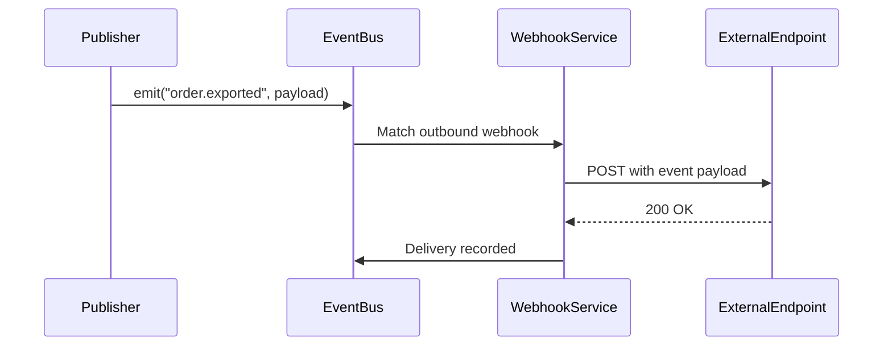
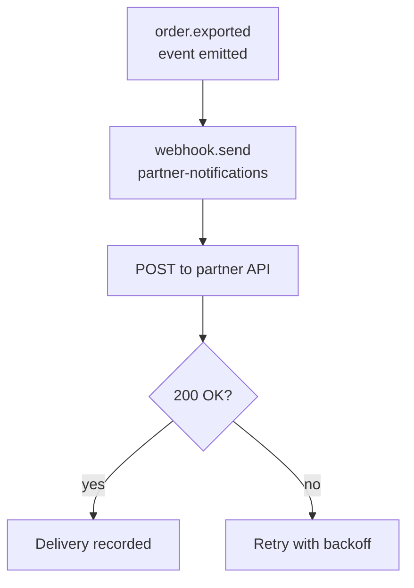
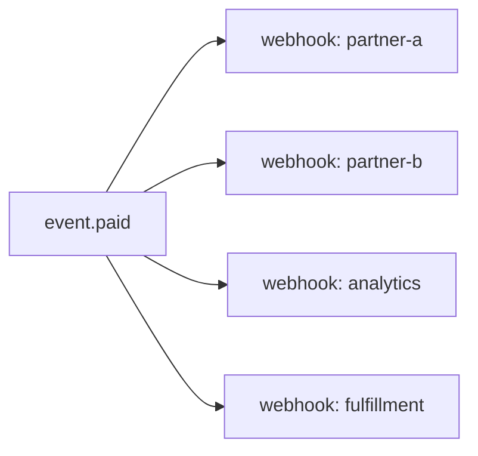

**Outbound webhooks** deliver platform events to external endpoints via HTTP POST. When a subscribed event is published, Pawabase sends an HTTP POST to every subscribed endpoint with the event payload. Unlike `event.emit` (which publishes to the internal event bus), `webhook.send` and outbound webhook subscriptions deliver directly to external URLs. This page covers the complete outbound webhook system including configuration, the delivery pipeline, retry policies, signature verification, and debugging.

<CardGroup cols={2}>
  <Card title="Automatic" icon="clock">Webhooks fire automatically on resource writes.</Card>
  <Card title="Manual" icon="hand-pointer">`webhook.send` block triggers delivery from flows.</Card>
</CardGroup>

## How outbound webhooks work

The outbound webhook system delivers events to external endpoints through a well-defined pipeline:

1. An **outbound webhook** is configured with an event name, endpoint URL, and signing secret
2. When the matching event is published, Pawabase sends an HTTP POST to the endpoint
3. The POST body contains the event payload
4. The endpoint acknowledges the delivery
5. If the endpoint fails, the delivery is retried



The outbound webhook delivery is managed by the `EventProcessor.route` method, which checks whether any enabled outbound webhooks match the event:

```python
if any(endpoint.enabled and endpoint_matches(endpoint.events, event.name)
       for endpoint in state.webhooks):
    await attempt("webhook", "endpoints", lambda: queue_deliveries(
        platform, state, event_id=event.id, event=event.name, payload=event.payload
    ))
```

The `queue_deliveries` function in `services/api/app/webhooks.py` creates a `WebhookDelivery` record for each matching endpoint and queues a `DeliverWebhookJob`:

```python
async def queue_deliveries(platform, state, *, event_id, event, payload) -> int:
    from app.jobs.webhooks import DeliverWebhookJob
    queued = 0
    for endpoint in state.webhooks:
        if not endpoint.enabled or not endpoint_matches(endpoint.events, event):
            continue
        delivery = await WebhookDelivery.create(
            endpoint=endpoint, event_id=event_id, event=event, payload=payload, status="pending"
        )
        await platform.dispatch(
            DeliverWebhookJob,
            project=state.project_ref,
            env=state.env_name,
            target=endpoint.name,
            source="webhook",
            delivery_id=delivery.id,
        )
        queued += 1
    return queued
```

## Webhook configuration

Each outbound webhook has these properties:

| Property | Description |
| --- | --- |
| `name` | Human-readable name |
| `event` | The event name to subscribe to |
| `url` | The endpoint URL |
| `secret` | Signing secret name (referenced from the secret store) |
| `headers` | Additional headers to include in the POST |
| `retry_policy` | Retry configuration |
| `enabled` | Whether the webhook is active |

```toml
[webhooks]
[[webhooks]]
name = "partner-notifications"
event = "order.exported"
url = "https://partner.example.com/webhooks/order"
secret = "PARTNER_WEBHOOK_SECRET"
headers = {"X-Custom-Header" = "value"}
retry_policy = { max_attempts = 5, backoff_multiplier = 2 }
```

The webhook endpoint is stored as a `WebhookEndpoint` record in the database. Each environment has its own set of webhook endpoints. The `state.webhooks` list in `EnvironmentState` contains all enabled webhook endpoints:

```python
state.webhooks = list(WebhookEndpoint.filter(environment_id=env_id, enabled=True).all())
```

## Delivery pipeline

When an event matches an outbound webhook, the delivery goes through this pipeline:

1. **Match** — The event name matches the webhook's subscribed event
2. **Sign** — The payload is signed with HMAC-SHA256 using the webhook's secret
3. **POST** — An HTTP POST is sent to the endpoint URL with the signed payload
4. **Acknowledge** — The endpoint should respond with `200` to acknowledge receipt
5. **Record** — The delivery is recorded in the `WebhookDelivery` table

```json
{
  "webhook_id": "wh_abc123",
  "event": "order.exported",
  "url": "https://partner.example.com/webhooks/order",
  "status": "delivered",
  "attempts": 1,
  "response_status": 200,
  "signed_payload": true,
  "delivered_at": "2026-09-28T10:00:00+00:00"
}
```

The `DeliverWebhookJob` handles the entire delivery pipeline:

```python
class DeliverWebhookJob(PawabaseJob):
    queue = "webhooks"
    tries = 5
    backoff = 2
    timeout = 30.0

    async def perform(self) -> Any:
        from app.outbound import check_target
        platform, _state = await self.environment()
        delivery = await WebhookDelivery.filter(id=self.params["delivery_id"]).first()
        if delivery is None:
            return {"skipped": "delivery no longer exists"}
        endpoint = delivery.endpoint
        secret = platform.box.open(endpoint.secret_ciphertext)
        body = delivery_body(delivery.event_id, delivery.event, delivery.payload, self.project, self.env)
        headers = {
            **{str(k): str(v) for k, v in (endpoint.headers or {}).items()},
            "content-type": "application/json",
            SIGNATURE_HEADER: sign_payload(secret, body),
            "Pawabase-Event": delivery.event,
            "Pawabase-Delivery": str(delivery.id),
        }
        ...
```

The `delivery_body` function creates the JSON payload:

```python
def delivery_body(event_id, event, payload, project, env) -> bytes:
    return json.dumps(
        {
            "id": event_id, "event": event, "project": project,
            "env": env, "data": payload, "sent_at": int(time.time()),
        }, default=str, separators=(",", ":")
    ).encode()
```

## Retry policy

If the endpoint returns a non-200 status or the request fails, the delivery is retried:

| Attempt | Delay | Behavior |
| --- | --- | --- |
| 1 | Immediate | First delivery attempt |
| 2 | 1 minute | Retry after 60 seconds |
| 3 | 2 minutes | Retry after 2 minutes |
| 4 | 4 minutes | Retry after 4 minutes |
| 5 | 8 minutes | Final retry |

After 5 failed attempts, the delivery is marked as `failed` and stopped. The webhook delivery record shows the error and all attempts.

The retry mechanism uses Sillo's `QRetryMiddleware` inside the `PawabaseJob` base class:

```python
def middleware_pipeline(self) -> list[Any]:
    pipeline = list(self.__class__.middleware)
    if self.tries > 1:
        pipeline.insert(
            0,
            QRetryMiddleware(
                max_attempts=self.tries, base_delay=float(self.backoff or 1), max_delay=60.0
            ),
        )
    return pipeline
```

The `backoff` parameter controls the delay between retries. The `max_delay` of 60.0 seconds caps the exponential backoff. For webhook deliveries, the `tries` is 5 and `backoff` is 2 seconds.

```json
{
  "webhook_id": "wh_abc123",
  "event": "order.exported",
  "status": "failed",
  "attempts": 5,
  "last_error": "Connection refused",
  "delivered_at": null
}
```

## Manual delivery with webhook.send

The `webhook.send` block in a flow triggers delivery to all outbound webhooks subscribed to a specific event, regardless of whether a resource change triggered it:

| Config | Type | Required | Description |
| --- | --- | --- | --- |
| `event` | `string` | yes | The event name |
| `payload` | `json` | no | The event payload |

**Output:** `{"deliveries": <int>}` — how many endpoint deliveries were queued.

```json
{
  "id": "notify_partners",
  "data": {
    "block": "webhook.send",
    "config": { "event": "order.exported", "payload": {"order_id": "{{ steps.order.output.id }}"} }
  }
}
```

The `SendWebhook` block in `app/flows/blocks/platform.py` calls `run.runtime.webhook_send()`:

```python
class SendWebhook(Block):
    key = "webhook.send"
    title = "Send webhook"
    category = "integrations"
    config = [
        {"name": "event", "type": "string", "required": True},
        {"name": "payload", "type": "json"},
    ]

    async def run(self, config, run):
        queued = await run.runtime.webhook_send(config["event"], config.get("payload"))
        return BlockResult(output={"deliveries": queued})
```

The `ApiRuntime.webhook_send` method calls `queue_deliveries`:

```python
async def webhook_send(self, event, payload):
    from app.webhooks import queue_deliveries
    return await queue_deliveries(
        self.platform, self.state,
        event_id=f"manual-{int(time.time() * 1000)}",
        event=event, payload=payload,
    )
```

## Signature verification

Every webhook delivery is signed with HMAC-SHA256. The signature is included in the `X-Pawabase-Signature` header. The external endpoint should verify the signature to ensure the webhook came from Pawabase and hasn't been tampered with.

See [Signatures](/webhooks/signatures) for the full signature verification process and code examples.

## Delivery status tracking

Every webhook delivery is recorded in the `WebhookDelivery` table. From Studio (**Build → Webhooks → Deliveries**) or the Platform API:

| Field | Description |
| --- | --- |
| `webhook_id` | The outbound webhook |
| `event` | The event name |
| `status` | `delivered`, `failed`, `pending` |
| `attempts` | Number of delivery attempts |
| `response_status` | The HTTP status code returned by the endpoint |
| `signed_payload` | Whether the payload was signed |
| `delivered_at` | When the delivery succeeded |
| `error` | Error message if delivery failed |
| `duration_ms` | How long the delivery took |
| `response_body` | The response body from the endpoint |

You can filter by webhook, event, status, and time range. Failed deliveries are visible in Studio's webhook management page.

The `WebhookDelivery` model tracks the complete delivery history:

```python
delivery = await WebhookDelivery.create(
    endpoint=endpoint, event_id=event_id, event=event, payload=payload, status="pending"
)
```

Each delivery attempt updates the record:

```python
delivery.attempts += 1
delivery.duration_ms = round((time.perf_counter() - started) * 1000, 3)
delivery.response_status = response["status"]
delivery.response_body = str(response["body"])[:2000]
if 200 <= response["status"] < 300:
    delivery.status, delivery.error = "delivered", None
    delivery.delivered_at = datetime.now(UTC)
else:
    delivery.status, delivery.error = "retrying", f"HTTP {response['status']}"
await delivery.save()
```

## Outbound webhook security

Security is a core concern for outbound webhooks:

- **Signature verification** — Every delivery is signed with HMAC-SHA256
- **Secret encryption** — Secrets are encrypted at rest using the platform master key
- **Target validation** — The `check_target` function prevents webhooks from being sent to private or loopback addresses
- **Timeout enforcement** — Each delivery has a 30-second timeout
- **Retry limits** — Maximum 5 retries to prevent infinite loops

The `check_target` function in `services/api/app/outbound.py`:

```python
def check_target(url: str, *, allow_private: bool = False) -> None:
    parsed = urlparse(url)
    if parsed.scheme not in ("http", "https") or not parsed.hostname:
        raise OutboundRefused("only http and https URLs are allowed")
    if allow_private:
        return
    infos = socket.getaddrinfo(parsed.hostname, None)
    for info in infos:
        address = ipaddress.ip_address(info[4][0])
        if (address.is_private or address.is_loopback or
            address.is_link_local or address.is_reserved or
            address.is_multicast):
            raise OutboundRefused(f"{parsed.hostname} resolves to a private address")
```

In production, private addresses are rejected. In local and testing environments, private addresses are allowed to support development.

## Common patterns

### Partner notifications



### Real-time integration

```json
[
  { "id": "emit", "data": { "block": "event.emit", "config": { "event": "order.paid", "payload": {...} } } },
  { "id": "webhook", "data": { "block": "webhook.send", "config": { "event": "order.paid" } } }
]
```

The `event.emit` publishes to the internal event bus (triggering flows, functions, realtime), and `webhook.send` delivers to external endpoints simultaneously.

### Batch notifications

A single event can trigger multiple webhook deliveries:



Each webhook delivery is independent — a failure in one doesn't affect the others.

## Common mistakes

<AccordionGroup>
  <Accordion title="Not verifying webhook signatures">
    Always verify the HMAC signature before processing a webhook. Without verification, an attacker could forge webhook requests and trigger unauthorized actions.
  </Accordion>
  <Accordion title="Returning non-200 status codes">
    Your endpoint should return `200` as quickly as possible. Slow responses or non-200 status codes trigger retries, which may cause duplicate deliveries.
  </Accordion>
  <Accordion title="Not making endpoints idempotent">
    Webhook deliveries may be retried. Your endpoint should handle duplicate deliveries gracefully — check for the event id before processing.
  </Accordion>
  <Accordion title="Confusing webhook.send with event.emit">
    `webhook.send` delivers to external webhook endpoints only. `event.emit` publishes to the internal event bus. Use `event.emit` for internal processing and `webhook.send` for external delivery.
  </Accordion>
  <Accordion title="Ignoring delivery status">
    Monitor webhook delivery status in Studio. Failed deliveries indicate issues with the external endpoint that need attention.
  </Accordion>
  <Accordion title="Not handling rate limits">
    External endpoints may rate-limit webhook deliveries. If you receive 429 responses, consider adjusting your webhook configuration or adding a rate limiter.
  </Accordion>
</AccordionGroup>

## Webhook delivery monitoring

Monitor webhook delivery health using these tools:

1. **Studio → Build → Webhooks → Deliveries** — Filter by webhook, event, status, and time range
2. **WebhookDelivery table** — Query delivery records directly for detailed analysis
3. **FailedJobRecord table** — View jobs that exhausted all retries
4. **Delivery metrics** — Track delivery success rates, average response times, and error rates

```python
# Check delivery status for a specific webhook
deliveries = await WebhookDelivery.filter(webhook_id="wh_abc123").order_by("-created_at").limit(10)
for d in deliveries:
    print(f"{d.event}: {d.status} ({d.attempts} attempts)")

# Check for failed deliveries
failed = await WebhookDelivery.filter(status="failed")
for d in failed:
    print(f"Failed: {d.event} - {d.error}")
```

## Webhook debugging

When outbound webhooks are not working:

1. **Check the endpoint URL** — Ensure it's a valid HTTPS URL
2. **Check the secret** — Ensure the signing secret is configured correctly
3. **Check the event name** — Ensure the webhook is subscribed to the correct event
4. **Check the endpoint response** — Non-200 responses cause retries
5. **Check network connectivity** — The endpoint must be reachable from the worker
6. **Check the `WebhookDelivery` table** — Look at status, attempts, and error messages
7. **Check the `FailedJobRecord` table** — View jobs that exhausted all retries

```python
# Debug a specific delivery
delivery = await WebhookDelivery.filter(id="delivery_id").first()
print(f"Status: {delivery.status}")
print(f"Attempts: {delivery.attempts}")
print(f"Error: {delivery.error}")
print(f"Response: {delivery.response_status} {delivery.response_body[:200]}")
```

## Next

<CardGroup cols={2}>
  <Card title="Signatures" icon="key" href="/webhooks/signatures">Verifying webhook signatures.</Card>
  <Card title="Inbound" icon="link" href="/webhooks/inbound">Receiving webhooks from external services.</Card>
  <Card title="Events" icon="bolt" href="/events/overview">The event system.</Card>
  <Card title="Subscriptions" icon="link" href="/events/subscriptions">How subscriptions work.</Card>
</CardGroup>

## Summary

Pawabase's outbound webhook system provides a complete solution for delivering events to external endpoints. Webhooks are configured per event, delivered via HTTP POST with HMAC-SHA256 signatures, and retried up to 5 times with exponential backoff. Every delivery is recorded in the `WebhookDelivery` table with full status tracking. The system includes security measures including signature verification, secret encryption, target validation, and timeout enforcement. The `webhook.send` block allows manual triggering of webhook deliveries from flows. See [Signatures](/webhooks/signatures) for verification details, [Inbound](/webhooks/inbound) for receiving webhooks, and [Events](/events/overview) for the event system.

## Outbound webhook architecture (expanded)

### The delivery flow

The outbound webhook delivery flow:

1. **Event published** — A `PlatformEvent` is emitted
2. **EventProcessor routes** — The `route` method checks webhook endpoints
3. **Delivery queued** — A `DeliverWebhookJob` is created for each matching endpoint
4. **Job dispatched** — The job is pushed to the `webhooks` queue
5. **Worker processes** — A worker picks up the job
6. **HTTP request sent** — The `DeliverWebhookJob` sends an HTTP POST
7. **Response received** — The endpoint responds
8. **Result recorded** — Delivery status is recorded
9. **Event emitted** — `webhook.delivered` or `webhook.failed` event is emitted

### The `queue_deliveries` function

The `queue_deliveries` function creates delivery jobs for all matching endpoints:

```python
async def queue_deliveries(platform, state, event_id, event, payload):
    for endpoint in state.webhooks:
        if not endpoint.enabled:
            continue
        if not endpoint_matches(endpoint.events, event):
            continue
        await platform.dispatch(
            DeliverWebhookJob,
            project=state.project_ref, env=state.env_name,
            endpoint=endpoint.slug,
            event=event, payload=payload, event_id=event_id,
        )
```

This function iterates over all webhook endpoints in the environment state, checks if they match the event, and dispatches a job for each matching endpoint.

### The `DeliverWebhookJob` class

The job class in `services/api/app/jobs/webhooks.py`:

```python
class DeliverWebhookJob(Job):
    queue = "webhooks"

    async def run(self):
        delivery = await self._prepare_delivery()
        response = await self._send(delivery)
        await self._record_result(delivery, response)
```

The job:
1. Prepares the delivery payload
2. Sends the HTTP request
3. Records the result
4. Emits success or failure events

## Outbound webhook configuration (expanded)

### Endpoint configuration fields

Each webhook endpoint has these configuration fields:

| Field | Type | Required | Description |
| --- | --- | --- | --- |
| `slug` | `string` | yes | Unique identifier for the endpoint |
| `url` | `string` | yes | The target URL for HTTP POST |
| `events` | `array` | yes | List of event patterns to listen for |
| `enabled` | `boolean` | no | Whether the endpoint is active (default: true) |
| `secret` | `string` | no | HMAC secret for signature verification |
| `retry_config` | `object` | no | Retry configuration |
| `rate_limit` | `object` | no | Rate limiting configuration |

### Endpoint configuration examples

```json
{
  "slug": "partner-notifications",
  "url": "https://partner.example.com/webhooks",
  "events": ["order.created", "order.paid", "order.cancelled"],
  "enabled": true,
  "secret": "super-secret-key",
  "retry_config": {
    "max_retries": 3,
    "retry_delay": 1,
    "retry_backoff": 2
  },
  "rate_limit": {
    "max_per_second": 5,
    "burst": 10
  }
}
```

### Event patterns for outbound webhooks

Event patterns use `fnmatch` glob matching:

```json
{
  "events": [
    "order.*",
    "user.signed_up",
    "mail.sent"
  ]
}
```

- `order.*` matches `order.created`, `order.paid`, `order.cancelled`
- `user.signed_up` matches exactly
- `mail.sent` matches exactly

### Retry configuration examples

```json
{
  "retry_config": {
    "max_retries": 3,
    "retry_delay": 1,
    "retry_backoff": 2
  }
}
```

- `max_retries`: Number of retry attempts (default: 3, max: 10)
- `retry_delay`: Initial delay in seconds (default: 1)
- `retry_backoff`: Exponential backoff factor (default: 2)

## Outbound webhook delivery process (expanded)

### HTTP request construction

The HTTP request is constructed with these headers:

```python
headers = {
    "Content-Type": "application/json",
    "X-Pawabase-Event": event_name,
    "X-Pawabase-Id": event_id,
    "X-Pawabase-Timestamp": str(int(time.time())),
    "X-Pawabase-Signature": signature,
}
```

The request body is the event payload as JSON:

```python
body = json.dumps(payload)
```

### HTTP request execution

The HTTP request is sent using an async HTTP client:

```python
async def _send(self, delivery):
    async with httpx.AsyncClient() as client:
        response = await client.post(
            delivery.url,
            json=delivery.payload,
            headers=delivery.headers,
            timeout=delivery.timeout,
        )
    return response
```

The timeout is configurable per endpoint.

### Response processing

The response is processed to determine the delivery outcome:

```python
async def _record_result(self, delivery, response):
    if response.status_code < 400:
        await self._mark_delivered(delivery, response)
    else:
        await self._mark_failed(delivery, response)
```

- `2xx` responses mark the delivery as delivered
- `4xx` responses mark the delivery as failed (no retry for client errors)
- `5xx` responses trigger retries

### Delivery result recording

The delivery result is recorded in the `WebhookDelivery` model:

```python
class WebhookDelivery(Model):
    id = UUIDField(primary_key=True)
    endpoint = CharField()
    event = CharField()
    event_id = UUIDField()
    payload = JSONField()
    status = CharField()  # "delivered", "failed", "pending"
    status_code = IntegerField(null=True)
    response_body = TextField(null=True)
    error = TextField(null=True)
    attempt = IntegerField(default=1)
    max_attempts = IntegerField(default=3)
    created_at = DateTimeField(auto_now_add=True)
    delivered_at = DateTimeField(null=True)
```

## Outbound webhook error handling (expanded)

### Error types

| Error Type | HTTP Status | Retry | Description |
| --- | --- | --- | --- |
| Connection refused | 0 | Yes | Endpoint unreachable |
| Timeout | 0 | Yes | Endpoint timed out |
| SSL error | 0 | Yes | SSL/TLS handshake failed |
| DNS failure | 0 | Yes | Domain resolution failed |
| 400 Bad Request | 400 | No | Invalid payload |
| 401 Unauthorized | 401 | No | Authentication failed |
| 403 Forbidden | 403 | No | Access denied |
| 404 Not Found | 404 | No | Endpoint not found |
| 500 Internal Server Error | 500 | Yes | Server error |
| 502 Bad Gateway | 502 | Yes | Gateway error |
| 503 Service Unavailable | 503 | Yes | Service unavailable |
| 504 Gateway Timeout | 504 | Yes | Gateway timeout |

### Error handling flow

The error handling flow:

```python
async def _send(self, delivery):
    try:
        response = await client.post(...)
        if response.status_code >= 500:
            raise ServerError(response.status_code)
        if response.status_code >= 400:
            raise ClientError(response.status_code)
        return response
    except (ConnectionError, TimeoutError) as exc:
        raise RetryableError(str(exc))
```

### Error logging

All errors are logged for debugging:

```python
logger.error(
    "Webhook delivery failed: endpoint=%s, event=%s, error=%s",
    delivery.endpoint, delivery.event, str(exc)
)
```

### Dead letter handling

After all retries are exhausted:

```python
async def _mark_failed(self, delivery, response):
    delivery.status = "failed"
    delivery.error = str(response)
    delivery.delivered_at = None
    await delivery.save()
    
    # Emit failure event
    await platform.emit("webhook.failed", {
        "endpoint": delivery.endpoint,
        "event": delivery.event,
        "error": str(response)
    })
```

The failed delivery is recorded and a `webhook.failed` event is emitted.

## Outbound webhook monitoring (expanded)

### Delivery metrics

Key metrics to track:

- **Delivery count**: Total deliveries sent
- **Success rate**: Delivered / Total
- **Failure rate**: Failed / Total
- **Average response time**: Mean response time
- **Retry rate**: Deliveries that required retries
- **Queue depth**: Pending deliveries
- **Error rate by endpoint**: Per-endpoint failure rates

### Monitoring queries

```python
# Count deliveries by status
status_counts = await WebhookDelivery.filter().group_by("status").count()

# Find all failed deliveries
failures = await WebhookDelivery.filter(status="failed")

# Find deliveries by endpoint
endpoint_deliveries = await WebhookDelivery.filter(endpoint="partner-notifications")

# Find deliveries by event
event_deliveries = await WebhookDelivery.filter(event="order.paid")

# Find deliveries by status and endpoint
combined = await WebhookDelivery.filter(status="failed", endpoint="partner-notifications")
```

### Studio observability

Studio's **Observability → Webhooks** dashboard provides:

- Delivery history with filtering
- Success/failure rates per endpoint
- Response time charts
- Retry tracking
- Endpoint configuration viewer

### Alerting configuration

Configure alerts for webhook failures:

```python
# Alert when failure rate exceeds threshold
if failure_rate > 0.05:
    await platform.emit("alert.webhook.high_failure_rate", {
        "endpoint": endpoint_slug,
        "failure_rate": failure_rate
    })
```

## Outbound webhook security (expanded)

### Payload encryption

For sensitive payloads, encrypt the webhook body:

```python
from cryptography.fernet import Fernet

def encrypt_payload(payload: dict, key: str) -> str:
    fernet = Fernet(key.encode())
    return fernet.encrypt(json.dumps(payload).encode()).decode()
```

### Signature verification on receipt

When the receiving endpoint verifies the signature:

```python
def verify_signature(payload: bytes, signature: str, secret: str) -> bool:
    expected = hmac.new(secret.encode(), payload, hashlib.sha256).hexdigest()
    return hmac.compare_digest(expected, signature)
```

### IP whitelisting on receipt

Restrict webhook sources by IP on the receiving end:

```python
ALLOWED_IPS = ["203.0.113.1", "198.51.100.1"]
client_ip = request.client.host
if client_ip not in ALLOWED_IPS:
    return Response(status=403)
```

### Replay attack prevention

Prevent replay attacks using timestamps and nonces:

```python
timestamp = int(request.headers.get("X-Pawabase-Timestamp", 0))
if abs(time.time() - timestamp) > 300:
    return Response(status=401)
```

## Outbound webhook testing (expanded)

### Manual testing

Test outbound webhooks manually:

```bash
# Trigger a webhook delivery
curl -X POST /api/webhooks/test/{slug} \
  -H "Authorization: Bearer {token}"
```

### Using the webhook test endpoint

Pawabase provides a test endpoint for testing:

```bash
# Send a test payload
curl -X POST /api/webhooks/test/{slug} \
  -H "Authorization: Bearer {token}" \
  -d '{"event": "order.paid", "payload": {...}}'
```

### Automated testing

Write automated tests for webhook delivery:

```python
async def test_webhook_delivery():
    endpoint = await WebhookEndpoint.create(
        slug="test-endpoint",
        url="https://test.example.com/webhooks",
        events=["order.paid"],
        secret="test-secret"
    )
    
    await platform.emit("order.paid", {"order_id": "test"})
    
    deliveries = await WebhookDelivery.filter(endpoint="test-endpoint")
    assert len(deliveries) == 1
    assert deliveries[0].status == "delivered"
```

### Mock testing

Mock the HTTP client for testing:

```python
async def test_webhook_delivery_mock():
    endpoint = await WebhookEndpoint.create(
        slug="test-endpoint",
        url="https://test.example.com/webhooks",
        events=["order.paid"],
        secret="test-secret"
    )
    
    # Mock the HTTP client
    mock_response = Mock(status_code=200)
    mock_client = Mock(post=Mock(return_value=mock_response))
    
    job = DeliverWebhookJob(...)
    await job._send(delivery)
```

## Outbound webhook best practices (expanded)

### Configuration best practices

1. Use specific event patterns
2. Enable signature verification
3. Configure appropriate retries
4. Set rate limits
5. Use HTTPS URLs
6. Monitor endpoint health
7. Use descriptive slugs

### Security best practices

1. Always use HMAC signatures
2. Verify timestamps to prevent replay attacks
3. Validate payloads on receipt
4. Implement IP whitelisting
5. Use different secrets per environment
6. Rotate secrets regularly
7. Encrypt sensitive payloads

### Performance best practices

1. Process deliveries asynchronously
2. Use connection pooling
3. Implement rate limiting
4. Scale workers based on queue depth
5. Use caching for repeated requests
6. Monitor delivery latency
7. Optimize payload sizes

### Monitoring best practices

1. Track delivery success rates
2. Monitor response times
3. Set up alerts for failures
4. Log all delivery attempts
5. Create dashboards
6. Track retry patterns
7. Monitor queue depths

## Summary

Outbound webhooks deliver Pawabase events to external systems via HTTP POST requests. Each endpoint has a slug, URL, event patterns, and optional signature verification. Deliveries are queued as `DeliverWebhookJob` instances, sent with HMAC signatures, and retried on failure. The system provides comprehensive monitoring, debugging, and security features. See [Inbound Webhooks](/webhooks/inbound) for receiving webhooks and [Signatures](/webhooks/signatures) for signature verification details.
