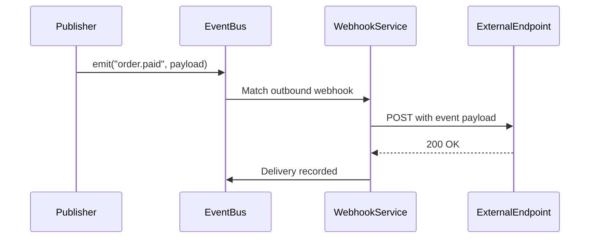
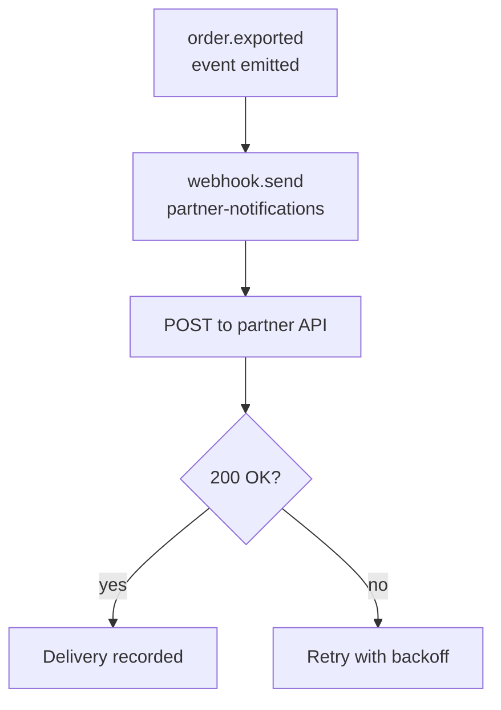

**Outbound webhooks** deliver platform events to external endpoints via HTTP POST. When a subscribed event is published, Pawabase sends a POST request to every subscribed endpoint with the event payload. Unlike `event.emit` (which publishes to the internal event bus), `webhook.send` and outbound webhook subscriptions deliver directly to external URLs.

<CardGroup cols={2}>
  <Card title="Automatic" icon="clock">Webhooks fire automatically on resource writes.</Card>
  <Card title="Manual" icon="hand-pointer">`webhook.send` block triggers delivery from flows.</Card>
</CardGroup>

## How outbound webhooks work

1. An **outbound webhook** is configured with an event name, endpoint URL, and signing secret
2. When the matching event is published, Pawabase sends an HTTP POST to the endpoint
3. The POST body contains the event payload
4. The endpoint acknowledges the delivery
5. If the endpoint fails, the delivery is retried



## Webhook configuration

Each outbound webhook has these properties:

| Property | Description |
| --- | --- |
| `name` | Human-readable name |
| `event` | The event name to subscribe to |
| `url` | The endpoint URL |
| `secret` | Signing secret name (referenced from the secret store) |
| `headers` | Additional headers to include in the POST |
| `retry_policy` | Retry configuration |

```toml
[webhooks]
[[webhooks]]
name = "partner-notifications"
event = "order.exported"
url = "https://partner.example.com/webhooks/order"
secret = "PARTNER_WEBHOOK_SECRET"
headers = {"X-Custom-Header" = "value"}
retry_policy = { max_attempts = 5, backoff_multiplier = 2 }
```

## Delivery pipeline

When an event matches an outbound webhook:

1. **Match**: The event name matches the webhook's subscribed event
2. **Sign**: The payload is signed with HMAC-SHA256 using the webhook's secret
3. **POST**: An HTTP POST is sent to the endpoint URL with the signed payload
4. **Acknowledge**: The endpoint should respond with `200` to acknowledge receipt
5. **Record**: The delivery is recorded in the `WebhookDelivery` table

```json
{
  "webhook_id": "wh_abc123",
  "event": "order.exported",
  "url": "https://partner.example.com/webhooks/order",
  "status": "delivered",
  "attempts": 1,
  "response_status": 200,
  "signed_payload": true,
  "delivered_at": "2026-09-28T10:00:00+00:00"
}
```

## Retry policy

If the endpoint returns a non-200 status or the request fails, the delivery is retried:

| Attempt | Delay | Behavior |
| --- | --- | --- |
| 1 | Immediate | First delivery attempt |
| 2 | 1 minute | Retry after 60 seconds |
| 3 | 2 minutes | Retry after 2 minutes |
| 4 | 4 minutes | Retry after 4 minutes |
| 5 | 8 minutes | Final retry |

After 5 failed attempts, the delivery is marked as `failed` and stopped. The webhook delivery record shows the error and all attempts.

```json
{
  "webhook_id": "wh_abc123",
  "event": "order.exported",
  "status": "failed",
  "attempts": 5,
  "last_error": "Connection refused",
  "delivered_at": null
}
```

## Manual delivery with webhook.send

The `webhook.send` block in a flow triggers delivery to all outbound webhooks subscribed to a specific event, regardless of whether a resource change triggered it:

| Config | Type | Required | Description |
| --- | --- | --- | --- |
| `event` | `string` | yes | The event name |
| `payload` | `json` | no | The event payload |

**Output:** `{"deliveries": <int>}` — how many endpoint deliveries were queued.

```json
{
  "id": "notify_partners",
  "data": {
    "block": "webhook.send",
    "config": { "event": "order.exported", "payload": {"order_id": "{{ steps.order.output.id }}"} }
  }
}
```

## Signature verification

Every webhook delivery is signed with HMAC-SHA256. The signature is included in the `X-Pawabase-Signature` header. The external endpoint should verify the signature to ensure the webhook came from Pawabase and hasn't been tampered with.

See [Signatures](/webhooks/signatures) for the full signature verification process and code examples.

## Delivery status tracking

Every webhook delivery is recorded in the `WebhookDelivery` table. From Studio (**Build → Webhooks → Deliveries**) or the Platform API:

| Field | Description |
| --- | --- |
| `webhook_id` | The outbound webhook |
| `event` | The event name |
| `status` | `delivered`, `failed`, `pending` |
| `attempts` | Number of delivery attempts |
| `response_status` | The HTTP status code returned by the endpoint |
| `signed_payload` | Whether the payload was signed |
| `delivered_at` | When the delivery succeeded |

You can filter by webhook, event, status, and time range. Failed deliveries are visible in Studio's webhook management page.

## Common patterns

### Partner notifications



### Real-time integration

```json
[
  { "id": "emit", "data": { "block": "event.emit", "config": { "event": "order.paid", "payload": {...} } } },
  { "id": "webhook", "data": { "block": "webhook.send", "config": { "event": "order.paid" } } }
]
```

The `event.emit` publishes to the internal event bus (triggering flows, functions, realtime), and `webhook.send` delivers to external endpoints simultaneously.

## Common mistakes

<AccordionGroup>
  <Accordion title="Not verifying webhook signatures">
    Always verify the HMAC signature before processing a webhook. Without verification, an attacker could forge webhook requests and trigger unauthorized actions.
  </Accordion>
  <Accordion title="Returning non-200 status codes">
    Your endpoint should return `200` as quickly as possible. Slow responses or non-200 status codes trigger retries, which may cause duplicate deliveries.
  </Accordion>
  <Accordion title="Not making endpoints idempotent">
    Webhook deliveries may be retried. Your endpoint should handle duplicate deliveries gracefully — check for the event id before processing.
  </Accordion>
  <Accordion title="Confusing webhook.send with event.emit">
    `webhook.send` delivers to external webhook endpoints only. `event.emit` publishes to the internal event bus. Use `event.emit` for internal processing and `webhook.send` for external delivery.
  </Accordion>
</AccordionGroup>

## Next

<CardGroup cols={2}>
  <Card title="Signatures" icon="key" href="/webhooks/signatures">Verifying webhook signatures.</Card>
  <Card title="Inbound" icon="link" href="/webhooks/inbound">Receiving webhooks from external services.</Card>
  <Card title="Events" icon="bolt" href="/events/overview">The event system.</Card>
  <Card title="Subscriptions" icon="link" href="/events/subscriptions">How subscriptions work.</Card>
</CardGroup>
