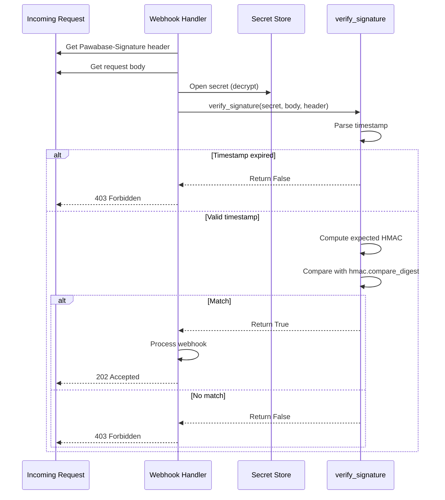

**Webhook signatures** ensure that webhook requests genuinely come from Pawabase and haven't been tampered with in transit. Every webhook delivery is signed with HMAC-SHA256 and the signature is included in the `Pawabase-Signature` header. The external endpoint should verify the signature before processing the webhook. This page covers the complete signature verification system including the signature format, verification algorithm, compatibility modes, code examples for every language, and security best practices.

<CardGroup cols={2}>
  <Card title="Pawabase format" icon="shield-check">The native `t=…,v1=…` format.</Card>
  <Card title="Plain HMAC" icon="code">Bare hex or `sha256=` prefix for compatibility.</Card>
</CardGroup>

## Why signatures matter

Without signature verification, an attacker who discovers your webhook URL could:

- Forge webhook requests to trigger unauthorized actions
- Replay valid webhook payloads to cause duplicate processing
- Tamper with webhook payloads to inject malicious data
- Impersonate Pawabase to external systems

Always verify the HMAC signature before processing a webhook. The signature is computed using the webhook's signing secret, which is stored in the Pawabase secret store and never transmitted. The `SecretBox` class in `pawabase_kit/crypto.py` handles encryption and decryption of secrets:

```python
class SecretBox:
    def __init__(self, master_key: str) -> None:
        self._key = _fernet_key(master_key)

    def seal(self, plaintext: str) -> str:
        return encrypt(plaintext, self._key)

    def open(self, ciphertext: str) -> str:
        return decrypt(ciphertext, self._key)
```

The master key is configured as `PAWABASE_MASTER_KEY` and must be at least 32 characters. Secrets are encrypted using PBKDF2-HMAC-SHA256 with 200,000 iterations and a fixed salt.

## The Pawabase-Signature header

Pawabase sends webhook signatures in the `Pawabase-Signature` header using this format:

```
t=1700000000,v1=<hex HMAC-SHA256 of "t.body">
```

Where:
- `t` is the Unix timestamp (seconds since epoch) when the signature was generated
- `v1` is the HMAC-SHA256 hex digest of `"{timestamp}.{body}"`

Example:

```
Pawabase-Signature: t=1700000000,v1=a1b2c3d4e5f6...
```

The timestamp is included in the signature computation to prevent replay attacks. The verification process checks that the timestamp is within the 300-second tolerance window.

## Verification algorithm

The verification process computes the expected signature and compares it to the received signature using a constant-time comparison:

```python
def verify_signature(
    secret: str, body: bytes, header: str, *, tolerance: int = TOLERANCE_SECONDS
) -> bool:
    """Check a ``t=…,v1=…`` signature (the format Pawabase sends)."""
    parts = dict(item.split("=", 1) for item in header.split(",") if "=" in item)
    try:
        timestamp = int(parts.get("t", ""))
    except ValueError:
        return False
    if abs(time.time() - timestamp) > tolerance:
        return False
    expected = hmac.new(
        secret.encode(), f"{timestamp}.".encode() + body, hashlib.sha256
    ).hexdigest()
    return hmac.compare_digest(expected, parts.get("v1", ""))
```

The `tolerance` parameter (default 300 seconds) prevents replay attacks. Requests with timestamps older than 5 minutes are rejected.

The verification steps are:

1. **Parse the header** — Split the `Pawabase-Signature` header into key-value pairs
2. **Extract the timestamp** — Convert the `t` value to an integer
3. **Check timestamp freshness** — Ensure `abs(current_time - timestamp) <= tolerance`
4. **Compute expected signature** — HMAC-SHA256 of `"{timestamp}.{body}"` using the secret
5. **Compare signatures** — Use `hmac.compare_digest` for constant-time comparison
6. **Return result** — `True` if the signature is valid, `False` otherwise

The `hmac.compare_digest` function is critical for security — it performs a constant-time comparison that prevents timing attacks. Using a regular string comparison (`==`) would leak information about the signature through timing differences.

The signing function generates the signature:

```python
def sign_payload(secret: str, body: bytes, timestamp: int | None = None) -> str:
    timestamp = int(timestamp or time.time())
    digest = hmac.new(secret.encode(), f"{timestamp}.".encode() + body, hashlib.sha256).hexdigest()
    return f"t={timestamp},v1={digest}"
```

The `sign_payload` function creates the `Pawabase-Signature` header value. It is used by the delivery job to sign each outbound webhook:

```python
headers = {
    **{str(k): str(v) for k, v in (endpoint.headers or {}).items()},
    "content-type": "application/json",
    SIGNATURE_HEADER: sign_payload(secret, body),
    "Pawabase-Event": delivery.event,
    "Pawabase-Delivery": str(delivery.id),
}
```

## Plain HMAC format

For compatibility with providers like GitHub and Shopify, Pawabase also supports a plain HMAC-SHA256 format:

```python
def verify_plain_hmac(secret: str, body: bytes, signature: str) -> bool:
    """Check a bare hex (optionally ``sha256=``-prefixed) HMAC-SHA256 of the body."""
    signature = signature.split("=", 1)[1] if signature.startswith("sha256=") else signature
    expected = hmac.new(secret.encode(), body, hashlib.sha256).hexdigest()
    return hmac.compare_digest(expected, signature.strip())
```

This handles webhooks that arrive with `X-Hub-Signature-256` (GitHub) or `X-Shopify-Hmac-SHA256` (Shopify) headers. The function strips the `sha256=` prefix if present and compares the remaining hex digest.

The `verify_plain_hmac` function is used for inbound webhooks from external services that use their own signature format:

```python
def verify_signature(secret, body, header, *, tolerance=300):
    parts = dict(item.split("=", 1) for item in header.split(",") if "=" in item)
    try:
        timestamp = int(parts.get("t", ""))
    except ValueError:
        return False
    if abs(time.time() - timestamp) > tolerance:
        return False
    expected = hmac.new(secret.encode(), f"{timestamp}.".encode() + body, hashlib.sha256).hexdigest()
    return hmac.compare_digest(expected, parts.get("v1", ""))
```

## Code examples

### Node.js (Express)

```javascript
const crypto = require('crypto');

function verifyWebhook(req, secret) {
  const signature = req.headers['x-pawabase-signature'];
  const body = JSON.stringify(req.body);
  const [timestamp, v1] = signature.split(',').map(s => s.split('=')[1]);
  const expected = crypto.createHmac('sha256', secret)
    .update(`${timestamp}.${body}`)
    .digest('hex');
  if (Math.abs(Date.now() / 1000 - timestamp) > 300) return false;
  return crypto.timingSafeEqual(Buffer.from(v1), Buffer.from(expected));
}

// Express middleware
app.post('/webhooks/pawabase', (req, res) => {
  if (!verifyWebhook(req, process.env.WEBHOOK_SECRET)) {
    return res.status(403).send('Invalid signature');
  }
  // Process the webhook
  res.status(200).send('OK');
});
```

The `crypto.timingSafeEqual` function performs constant-time comparison to prevent timing attacks. The `Date.now() / 1000` converts milliseconds to Unix timestamp seconds.

### Python (FastAPI)

```python
import hmac, hashlib, time
from fastapi import Request, HTTPException

async def verify_webhook(request: Request, secret: str):
    signature = request.headers.get("Pawabase-Signature", "")
    body = await request.body()
    parts = dict(item.split("=", 1) for item in signature.split(",") if "=" in item)
    try:
        timestamp = int(parts.get("t", ""))
    except (ValueError, KeyError):
        raise HTTPException(status_code=403, detail="Invalid signature")
    if abs(time.time() - timestamp) > 300:
        raise HTTPException(status_code=403, detail="Signature expired")
    expected = hmac.new(
        secret.encode(), f"{timestamp}.".encode() + body, hashlib.sha256
    ).hexdigest()
    if not hmac.compare_digest(expected, parts.get("v1", "")):
        raise HTTPException(status_code=403, detail="Invalid signature")
    return True

# FastAPI endpoint
@app.post("/webhooks/pawabase")
async def handle_webhook(request: Request):
    if not await verify_webhook(request, os.environ["WEBHOOK_SECRET"]):
        raise HTTPException(status_code=403, detail="Invalid signature")
    # Process the webhook
    return {"status": "ok"}
```

The `hmac.compare_digest` function is the critical security component — it prevents timing attacks by performing a constant-time comparison.

### Go

```go
func VerifyWebhook(r *http.Request, secret string) bool {
    signature := r.Header.Get("Pawabase-Signature")
    body, _ := io.ReadAll(r.Body)
    parts := parseSignature(signature)
    timestamp, _ := strconv.ParseInt(parts["t"], 10, 64)
    if time.Now().Unix()-timestamp > 300 { return false }
    expected := hmac.New(sha256.New, []byte(secret))
    expected.Write([]byte(fmt.Sprintf("%d.", timestamp)))
    expected.Write(body)
    digest := fmt.Sprintf("%x", expected.Sum(nil))
    return hmac.Equal([]byte(digest), []byte(parts["v1"]))
}

func parseSignature(signature string) map[string]string {
    parts := make(map[string]string)
    for _, pair := range strings.Split(signature, ",") {
        kv := strings.SplitN(pair, "=", 2)
        if len(kv) == 2 {
            parts[kv[0]] = kv[1]
        }
    }
    return parts
}
```

The `hmac.Equal` function performs constant-time comparison. The `time.Now().Unix()` gets the current Unix timestamp in seconds.

### Ruby

```ruby
require 'openssl'
require 'json'

def verify_webhook(request, secret)
  signature = request.headers['Pawabase-Signature']
  body = request.body.read
  parts = signature.split(',').map { |s| s.split('=', 2) }.to_h
  timestamp = parts['t'].to_i
  return false if (Time.now.to_i - timestamp).abs > 300
  expected = OpenSSL::HMAC.hexdigest('sha256', secret, "#{timestamp}.#{body}")
  ActiveSupport::SecurityUtils.secure_compare(expected, parts['v1'])
end
```

The `ActiveSupport::SecurityUtils.secure_compare` method performs constant-time comparison. The `OpenSSL::HMAC.hexdigest` computes the HMAC-SHA256 digest.

### PHP

```php
function verifyWebhook($requestBody, $signatureHeader, $secret) {
    $parts = [];
    foreach (explode(',', $signatureHeader) as $pair) {
        [$key, $value] = explode('=', $pair, 2);
        $parts[$key] = $value;
    }
    $timestamp = intval($parts['t'] ?? '');
    if (abs(time() - $timestamp) > 300) {
        return false;
    }
    $expected = hash_hmac('sha256', $timestamp . '.' . $requestBody, $secret);
    return hash_equals($expected, $parts['v1'] ?? '');
}
```

The `hash_equals` function performs constant-time comparison. The `hash_hmac` function computes the HMAC-SHA256 digest.

### Java

```java
public boolean verifyWebhook(String body, String signatureHeader, String secret) {
    String[] parts = signatureHeader.split(",");
    String timestamp = null, v1 = null;
    for (String part : parts) {
        String[] kv = part.split("=");
        if (kv.length == 2) {
            if (kv[0].equals("t")) timestamp = kv[1];
            if (kv[0].equals("v1")) v1 = kv[1];
        }
    }
    long ts = Long.parseLong(timestamp);
    if (Math.abs(System.currentTimeMillis() / 1000 - ts) > 300) return false;
    Mac hmacSha256 = Mac.getInstance("HmacSHA256");
    SecretKeySpec secretKey = new SecretKeySpec(secret.getBytes(), "HmacSHA256");
    hmacSha256.init(secretKey);
    String expected = bytesToHex(hmacSha256.doFinal((ts + "." + body).getBytes()));
    return MessageDigest.isEqual(expected.getBytes(), v1.getBytes());
}
```

The `MessageDigest.isEqual` method performs constant-time comparison. The `Mac.getInstance("HmacSHA256")` creates the HMAC-SHA256 calculator.

## Outbound webhook verification

When Pawabase delivers an outbound webhook to an external endpoint, the endpoint uses the same verification mechanism. The signature is computed over the delivery body and the webhook's signing secret:

```python
def sign_payload(secret: str, body: bytes, timestamp: int | None = None) -> str:
    timestamp = int(timestamp or time.time())
    digest = hmac.new(secret.encode(), f"{timestamp}.".encode() + body, hashlib.sha256).hexdigest()
    return f"t={timestamp},v1={digest}"
```

The external endpoint extracts the signature from the `Pawabase-Signature` header, recomputes the expected signature, and compares them.

The delivery job signs the body:

```python
headers = {
    **{str(k): str(v) for k, v in (endpoint.headers or {}).items()},
    "content-type": "application/json",
    SIGNATURE_HEADER: sign_payload(secret, body),
    "Pawabase-Event": delivery.event,
    "Pawabase-Delivery": str(delivery.id),
}
```

The external endpoint receives the `Pawabase-Signature` header along with `Pawabase-Event` and `Pawabase-Delivery` headers for additional context.

## Signature format details

### Pawabase format

```
t=<timestamp>,v1=<hex_digest>
```

- `t` is the Unix timestamp in seconds
- `v1` is the HMAC-SHA256 hex digest of `"{timestamp}.{body}"`
- The dot (`.`) separates the timestamp from the body in the signature computation
- The body is the raw request body (not parsed JSON)

Example:
```
t=1700000000,v1=a1b2c3d4e5f6a1b2c3d4e5f6a1b2c3d4e5f6a1b2c3d4e5f6a1b2c3d4e5f6a1b2
```

### Plain HMAC format

```
<hex_digest>
```

or

```
sha256=<hex_digest>
```

- The hex digest is the HMAC-SHA256 of the raw body
- The `sha256=` prefix is optional but commonly used
- No timestamp is included (no replay protection)

## Security best practices

1. **Always verify the signature** — never process a webhook without checking it
2. **Check the timestamp** — reject requests older than 5 minutes to prevent replay attacks
3. **Use constant-time comparison** — `hmac.compare_digest` prevents timing attacks
4. **Store secrets securely** — use the Pawabase secret store, never hardcode secrets
5. **Handle failures gracefully** — return `200` quickly after verification; let the queue handle retries
6. **Make endpoints idempotent** — webhooks may be retried; check for duplicate events
7. **Rotate secrets regularly** — update signing secrets periodically
8. **Monitor delivery patterns** — unusual patterns may indicate attacks
9. **Use HTTPS** — always serve webhook endpoints over HTTPS
10. **Log verification failures** — track failed signature attempts for security monitoring

<Warning>
Never trust a client-supplied header to identify the webhook source. The signature is the only proof that the request came from Pawabase. A request with a valid `Pawabase-Signature` header but an invalid signature must be rejected.
</Warning>

## Replay attack prevention

The timestamp tolerance of 300 seconds is specifically designed to prevent replay attacks. An attacker who intercepts a valid webhook request cannot replay it after 5 minutes because the timestamp will be outside the tolerance window.

Additional replay attack prevention measures:

- **Idempotent processing** — Check for duplicate event IDs before processing
- **EventLog tracking** — Every event is recorded in `EventLog` with its unique `event_id`
- **Deduplication** — The `EventProcessor.handle` method checks `EventLog.filter(event_id=event.id).exists()`
- **Nonce tracking** — Some implementations track processed event IDs in a cache

```python
# Replay attack prevention
if await EventLog.filter(event_id=event.id).exists():
    return []  # Already processed — skip
```

## Signature verification flow

The complete signature verification flow for an inbound webhook request:



## Next

<CardGroup cols={2}>
  <Card title="Inbound" icon="link" href="/webhooks/inbound">Receiving webhooks from external services.</Card>
  <Card title="Outbound" icon="link" href="/webhooks/outbound">Delivering events to external endpoints.</Card>
  <Card title="Events" icon="bolt" href="/events/overview">The event system.</Card>
</CardGroup>

## Summary

Pawabase's signature verification system provides comprehensive security for webhook communications. The `Pawabase-Signature` header format (`t=timestamp,v1=hex_digest`) includes both a timestamp for replay attack prevention and an HMAC-SHA256 digest for integrity verification. The system supports both the native Pawabase format and plain HMAC formats for compatibility with GitHub, Shopify, and other providers. Code examples are provided for every major language including Node.js, Python, Go, Ruby, PHP, and Java. The `hmac.compare_digest` function is used throughout for constant-time comparison to prevent timing attacks. See [Inbound](/webhooks/inbound) for the complete inbound webhook pipeline, [Outbound](/webhooks/outbound) for delivering events externally, and [Events](/events/overview) for the event system.

## HMAC signature verification (expanded)

### How HMAC signatures work

HMAC (Hash-based Message Authentication Code) provides both data integrity and authentication. In Pawabase, HMAC-SHA256 is used to verify that webhook payloads have not been tampered with.

The signature is computed using the webhook secret and the payload:

```python
import hmac
import hashlib

def generate_signature(payload: bytes, secret: str) -> str:
    mac = hmac.new(secret.encode(), payload, hashlib.sha256)
    return mac.hexdigest()
```

The same function is used on the receiving end to verify:

```python
def verify_signature(payload: bytes, signature: str, secret: str) -> bool:
    expected = generate_signature(payload, secret)
    return hmac.compare_digest(expected, signature)
```

### Why `hmac.compare_digest`?

The `hmac.compare_digest` function is used instead of `==` to prevent timing attacks:

- `==` short-circuits on the first mismatched character, leaking timing information
- `hmac.compare_digest` takes constant time regardless of where the mismatch occurs
- This prevents attackers from gradually guessing the correct signature

### Signature generation flow

When a webhook is sent, the signature is generated as follows:

1. **Serialize the payload**: Convert the payload dict to JSON bytes
2. **Compute HMAC**: Use HMAC-SHA256 with the secret key
3. **Hex encode**: Convert the raw HMAC bytes to a hex string
4. **Add to headers**: Include the signature in the `X-Pawabase-Signature` header

```python
import json
import hmac
import hashlib

def generate_webhook_signature(payload: dict, secret: str) -> str:
    body = json.dumps(payload, separators=(',', ':'), sort_keys=True).encode()
    mac = hmac.new(secret.encode(), body, hashlib.sha256)
    return mac.hexdigest()
```

Note: `sort_keys=True` ensures consistent signature generation regardless of key ordering in the payload dict.

## Signature header format (expanded)

### All webhook headers

Webhook deliveries include these headers for verification:

| Header | Format | Description |
| --- | --- | --- |
| `X-Pawabase-Event` | `string` | The event name |
| `X-Pawabase-Signature` | `hex string` | HMAC-SHA256 signature |
| `X-Pawabase-Timestamp` | `unix timestamp` | Unix timestamp of the event |
| `X-Pawabase-Id` | `UUID v4` | Unique event identifier |
| `Content-Type` | `application/json` | Always JSON |

### Signature header example

```http
POST /webhooks/partner-notifications HTTP/1.1
Host: partner.example.com
Content-Type: application/json
X-Pawabase-Event: order.paid
X-Pawabase-Signature: a1b2c3d4e5f6...
X-Pawabase-Timestamp: 1695600000
X-Pawabase-Id: 550e8400-e29b-41d4-a716-446655440000

{"event": "order.paid", "payload": {"order_id": "1"}}
```

### Signature in Python

Verify the signature in your webhook handler:

```python
import hmac
import hashlib
import json

async def handle_webhook(request):
    # Get headers
    signature = request.headers.get("X-Pawabase-Signature")
    timestamp = request.headers.get("X-Pawabase-Timestamp")
    event_name = request.headers.get("X-Pawabase-Event")
    event_id = request.headers.get("X-Pawabase-Id")
    
    # Get body
    body = await request.text()
    payload = json.loads(body)
    
    # Verify signature
    secret = get_webhook_secret(event_name)
    expected = hmac.new(secret.encode(), body.encode(), hashlib.sha256).hexdigest()
    
    if not hmac.compare_digest(signature, expected):
        return Response(status=401)
    
    # Verify timestamp
    if abs(time.time() - int(timestamp)) > 300:
        return Response(status=401)
    
    # Process the webhook
    return Response(status=200)
```

## Timestamp validation (expanded)

### Why timestamp validation matters

Timestamp validation prevents replay attacks:

- An attacker captures a valid webhook payload
- The attacker re-sends it later
- Without timestamp validation, the webhook would be accepted

By checking the timestamp, the receiver ensures the webhook was sent recently.

### How timestamp validation works

The timestamp validation checks:

1. The `X-Pawabase-Timestamp` header is present
2. The timestamp is a valid Unix timestamp
3. The timestamp is within the tolerance window

```python
def validate_timestamp(timestamp: str, tolerance: int = 300) -> bool:
    if not timestamp:
        return False
    try:
        received = int(timestamp)
    except ValueError:
        return False
    now = int(time.time())
    return abs(now - received) <= tolerance
```

### Default tolerance

The default tolerance is 300 seconds (5 minutes):

```python
# Allow 5 minutes of clock skew
TOLERANCE = 300
```

This allows for:

- Clock differences between systems
- Network delays
- Processing delays

### Custom tolerance

Adjust the tolerance based on your requirements:

```python
# Stricter tolerance (1 minute)
TOLERANCE = 60

# More lenient tolerance (10 minutes)
TOLERANCE = 600
```

### Clock synchronization

Ensure both sender and receiver have synchronized clocks:

- Use NTP (Network Time Protocol)
- Verify clock skew is within acceptable limits
- Monitor clock differences over time

## Signature verification on receipt (expanded)

### Complete verification flow

The complete verification flow when receiving a webhook:

```python
async def verify_webhook(request):
    # 1. Extract headers
    signature = request.headers.get("X-Pawabase-Signature")
    timestamp = request.headers.get("X-Pawabase-Timestamp")
    event_name = request.headers.get("X-Pawabase-Event")
    event_id = request.headers.get("X-Pawabase-Id")
    
    # 2. Extract body
    body = await request.text()
    
    # 3. Get the secret for this endpoint
    endpoint = await WebhookEndpoint.get(slug=request.path.strip("/"))
    secret = endpoint.secret
    
    # 4. Verify timestamp
    if not validate_timestamp(timestamp):
        return Response(status=401, content="Timestamp expired")
    
    # 5. Verify signature
    expected = hmac.new(secret.encode(), body.encode(), hashlib.sha256).hexdigest()
    if not hmac.compare_digest(signature, expected):
        return Response(status=401, content="Invalid signature")
    
    # 6. Verify payload structure
    payload = json.loads(body)
    if not isinstance(payload, dict):
        return Response(status=400, content="Invalid payload")
    
    # 7. Process the webhook
    return Response(status=200)
```

### Verification order

The verification order matters:

1. **Timestamp first** — Cheap check, prevents replay attacks
2. **Signature second** — Expensive HMAC computation
3. **Payload structure third** — Parsing and validation
4. **Process last** — Only after all verification passes

This order ensures that invalid requests are rejected as early as possible, saving computational resources.

### Error handling

Handle verification errors appropriately:

```python
# Timestamp error - 401 Unauthorized
if not validate_timestamp(timestamp):
    return Response(status=401)

# Signature error - 401 Unauthorized
if not verify_signature(body, signature, secret):
    return Response(status=401)

# Payload error - 400 Bad Request
try:
    payload = json.loads(body)
except json.JSONDecodeError:
    return Response(status=400)
```

## Signature security considerations (expanded)

### Secret management

Proper secret management is critical:

1. **Generate strong secrets**: Use cryptographically random strings
2. **Store secrets securely**: Use environment variables or secret managers
3. **Rotate secrets regularly**: Change secrets periodically
4. **Use different secrets per environment**: Never share secrets across environments
5. **Never commit secrets to version control**: Use `.gitignore`

```python
# Generate a strong secret
import secrets
secret = secrets.token_hex(32)  # 64-character hex string
```

### Secret rotation

Implement secret rotation without downtime:

```python
# During rotation, accept both old and new secrets
def verify_signature(body: str, signature: str, secrets: list[str]) -> bool:
    for secret in secrets:
        expected = hmac.new(secret.encode(), body.encode(), hashlib.sha256).hexdigest()
        if hmac.compare_digest(signature, expected):
            return True
    return False
```

This allows you to have both the old and new secret active during rotation.

### Signature replay protection

Beyond timestamps, use nonces for additional replay protection:

```python
seen_nonces: set[str] = set()

def check_nonce(event_id: str) -> bool:
    if event_id in seen_nonces:
        return False
    seen_nonces.add(event_id)
    return True
```

Track processed event IDs to prevent duplicate processing.

### Timing attack prevention

Always use `hmac.compare_digest` for signature comparison:

- Never use `==` for signature comparison
- Never use string comparison with early exit
- The comparison must take constant time

```python
# NEVER do this
if signature == expected:  # Timing attack vulnerable
    ...

# ALWAYS do this
if hmac.compare_digest(signature, expected):  # Constant time
    ...
```

## Signature implementation examples (expanded)

### Python implementation

Complete Python implementation for verifying webhook signatures:

```python
import hmac
import hashlib
import json
import time
from typing import Optional

class WebhookVerifier:
    def __init__(self, secret: str, tolerance: int = 300):
        self.secret = secret
        self.tolerance = tolerance
    
    def verify(self, body: str, signature: str, timestamp: str) -> bool:
        # Verify timestamp
        if not self._verify_timestamp(timestamp):
            return False
        
        # Verify signature
        expected = self._generate_signature(body)
        return hmac.compare_digest(signature, expected)
    
    def _verify_timestamp(self, timestamp: str) -> bool:
        try:
            received = int(timestamp)
        except (ValueError, TypeError):
            return False
        now = int(time.time())
        return abs(now - received) <= self.tolerance
    
    def _generate_signature(self, body: str) -> str:
        return hmac.new(
            self.secret.encode(), 
            body.encode(), 
            hashlib.sha256
        ).hexdigest()
```

### Node.js implementation

Complete Node.js implementation for verifying webhook signatures:

```javascript
const crypto = require('crypto');

class WebhookVerifier {
    constructor(secret, tolerance = 300) {
        this.secret = secret;
        this.tolerance = tolerance;
    }
    
    verify(body, signature, timestamp) {
        // Verify timestamp
        if (!this.verifyTimestamp(timestamp)) {
            return false;
        }
        
        // Verify signature
        const expected = this.generateSignature(body);
        return crypto.timingSafeEqual(
            Buffer.from(expected),
            Buffer.from(signature)
        );
    }
    
    verifyTimestamp(timestamp) {
        const received = parseInt(timestamp);
        const now = Math.floor(Date.now() / 1000);
        return Math.abs(now - received) <= this.tolerance;
    }
    
    generateSignature(body) {
        return crypto
            .createHmac('sha256', this.secret)
            .update(body)
            .digest('hex');
    }
}
```

### Go implementation

Complete Go implementation for verifying webhook signatures:

```go
package main

import (
    "crypto/hmac"
    "crypto/sha256"
    "encoding/hex"
    "encoding/json"
    "net/http"
    "strconv"
    "time"
)

func VerifyWebhook(body []byte, signature string, timestamp string) bool {
    // Verify timestamp
    if !verifyTimestamp(timestamp) {
        return false
    }
    
    // Verify signature
    expected := generateSignature(body)
    return hmac.Equal([]byte(expected), []byte(signature))
}

func generateSignature(body []byte) string {
    mac := hmac.New(sha256.New, []byte(secret))
    mac.Write(body)
    return hex.EncodeToString(mac.Sum(nil))
}

func verifyTimestamp(timestamp string) bool {
    received, err := strconv.ParseInt(timestamp, 10, 64)
    if err != nil {
        return false
    }
    now := time.Now().Unix()
    return abs(int(now)-int(received)) <= 300
}
```

## Signature debugging (expanded)

### Common signature issues

| Issue | Cause | Resolution |
| --- | --- | --- |
| Signature mismatch | Wrong secret | Verify the secret matches |
| Signature mismatch | JSON formatting difference | Use consistent JSON serialization |
| Signature mismatch | Key ordering difference | Use `sort_keys=True` in Python |
| Signature mismatch | Whitespace differences | Use consistent JSON encoding |
| Timestamp expired | Clock skew | Synchronize clocks with NTP |
| Timestamp expired | Too much delay | Check network latency |
| Timestamp expired | Wrong timezone | Use Unix timestamps consistently |

### Debugging signature mismatch

1. **Compare raw payloads**: Log the exact body bytes on both sides
2. **Check JSON encoding**: Ensure consistent `separators`, `sort_keys`
3. **Verify the secret**: Check that the same secret is used for both generation and verification
4. **Check encoding**: Ensure UTF-8 encoding is used consistently
5. **Log intermediate values**: Print the expected signature for comparison

```python
# Debug signature mismatch
body = await request.text()
print(f"Body: {body}")
print(f"Expected signature: {hmac.new(secret.encode(), body.encode(), hashlib.sha256).hexdigest()}")
print(f"Received signature: {signature}")
```

### Debugging timestamp issues

1. **Check system clocks**: Verify both systems have synchronized clocks
2. **Check NTP**: Ensure NTP is running on both systems
3. **Check timezone**: Ensure Unix timestamps are used consistently
4. **Check network latency**: High latency can cause timestamps to expire
5. **Increase tolerance**: Temporarily increase tolerance for debugging

## Signature best practices (expanded)

### Best practices for producers

1. Always generate signatures using HMAC-SHA256
2. Use `sort_keys=True` for consistent JSON serialization
3. Include the timestamp in the headers
4. Use the `X-Pawabase-Id` header for unique identification
5. Use the same secret for all events from the same endpoint
6. Keep secrets confidential and rotate regularly

### Best practices for consumers

1. Always verify signatures before processing
2. Use `hmac.compare_digest` for comparison
3. Verify timestamps to prevent replay attacks
4. Use a tolerance of at least 300 seconds
5. Validate the payload structure
6. Log verification failures for debugging
7. Never reveal which part of the verification failed

### Best practices for secret management

1. Generate secrets using `secrets.token_hex(32)`
2. Store secrets in environment variables or secret managers
3. Never hardcode secrets in source code
4. Use different secrets per environment
5. Rotate secrets on a regular schedule
6. Use secret rotation with overlapping validity periods
7. Audit secret access regularly

### Best practices for error handling

1. Return `401 Unauthorized` for signature failures
2. Return `400 Bad Request` for malformed payloads
3. Return `401 Unauthorized` for expired timestamps
4. Log all verification failures with details
5. Never reveal the expected signature in error messages
6. Use consistent error messages to prevent information leakage
7. Rate-limit webhook verification attempts

## Summary

Webhook signatures use HMAC-SHA256 to verify payload integrity and authenticity. Signatures are generated using the webhook secret and the JSON payload, and included in the `X-Pawabase-Signature` header. Verification uses `hmac.compare_digest` to prevent timing attacks, and timestamp validation prevents replay attacks. Proper secret management, rotation, and error handling are essential for maintaining webhook security. See [Inbound Webhooks](/webhooks/inbound) for the webhook delivery process and [Outbound Webhooks](/webhooks/outbound) for delivery configuration.
