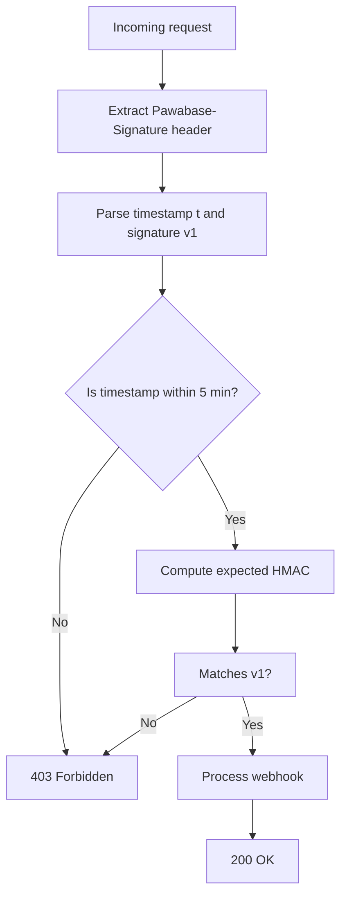

Every outbound webhook delivery from Pawabase includes an `Pawabase-Signature` header. This header contains an HMAC-SHA256 signature that lets your endpoint verify the request genuinely came from Pawabase and wasn't tampered with in transit.

<Note>
This page covers **verifying inbound webhook requests** — webhooks that Pawabase sends *to* your endpoints. For configuring signing secrets or checking delivery status of outbound webhooks, see [Outbound webhooks](/webhooks/outbound).
</Note>

## The signature header

Pawabase sends the `Pawabase-Signature` header in this format:

```
t=<unix_timestamp>,v1=<hex_hmac_sha256>
```

- **`t`** — Unix timestamp (seconds since epoch) when the signature was generated
- **`v1`** — HMAC-SHA256 hex digest computed over `"{timestamp}.{body}"`

Example:

```http
POST /webhooks/pawabase HTTP/1.1
Host: your-app.com
Content-Type: application/json
Pawabase-Signature: t=1700000000,v1=a1b2c3d4e5f6a1b2c3d4e5f6a1b2c3d4e5f6a1b2c3d4e5f6a1b2c3d4e5f6
```

The timestamp is part of the signature — it's not just metadata. This prevents replay attacks: the timestamp must be within **5 minutes** of the current time, or the signature is rejected.

## How to get the signing secret

Each webhook has its own signing secret, which you configured when creating the webhook in **Studio → Automate → Webhooks → Outbound**. Choose an existing webhook in Studio to see its secret, or store it in an environment variable on your endpoint:

```bash
WEBHOOK_SECRET=your-webhook-signing-secret
```

## Verification algorithm

Your endpoint should verify signatures using these steps:

1. **Parse the header** — Split on commas, then on `=`, to extract `t` and `v1`.
2. **Check timestamp freshness** — Reject if `abs(current_time - timestamp) > 300` seconds (5 minutes).
3. **Compute expected signature** — `HMAC-SHA256(secret, "{timestamp}.{body}")` where `body` is the **raw** request body (not parsed JSON).
4. **Compare** — Use a constant-time comparison function to check `expected == v1`.

<Warning>
The body used for signing is the **raw bytes** of the request body, not the parsed JSON object. If your framework parses the body before your code runs (e.g., Express's `bodyParser.json()`), you may have already consumed the stream. Use `raw-body` middleware or buffer the raw body.
</Warning>

## Code examples

### Node.js (Express)

```javascript
const crypto = require('crypto');

function verifyPawabaseWebhook(body, signature, secret) {
  const parts = signature.split(',');
  const timestamp = parts[0].split('=')[1];
  const v1 = parts[1].split('=')[1];

  // Check timestamp is within 5 minutes
  if (Math.abs(Date.now() / 1000 - parseInt(timestamp)) > 300) {
    return false;
  }

  // Compute expected signature
  const payload = `${timestamp}.${body}`;
  const expected = crypto
    .createHmac('sha256', secret)
    .update(payload)
    .digest('hex');

  // Constant-time comparison
  return crypto.timingSafeEqual(
    Buffer.from(v1, 'hex'),
    Buffer.from(expected, 'hex')
  );
}

// Express middleware
app.post('/webhooks/pawabase', express.raw({ type: 'application/json' }), (req, res) => {
  const signature = req.headers['pawabase-signature'];

  if (!verifyPawabaseWebhook(req.body, signature, process.env.WEBHOOK_SECRET)) {
    return res.status(403).send('Invalid signature');
  }

  const payload = JSON.parse(req.body);
  // Process the verified webhook
  res.status(200).send('OK');
});
```

### Python (FastAPI)

```python
import hmac
import hashlib
import os
import time
from fastapi import Request, HTTPException

def verify_signature(body: bytes, signature: str, secret: str) -> bool:
    parts = dict(item.split("=", 1) for item in signature.split(",") if "=" in item)
    try:
        timestamp = int(parts.get("t", ""))
    except ValueError:
        return False

    if abs(time.time() - timestamp) > 300:
        return False

    expected = hmac.new(
        secret.encode(),
        f"{timestamp}.".encode() + body,
        hashlib.sha256
    ).hexdigest()

    return hmac.compare_digest(expected, parts.get("v1", ""))

# FastAPI endpoint — use raw body
@app.post("/webhooks/pawabase")
async def handle_webhook(request: Request):
    signature = request.headers.get("Pawabase-Signature", "")
    body = await request.body()  # raw bytes

    if not verify_signature(body, signature, os.environ["WEBHOOK_SECRET"]):
        raise HTTPException(status_code=403, detail="Invalid signature")

    payload = json.loads(body)
    # Process the verified webhook
    return {"status": "ok"}
```

### Go

```go
func verifyWebhook(body []byte, signature, secret string) bool {
    parts := strings.Split(signature, ",")
    var timestamp, v1 string
    for _, p := range parts {
        kv := strings.SplitN(p, "=", 2)
        if len(kv) == 2 {
            if kv[0] == "t" { timestamp = kv[1] }
            if kv[0] == "v1" { v1 = kv[1] }
        }
    }

    ts, err := strconv.ParseInt(timestamp, 10, 64)
    if err != nil || time.Now().Unix()-ts > 300 {
        return false
    }

    payload := fmt.Sprintf("%d.%s", ts, body)
    mac := hmac.New(sha256.New, []byte(secret))
    mac.Write([]byte(payload))
    expected := hex.EncodeToString(mac.Sum(nil))

    return hmac.Equal([]byte(expected), []byte(v1))
}
```

### Ruby

```ruby
def verify_webhook(body, signature, secret)
  parts = signature.split(',').map { |s| s.split('=', 2) }.to_h
  timestamp = parts['t'].to_i

  return false if (Time.now.to_i - timestamp).abs > 300

  payload = "#{timestamp}.#{body}"
  expected = OpenSSL::HMAC.hexdigest('sha256', secret, payload)
  ActiveSupport::SecurityUtils.secure_compare(expected, parts['v1'])
end
```

### PHP

```php
function verify_webhook($body, $signature, $secret) {
    $parts = [];
    foreach (explode(',', $signature) as $pair) {
        $kv = explode('=', $pair, 2);
        if (count($kv) === 2) {
            $parts[$kv[0]] = $kv[1];
        }
    }

    $timestamp = intval($parts['t'] ?? '');
    if (abs(time() - $timestamp) > 300) {
        return false;
    }

    $expected = hash_hmac('sha256', $timestamp . '.' . $body, $secret);
    return hash_equals($expected, $parts['v1'] ?? '');
}
```

## Replay attack prevention

The timestamp tolerance (300 seconds) is the primary replay defense. An attacker who intercepts a valid webhook:

1. Cannot replay it after 5 minutes — the timestamp will be outside the tolerance window.
2. Cannot reuse the signature for a different payload — the body is part of the HMAC computation.

**Additional best practices:**

- **Idempotent processing** — On every webhook, check if you've already processed the event ID. Store the `Pawabase-Delivery` header value (a unique ID per delivery) in your database, and skip if it already exists.
- **Short timeout** — Respond `200 OK` as fast as possible. Slow responses cause retries, which can look like replay attacks.
- **Log failures** — Track failed verification attempts for security monitoring.

## Signature verification flow



## Common verification issues

<AccordionGroup>
  <Accordion title="Body hash mismatch">
    The most common error: using parsed JSON instead of the raw request body for the HMAC computation. The signature was computed over the raw bytes, not the JSON-parsed object. Always hash the raw body.
  </Accordion>
  <Accordion title="Timestamp expired">
    If you get a 403 with "timestamp expired," the request took more than 5 minutes to reach your endpoint. This usually means your endpoint is slow or behind a long network queue. Respond immediately and process in the background.
  </Accordion>
  <Accordion title="Missing header in certain deployments">
    If you're behind API Gateway, Lambda, or a proxy that rewrites headers, the `Pawabase-Signature` header might be dropped or renamed. Ensure your proxy passes all headers through unchanged.
  </Accordion>
</AccordionGroup>

## Next steps

<Callout>
- For receiving webhooks **from** external services (not from Pawabase), see [Inbound webhooks](/webhooks/inbound).
- For the full webhook delivery pipeline, see [Outbound webhooks](/webhooks/outbound).
- For general debugging, see [Troubleshooting](/reference/troubleshooting).
</Callout>
